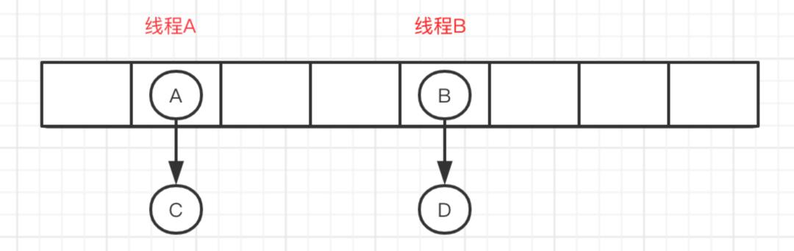

## Java集合


### 1. Set

- TreeSet:基于红黑树实现，支持有序性操作
- HashSet:基于`HashMap`实现,底层采用 `HashMap` 来保存元素，支持快速查找但不支持有序性操作。
- LinkHashSet:是`HashSet`的子类，具有HashSet的查找效率，并且内部使用双向链表维护插入顺序


### 2.LIst

- ArrayList:基于动态数组实现，支持随机访问，每次扩容1.5倍
- Vector:和ArrayList类似，但它是线程安全的,每次扩容为2倍
- LinkedList:基于双向链表实现，只能顺序访问，但是可以快速在链表中间插入删除链表。还可以用作栈，队列和双向队列

### 3.Queue

- ArrayQueue:双端队列，用`Object[]` 数组 + 双指针实现
- PriorityQueue:基于堆结构实现，可以实现优先队列


### Map

- TreeMap：红黑树实现
- HashMap:基于哈希表实现，底层数据结构是数据组+链表/红黑树实现
- HashTable:和HashMap类似，但是他是线程安全。
- LinkedHashMap：继承自HashMap，使用双向链表来维护元素的顺序，顺序为插入顺序或者最近最少使用（LRU）顺序。


### 说说List、SET、Map的区别

List:储存的顺序是有序的，可重复的，每次扩容为1.5倍

Set:储存的数据的唯一的。无序的，每次扩容为2倍

Map:通过就键值对存储数据，key是无序不可以重复的。


#### ArrayList和LinkedList的区别？

1：都不能保证线程安全

2：ArrayList底层用数组实现，支持随机访问，每次增加修改都需要把后面的元素进行移动，时间复杂度o(n-i)。而LinkedList使用双向链表来实现，不支持随机访问，直接用add()方法插入时时间复杂度o(1),指定位置插入时，O（N）

3：ArrayList因为list列表的结尾会预留一定的容量空间吗，会造成空间浪费。而LinkedList存储每个元素都需要比ArrayList消耗更多的空间，因为要存放直接前驱，直接后继和数据


#### HashMap和HashTable的区别？

1. **线程是否安全:** HashMap 是非线程安全的，在多线程环境下，1.7 会产生死循环、数据丢失、数据覆盖的问题，1.8 中会有数据覆盖的问题。 HashTable 是线程安全的,因为 HashTable 内 部的方法基本都经过 synchronized 修饰。
2. **效率:** 因为线程安全的问题， HashMap 要比 HashTable 效率高一点。
3. **对** **Null key** **和** **Null value** **的支持:** HashMap 可以存储 null 的 key 和 value，但 null 作为键只能有一个，null 作为值可以有多个;HashTable 不允许有 null 键和 null 值，否则会抛出 NullPointerException 。
4. **初始容量大小和每次扩充容量大小的不同 :** 1 创建时，如果不指定容量，HashTable默认初始化为11的大小，每次扩容为2n+1。HashMap初始为16，每次扩容为原来的两倍。2 给定了初始容量，HashTable会直接使用给定的大小，而HashMap会扩容为2的幂次方倍。
5. **底层数据结构:** 当链表⻓度大于阈值(默认为 8)(将链表转换成红黑树前会判断，如果当前数组的⻓度小于 64，那么会选择先进行数组扩容，而不是转换为红黑树)时，将链表转化为红黑树，以减少搜索时间。Hashtable 没有这样的机制。


### ArraryList存储结构

基于数组实现的，支持快速随机访问，默认大小为10


#### 扩容

扩容方法为`oldCapacity + (oldCapacity >> 1)`，所以扩容后的大小为原来的1.5倍左右。

每次扩容都需要调用Array.copyOf()把原数组整个复制到新数组中。


#### 删除元素

每次都需要将`index+1`后面的元素都复制到`index`位置上。时间复制度为O(N)


#### 序列化

保存元素的数组使用`transient`修饰，

因为是基于数组实现的，因此保存元素的数组并不一定都会使用的到，所以就没必要全部都进行序列化。


### Fail-Fast和Fail-Safe

fail-safe和fail-fast ，是多线程并发操作集合时的一种失败处理机制。


#### Fail-fast

 表示快速失败，在集合遍历过程中，一旦发现容器中的构发生变化，会立刻抛出ConcurrentModificationException异常，从而导致遍历失败，像这种情况。

结构发生变化是指添加或者删除至少一个元素的所有操作，或者是调整内部数组的大小，仅仅只是设置元素的值不算结构发生变化。


删除元素使用Iterator迭代器删除，或者for循环从后进行遍历删除，不能使用for()普通循环或者增强for循环进行删除，


#### Fail-safe

表示失败安全，也就是在这种机制下，出现集合元素的修改，不会抛出ConcurrentModificationException。

原因是采用安全失败机制的集合容器，在遍历时不是直接在集合内容上访问的，而是先复制原有集合内容。


### CopyOnWriteArrayList

读写分离：写操作在一个复制的数组上进行，读操作还是在原始数组中进行，读写分离，互不影响。

写操作需要加锁，防止并发写入时导致写入数据丢失。


数据不一致：读操作不能读取实时性的数据，因为部分写操作的数据还未同步到读数组中。


### HashMap存储结构

内部包含了一个 Entry 类型的数组 table。它包含了四个字段：`key`、`value`、`hashCode`、`nextEntry`。即数组中的每个位置被当成一个桶，一个桶存放一个链表。HashMap 使用拉链法来解决冲突，同一个链表中存放哈希值和散列桶取模运算结果相同的 Entry。


### HashMap 的工作原理

#### 存储对象


- 判断数组是否为空，如果为空，先初始化数组
- 通过（n-1）&hash计算存储位置
- 如果指定位置不存在值，则存进节点中。
- 如果存在，则发生hash冲突，判断key是否等，如果相等，则更新value值
- 判断数组当前节点是否为红黑树节点，如果是则放入红黑树节点中
- 如果不是则通过尾插法放入链表。如果链表长度大于8，转换为红黑树
- 插入完后，判断节点数是否大于`n*loadFactor`，如果是，扩容为2n，并迁移数据


#### 如何确定初始容量的

- 如果`new HashMap()`不传值，则默认初始容量为16，负载因子为0.75f

- 如果传入初始值`n`，则会扩容为2的幂次方倍

  ```java
      static final int tableSizeFor(int cap) {
          int n = cap - 1;
          n |= n >>> 1;
          n |= n >>> 2;
          n |= n >>> 4;
          n |= n >>> 8;
          n |= n >>> 16;
          return (n < 0) ? 1 : (n >= MAXIMUM_CAPACITY) ? MAXIMUM_CAPACITY : n + 1;
      }
  ```

  > \>\>\> 通过让初始二进制分别右移1、2、4、8、16位，与自己位或，把高位第一个1，不断右移， 然后把高位为1的后面全部变成1，111111+1=100000

  


#### hash函数设置

```java
    static final int hash(Object key) {
        int h;
        return (key == null) ? 0 : (h = key.hashCode()) ^ (h >>> 16);
    }
```

允许key为`null`的存在

`h=key.hashCode()^ (h >>> 16)`为扰动函数

- 降低 hash碰撞，越分散约好
- 算法要尽可能高效，所以采用位运算


##### 为什么采用hashcode的高16位和低16位异或能降低hash碰撞？hash函数能不能直接用key的hashcode？

因为 key.hashCode() 函数调用的是key键值类型自带的哈希函数，返回int型散列值。

int值范围为**-2147483648~2147483647**，前后加起来大概40亿的映射空间。只要哈希函数映射得比较均匀松散，一般应用是很难出现碰撞的。

如果HashMap数组的初始大小才16，用之前需要对数组的长度取模运算，得到的余数才能用来访问数组下标。

模运算就是把散列值和数组长度-1做一个"与"操作，位运算比%运算要快。


##### HashMap的数组长度取2的整数幂

这样(数组长度-1)正好相当于一个“低位掩码”。“与”操作的结果就是散列值的高位全部归零，只保留低位值，用来做数组下标访问。以初始长度16为例，16-1=15。2进制表示是00000000 00000000 00001111。和某散列值做“与”操作如下，结果就是截取了最低的四位值。


原函数这样做，就算散列值再分散，结果只取后四位的话，碰撞还是很严重。如果散列做得不好，分布上成等差数列的漏洞，那正好让低后四位成规律性重复，就会一直发生碰撞。


##### 扰动函数的作用：


右移16位，刚好是32bit的一半，让自己的高半区和低半区作异或，就是为了混合原始哈希码的高位和地位，以此来加大低位的随机性。而且混合后的地位掺杂了高位的部分特征，这样高位的信息也变相保存下来了。


另外Java1.8相比1.7做了调整，1.7做了四次移位和四次异或，但明显Java 8觉得扰动做一次就够了，做4次的话，多了可能边际效用也不大，所谓为了效率考虑就改成一次了。


#### jdk1.8的优化

1. 数组+链表改成了数组+链表\红黑树
2. 链表插入方式从头插法改成了尾插法
3. 扩容的时候，1.7需要对原数组中的元素重新进行`hash`定位在数组中的位置，1.8则是位置不变或索引+旧容量大小
4. 插入时，1.7是先判断会否需要扩容再插入；1.8则是插入完再去判断是否需要扩容。


原因： 

1. 防止发生hash冲突，链表过长，将时间复杂度从o(N)降为o(log N)

2. 因为1.7头插法扩容时，头插法会使链表发生反转，多线程环境下会产生环

   A线程在插入节点B，B线程也在插入，遇到容量不够开始扩容，重新hash，放置元素，采用头插法，后遍历到的B节点放入了头部

   这样形成了环，如下图所示：

   


#### 1.8扩容时为什么不重新hash?

因为扩容是扩大到元素组的2倍。用于计算数组位置的掩码仅仅是高位多了个1


扩容前长度为16，用于计算 (n-1) & hash 的二进制n - 1为0000 1111，

扩容后为32后的二进制就高位多了1，============>为0001 1111。

因为是& 运算，1和任何数 & 都是它本身，那就分二种情况，如下图：原数据hashcode高位第4位为0和高位为1的情况；

第四位高位为0，重新hash数值不变，第四位为1，重新hash数值比原来大16(旧数组的容量)


#### 为什么转化为红黑树的阈值是8，转回链表的是6？

因为节点分布在hash桶的概率遵循泊松分布，桶超过8的概率为百万分之6，概率已经足够小。

而选择6是因为留下了中间差值7可以防止频繁的链表和树的转换。


#### 实现线程安全的方式

- HashTable是直接在操作方法上加synchronized关键字，锁住整个数组，粒度比较大
- Collections.synchronizedMap是使用Collections集合工具的内部类，通过传入Map封装出一个SynchronizedMap对象，内部定义了一个对象锁，方法内通过对象锁实现；
- ConcurrentHashMap使用分段锁，降低了锁粒度，让并发度大大提高。

#### 获取对象

将Key传给get方法

- 调用`hash(key)`计算出k的`hash`值，然后结合数组长度，得到数组下标
- 遍历链表/红黑树,`equals()`方法查找出key值对应的value值

> hashCode是定位的，存储位置；equals是定性的，比较对象是否相等


#### **ConcurrentHashMap**

##### 1.7之前使用分段锁来实现

首先将数据分为一段一段的存储，然后给每一段数据配一把锁，当一个线程占用锁访问其中一个段数据时，其他段的数据也能被其他线程访问。



**ConcurrentHashMap** **是由** **Segment** **数组结构和** **HashEntry** **数组结构组成**。

Segment 实现了 ReentrantLock ,所以 Segment 是一种可重入锁，扮演锁的⻆色。 HashEntry 用 于存储键值对数据。

​     

#####  1.8取消了 Segment 分段锁，采用 CAS 和 synchronized 来保证并发安全

synchronized 只锁定当前链表或红黑二叉树的首节点，这样只要 hash 不冲突，就不会产生并 发，效率又提升 N 倍。

首先使用无锁操作CAS插入头结点，失败则循环重试

若头结点已存在，则尝试去获取头结点的同步锁，再进行操作 

