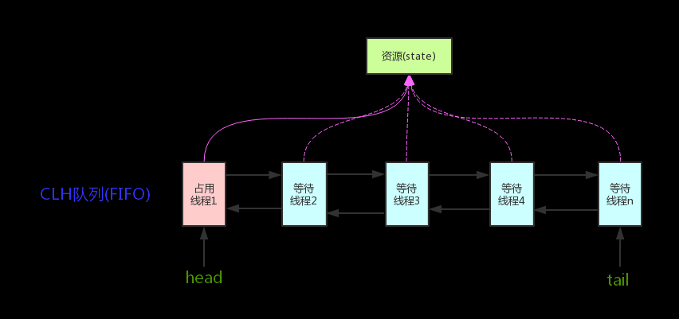

## 多线程


### 线程和进程的区别

- 进程：系统运行程序的基本单位，是 程序的一次执行过程，因此是动态的，系统运行一个程序即是进程从创建，运行到消亡的过程。
- 线程：一个进程在运行中会产生多个线程，每个线程共享着一片内存区域，又拥有自己的工作内存。


### 创建线程的方法

- 创建实现Runadble接口的类，不会返回结果或抛出检查异常
- 创建Callable类，重写Call方法，Call方法执行后，可以通过Future对象拿到返回值
- 继承Thread重写Run（）方法


### 并行和并发的区别

- 在一段时间内，多个任务都在执行

- 在同一时间内，多个任务同时执行


### 为什么使用多线程？带来的问题？

提高CPU的利用率，提成程序的执行效率

- 死锁
- 内存泄露
- 上下文切换


### 线程的生命周期和状态

- NEW创建
- RUNNABLE 运行或者就绪
- Blocked 阻塞
- waiting 等待
- time_waiting  超时等待
- terminated 终止状态


### 什么是死锁？

多个线程同时被阻塞，他们都在等待着某个资源的释放，但某个线程因为某些原因，会一直持有着，并不会释放


#### 产生死锁的必要条件

不可剥夺、互斥、请求与保持、循环等待


#### 如何避免死锁

破坏请求与保持：一次申请所有资源

破坏不可剥夺：申请资源申请不到时，释放占有的资源

破坏循环等待：靠按序申请资源来预防。


### Synchronized关键字

解决多线程之间访问资源的同步性问题，Synchronized保证被他修饰的方法或者代码块在任意时刻只有一个线程能够执行。

另外早期是属于重量级锁，因为会Java的线程是映射到操作系统的原生线程上的，若果挂起的或者唤醒一个线程都需要从用户态切换到内核态。时间成本比较高

Java6之后对锁引入了大量优化：

- 自旋锁：通过让线程执行忙循环的过程来等待锁的释放，不让出CPU

- 自适应自旋锁：自旋次数不确定，通过上次在同一个锁上自旋时间及锁的拥有者的状态来决定

- 锁消除：JIT编译时，去除掉不可能存在资源竞争的锁

- 锁粗话：扩大加锁的范围，避免反复加锁

- 偏向锁：偏向锁假定将来只有第一个申请锁的线程会使用锁。如果一个线程获得了锁，那么这个锁就进入了偏向模式，下次线程再次请求锁时，无需做同步操作就可以获得锁。

- 轻量级锁：如果资源明显存在着其他线程申请锁，那么偏向锁就会膨胀为轻量级锁。

- 重量级锁：如果存在多个线程同一时间访问锁时，那么就会膨胀为重量级锁


#### 应用方法

- 修饰实例方法：给当前实例对象加锁
- 修饰静态方法：给当前类对象加锁
- 修饰代码块：给给定对象加锁


#### Synchronized底层原理

当修饰代码块，会使用monitorenter和monitorexit指示同步代码块的开始和结束位置，当执行到monitorenter指令时，线程会试图获取monitor的持有权。

当修饰方法时：使用ACC_SYNCHRONIZED修饰方法。证明这是一个同步方法。


#### synchronized 关键字和 volatile 关键字的区别

- synchronized 关键字可以修饰方法和代码块，volatile只能修饰变量

- volatile保证了数据的可见性，禁止指令重排，但不能保证原子性。

- volatile 关键字主要⽤于解决变量在多个线程之间的可⻅性，⽽ synchronized 关键字解决 的是多个线程之间访问资源的同步性。

  

#### synchronized 和 ReentrantLock的区别

-  都是可重入锁
-  synchronized 依赖于JDK，ReentrantLock是依赖于API
-  LOCK增加了高级功能：
   - 等待可中断
   - 可以实现公平锁
   - 可以实现选择性的通知
   


### JMM内存模型

Java虚拟机规范中定义了Java内存模型，屏蔽了底层操作系统和各种硬件的差异，使得Java程序在各个平台下都能得到一致的效果。

1.2之前：Java内存模型总是从主内存读取变量

后面，线程可以把变量保存在本地内存中，而不是直接在主内存进行读写。


### ThreadLocal

实现每个线程都有自己的专属本地变量。


内部维护了一个类似map的ThreadLocalMap数据结构，key保存当前对象的Thread对象，值为OBject对象


内存泄漏：

ThreadLocalMap的key为弱引用，value为强引用。当Threadlocal没有被外部强引用时，在垃圾回收的时候key就会被回收掉，这时，就会出现key为null的键，如果我们不做任何操作，那么这个value就永远不会被回收所以，每次操作Threadlocal方法结束后，都需要手动创建remove（）方法。


### 线程池的好处

- 降低资源消耗：降低线程的创建和消耗造成的消耗
- 提高响应速度：节省了创建线程的时间
- 提高系统的稳定性：线程是稀缺资源，如果⽆限制的创建，不仅会消耗系统资源，还会降 低系统的稳定性，使⽤线程池可以进⾏统⼀的分配，调优和监控。


#### excute()和submit（）区别

- excute（）用于提交不需要返回值的方法，无法判断任务是否被线程池执行成功
- submit（）：会返回一个future（）对象，可以判断任务是否执行成功


#### sleep和wait的区别

- sleep不会释放锁。wait会
- wait用于线程间的通信，sleep用于暂停执行
- wait需要其他线程调用Notify()/NotifyAll方法唤醒，sleep会自己醒


#### 创建线程池的方法：

- 不建议通过Excutors创建：FixedThreadPool 和 SingleThreadExecutor ： 允许请求的队列⻓度为 Integer.MAX_VALUE ，可能堆积⼤量的请求，从⽽导致 OOM。 CachedThreadPool 和 ScheduledThreadPool ： 允许创建的线程数量为 Integer.MAX_VALUE ，可能会创建⼤量线程，从⽽导致 OOM。

- ThreadPoolExcuter创建


### AQS（AbstractQueuedSynchronizer）

功能

构建锁和同步器的框架,维护了一个 volatile int sate 和FIFO的线程等待队列



#### Sate的三种访问方式

- getState()
- setState()
- compareAndSetSate()


#### AQS资源的共享方式:

- exclusive(独占，只有一个线程能访问得到，ReentrantLock)
  - 公平锁：按照队列的排序获取锁
  - 非公平锁：无所队列的锁，谁抢到就是谁的
- Share(共享，多个线程同时执行，Semaphore/CountDownLatch/cyclicBariier/ReadWriteLock


#### 底层使用了模板方法模式

同步器的设计是基于模板方式实现的，如果需要自定义同步器，我们可以继承AQS并重写指定的方法。（对共享资源sate的获取和释放）


#### 组件

- Semaphore(信号量)：允许多个线程同时访问某个资源
- CountDownLatch(倒计时器)：协调多个线程的同步，用于控制线程的等待，让某个线程等待直至倒计时结束。
- CyclicBarrier(循环栅栏)：让一组线程到达一个同步点时被阻塞，只有最后一个线程到达同步点时，才会所有被拦截的线程才能开始继续工作


生产上的应用：

同时读取多个考勤文件。需要同时等待考勤文件处理完业务后，再去告诉客户端结果。

```java
public class CountDownLatchExample1 {
    // 处理⽂件的数量
    private static final int threadCount = 6;

    public static void main(String[] args) throws InterruptedException {
        // 创建⼀个具有固定线程数量的线程池对象（推荐使⽤构造⽅法创建）
        ExecutorService threadPool = Executors.newFixedThreadPool(10);
        final CountDownLatch countDownLatch = new CountDownLatch(threadCount);
        for (int i = 0; i < threadCount; i++) {
            final int threadnum = i;
            threadPool.execute(() -> {
                try {
                    //处理⽂件的业务操作
 ......
                } catch (InterruptedException e) {
                    e.printStackTrace();
                } finally {
                    //表示⼀个⽂件已经被完成
                    countDownLatch.countDown();
                }
            });
        }
        countDownLatch.await();
        threadPool.shutdown();
        System.out.println("finish");
    }
}
```
