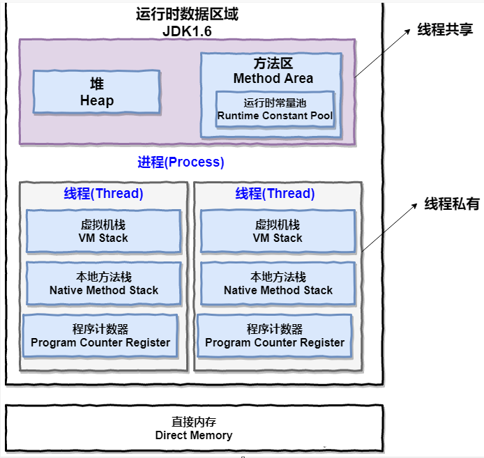
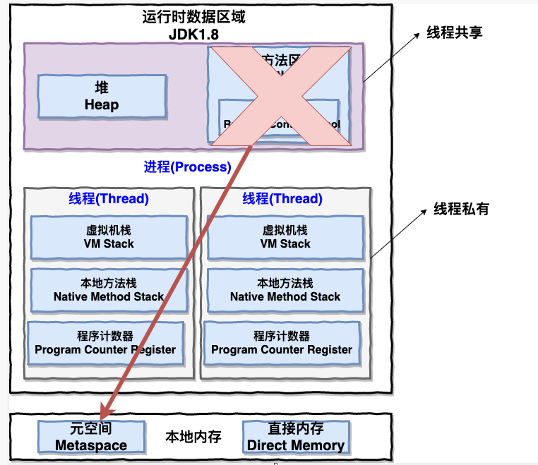
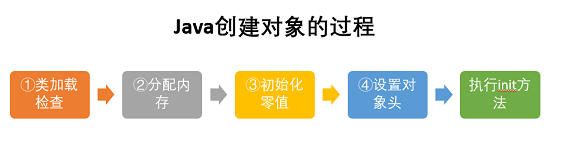
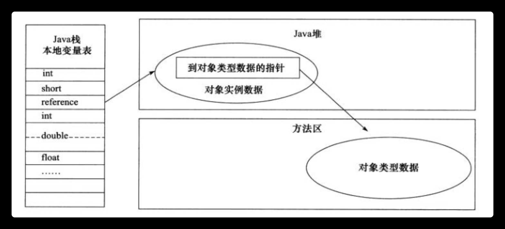

## JVM

#### java内存区域

JDK1.7

JDK1.8

线程私有的

- 程序计数器
- 虚拟机栈
- 本地方法栈

线程共享的

- 堆
- 方法区（1.8后移除，变为元空间）
- 直接内存

##### 程序计数器

1. 字节码解释器通过改变程序计数器来依次读取指令，从而实现代码的流程控制，如：顺序执行、选择、循环、异常处理。
2. 在多线程情况下，程序计数器用于记录当前线程的执行位置，当线程被切换回来时就能知道上次执行到哪里了。

唯一一个不会抛出oom异常的内存区域

##### 虚拟机栈

由一个个栈帧组成，描述的是Java方法执行的内存模型。每次方法调用的数据都是通过栈传递的

Java内存可以粗糙地分为堆内存和栈内存，栈内存说的就是虚拟机栈或者栈中的局部变量表部分

局部变量表主要存放着编译期可知的各种数据类型和对象引用

##### 本地方法栈

为执行Native方法服务的

##### 堆

存放对象实例、数组和字符串常量池（1.7从方法区移入）

堆内存分为：新生代内存和老生代

##### 方法区

储存已被虚拟机加载的类信息，常量，静态变量等数据

和永生代的关系：方法区是Java虚拟机规范的定义，而永生代是Hotspot虚拟机对此的实现

##### 运行时常量池

运行时常量池是方法区的一部分。用于存放编译期生成的各种字面量和符号引用

#### 对象创建过程

1. 类加载检查：虚拟机遇到New指令时，会去检查能否在常量池定位到这个类的常量引用。并且检查这个类是否已经加载解析初始化过

2. 分配对象：类加载检查通过后，就会在堆中为对象分配内存。分配方式有：指针碰撞和空闲列表。由堆是否规整决定的。

   - 指针碰撞：内存规整时使用，把用过的内存整理到一边，没有用过的整理到另一边。然后中间有个分界指针，只要把该指针移动对象内存大小的位置即可
   - 空闲列表：不规整时使用，虚拟机维护一个列表。记录着哪些内存是可用的，分配时，只要将足够大的内存卡分配给对象。最后更新列表记录

   内存分配并发的解决：

   - CAS:每次不加锁，假设会分配成功，失败则重试，直到成功为止
   - TLAB:为每个线程预先在Eden分配内存，java给对象分配内存时，首先在TLAB分配，当对象大于TLAB的剩余内存或者已用尽时再用CAS分配

3. 初始化零值：将分配到的内存区域都初始化零值，保证了对象的实例字段在JAVA代码中不用赋初始值就能使用

4. 设置对象头：对对象进行必要的设置，如：对象是哪个类的实例、如何才能找到类的元数据信息、对象的哈希码，对象的gc分代年龄信息、锁状态标志等

5. 执行init方法

####  对象的内存布局

在 Hotspot 虚拟机中，对象在内存中的布局可以分为 3 块区域：**对象头**、**实例数据**和**对齐填充**。

- 对象头：
  - 第一部分用于存储对象自身的运行时数据（哈希码、GC 分代年龄、锁状态标志等等）
  - 另一部分是类型指针，即对象指向它的类元数据的指针，虚拟机通过这个指针来确定这个对象是那个类的实例。

- 实例数据：对象真正存储的有效信息，也是在程序中所定义的各种类型的字段内容。
- 对齐填充：对象的大小必须是 8 字节的整数倍，起占位作用

#### 对象的访问方式

 Java 程序通过栈上的 reference 数据来操作堆上的具体对象。对象的访问方式由虚拟机实现而定，目前主流的访问方式有**① 使用句柄**和**② 直接指针**两种：

1. 句柄：在JAVA堆中划分出一块内存区域作为句柄池，reference中存储的就是对象的句柄地址，而句柄中就包含了对象的实例数据和类型数据各自的具体地址信息

2. 直接指针：reference 中存储的直接就是对象的地址

   

#### 堆内存的分配策略

- 对象优先在eden区进行分配
- 大对象直接进入老年代
- 长期存活的对象进入老年代

#### 如何判断对象已经死亡

- 引用计数法：给对象添加一个引用计数器，每当有一个地方引用到他时，计数器就加1。

- 可达性分析算法：通过⼀系列的称为 “GC Roots” 的对象作为起点，当一个对象到GC Roots没有任何引用链相连的时候，则证明该对象不可用

  ​	GC Roots的对象有：

  - 虚拟机栈中的引用的对象
  - 方法区内类静态属性引用的对象
  - 方法区中常量引用的对象
  - 本地方法栈中JNI引用的对象

  

#### 判断常量是废弃常量

当没有任何String对象应用该字符串常量的话，就说明是废弃常量

#### 判断类是无用类

- 该类的所有实例都已经被回收
- 加载该类的classLoader已经被回收
- 该类对应的class对象没有在任何地方被引用，无法在任何地方通过反射获取到该类的方法。

#### 垃圾回收算法

##### 标记清除

标记出所有不需要回收的对象，然后回收没被标记的对象。效率问题，空间问题（产生大量不连续的碎片）

##### 复制算法

将内存分为一样大小的两块区域，每次使用其中一块，当这一块内存区域使用完后，就将还存活的对象复制到另一边，然后把使用的空间清理调

##### 标记整理

标记完后，让所有存活的对象向一端移动，直接清理掉端边界以外的内存

##### 分代收集算法

⽐如在新⽣代中，每次收集都会有⼤量对象死去，所以可以选择复制算法，只需要付出少量对象 的复制成本就可以完成每次垃圾收集。⽽⽼年代的对象存活⼏率是⽐较⾼的，⽽且没有额外的空 间对它进⾏分配担保，所以我们必须选择“标记-清除”或“标记-整理”算法进⾏垃圾收集。

#### 引用

强引用：必不可少的生活用品：宁愿抛出错误也不回收他

软引用：当内存不足时，就会回收他。

弱引用：扫描到就会回收他。

虚引用：随时都可能会被回收

虚引⽤主要⽤来跟踪对象被垃圾回收的活动。

