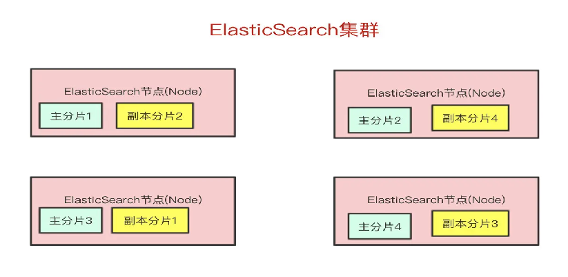
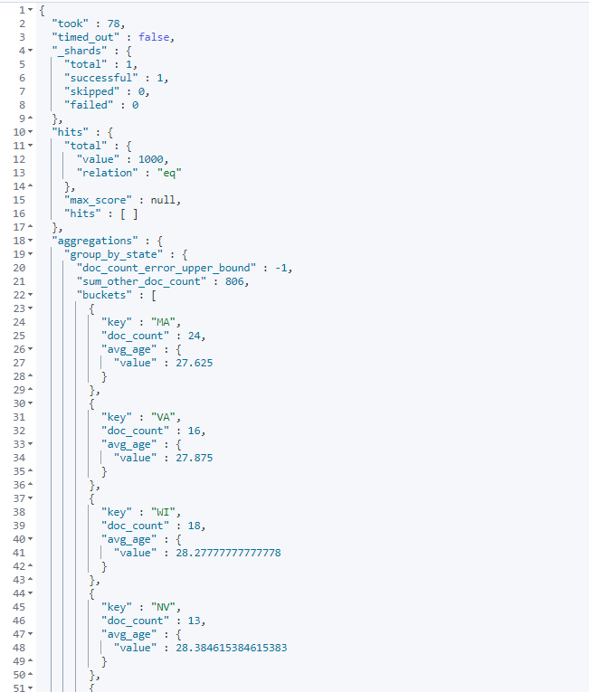

## ElasticSearch


### 简介

Elasticsearch 是一个**实时**的**分布式存储、搜索、分析**的引擎。、


#### 功能

1）检索相关数据

2）返回统计结果

3）速度快


#### 为什么用ES?

虽然**数据库**也能做到（实时、存储、搜索、分析）


但Elasticsearch是专门做**搜索**的：

- Elasticsearch对模糊搜索非常擅长（搜索速度很快）

- 从Elasticsearch搜索到的数据可以根据**评分**过滤掉大部分的，只要返回评分高的给用户就好了（原生就支持排序）

- 没有那么准确的关键字也能搜出相关的结果（能匹配有相关性的记录）

  

##### ES可以模糊查询

像MySQL的模糊查询，这种是不走索引的，当数据库的量很大时，查询会是秒级别的

```sql
select * from user where name like '%wuwuwu%'
```


##### 非精确查询

用户输入的内容往往并没有这么的**精确**，比如我从Google输入`ElastcSeach`（打错字），但是Google还是能估算我想输入的是`Elasticsearch`


### 数据结构

- 树型的查找时间复杂度一般是O(logn)
- 链表的查找时间复杂度一般是O(n)
- 哈希表的查找时间复杂度一般是O(1)
- ....不同的数据结构所花的时间往往不一样，你想要查找的时候要**快**，就需要有底层的数据结构支持


我们根据“**完整的条件**”查找一条记录叫做**正向索引**；

而ES的底层数据结构实现是一个**倒排索引**。


##### 分词

**分词**是ES能实现快速“模糊匹配”/“相关性查询”的关键


在ES中出现四次的"算法"会出现这样的结果

- 算法 -> 2,13,42

或者


这种根据**某个词**(不完整的条件)再查找对应记录，叫做**倒排索引**。


在es中，切分词条需要用到分词器，而我们用的最多的就是IK分词器


es的数据结构如图：


输入一段文字，es会对这段文字进行分词，这些分词汇总起来成为`Term Dictonary`

而通过分词需要找到对应的记录，这些文档ID保存在`PostingList`


在`Term Dictionary`中的词会进行**排序**，等要查找的时候就可以通过**二分**来查，而不需要遍历整个`Term Dictionary`

同时，由于`Term Dictionary`的词太多了，不可能所有都放到内存中，所以es还抽了一层叫做 `Term index`，只存词的前缀。`Term Index`会存在内存中


### 术语和架构


#### 常见术语：

**Index**：Elasticsearch的Index相当于数据库的Table

**Type**：这个在新的Elasticsearch版本已经废除（在以前的Elasticsearch版本，一个Index下支持多个Type--有点类似于消息队列一个topic下多个group的概念）

**Document**：Document相当于数据库的一行记录

**Field**：相当于数据库的Column的概念

**Mapping**：相当于数据库的Schema的概念

**DSL**：相当于数据库的SQL（给我们读取Elasticsearch数据的API）


#### 架构

##### 1）Cluster:集群

ES可以作为独立的单个搜索服务器。但是为了处理大型数据集，实现容错和高可用性，ES可以运行在许多互相合作的服务器上。所以Elasticsearch是**分布式**存储的

##### 2）Node:节点

形成集群的每个服务器称为节点，其中会有一个`Master Node`，它主要负责维护索引元数据、负责切换主分片和副本分片身份等工作（后面会讲到分片的概念），如果主节点挂了，会选举出一个新的主节点。

##### 3）Shard:分片

一个Index的数据我们可以分发到不同的Node上进行存储，这个操作就叫做**分片**。


比如现在我集群里边有4个节点，我现在有一个Index，想将这个Index在4个节点上存储，那我们可以设置为4个分片。这4个分片的数据**合起来**就是Index的数据


为什们要分片呢？

- 如果一个Index的数据量太大，只有一个分片，那只会在一个节点上存储，随着数据量的增长，一个节点未必能把一个Index存储下来。
- 多个分片，在写入或查询的时候就可以并行操作（从各个节点中读写数据，提高吞吐量）

##### 4）Replia:副本

现在问题来了，如果某个节点挂了，那部分数据就丢了吗？显然Elasticsearch也会想到这个问题，所以分片会有主分片和副本分片之分（为了实现**高可用**）

数据写入的时候是**写到主分片**，副本分片会**复制**主分片的数据，读取的时候**主分片和副本分片都可以读**。

如果某个节点挂了，前面所提高的`Master Node`就会把对应的副本分片提拔为主分片，这样即便节点挂了，数据就不会丢。



### 写入流程


集群每个节点都是`coordinating node`（协调节点）

如果节点1收到了请求，但发现主分片在节点2上，那么就会把请求转发到节点2上。


路由到对应的节点以及对应的主分片时，会做以下的事：

1. 将数据写到内存缓存区
2. 然后将数据写到translog缓存区
3. 每隔**1s**数据从buffer中refresh到FileSystemCache中，生成segment文件，一旦生成segment文件，就能通过索引查询到了
4. refresh完，memory buffer就清空了。
5. 每隔**5s**中，translog 从buffer flush到磁盘中
6. 定期/定量从FileSystemCache中,结合translog内容`flush index`到磁盘中。


- es会先把数据写入到内存缓冲区，每隔1s刷新到文件系统缓冲区，此时会生成一个segement文件，有segement数据才可以被查询得到。所以es是近实时查询的。
- 为了防止节点宕机，内存数据丢失，es会另写一份数据到日志文件上，但最开始还是先写到内存缓冲区，每隔5s才会把数据刷到磁盘。（所以如果某个节点挂了，可能会造成5s的数据丢失）
- 等到磁盘中的translog文件大到一定程度或者超过30分钟，会触发commit操作，将内存中的segement文件异步刷到磁盘中，完成持久化操作。


#### 更新和删除

es的更新和删除会给对应的`doc`记录打上`.del`标识，如果是删除操作就打上`delete`状态，如果是更新操作就把原来的`doc`标志为`delete`，然后重新新写入一条数据


前面提到了，每隔**1s**会生成一个segement 文件，那segement文件会越来越多越来越多。Elasticsearch会有一个**merge**任务，会将多个segement文件**合并**成一个segement文件。

在合并的过程中，会把带有`delete`状态的`doc`给**物理删除**掉。


####  查询

查询我们最简单的方式可以分为两种：

- 根据ID查询doc
- 根据query（搜索词）去查询匹配的doc


根据**ID**去查询具体的doc的流程是：

- 检索内存的Translog文件
- 检索硬盘的Translog文件
- 检索硬盘的Segement文件

根据**query**去匹配doc的流程是：

- 同时去查询内存和硬盘的Segement文件


### DSL

#### 集群状态查看

- 查看集群健康状态：

```apl
GET /_cat/health?v


epoch      timestamp cluster       status node.total node.data shards pri relo init unassign pending_tasks max_task_wait_time active_shards_percent
1638260282 08:18:02  elasticsearch yellow          1         1     19  19    0    0       11             0                  -                 63.3%
```

- 查看节点状态:

  ```apl
  GET /_cat/nodes?v
  
  ip         heap.percent ram.percent cpu load_1m load_5m load_15m node.role master name
  172.17.0.4           35          90   6    0.45    0.30     0.25 dimrt     *      elasticsearch
  ```

  

- 查看所有索引信息：

  ```apl
  GET /_cat/indices?v
  
  health status index                          uuid                   pri rep docs.count docs.deleted store.size pri.store.size
  yellow open   springboot-logstash-2021.11.11 fReH4GsvSdCD-fujT387vw   1   1        832            0    478.1kb        478.1kb
  yellow open   customer                       ouyPZnnfTUS9B0C5ZZ0czA   1   1          3            6      9.7kb          9.7kb
  ```


#### 索引操作

- 创建索引

  ```apl
  PUT /customer
  ```

- 删除索引

  ```apl
  DELETE /customer
  ```


#### 类型操作

- 查看索引类型

  ```apl
  GET /custome/_mapping
  
  return:
  {
    "customer" : {
      "mappings" : {
        "properties" : {
          "name" : {
            "type" : "text",
            "fields" : {
              "keyword" : {
                "type" : "keyword",
                "ignore_above" : 256
              }
            }
          }
        }
      }
    }
  }
  ```


#### 文档操作

- 在索引中添加文档

  ```apl
  PUT /customer/_doc/4
  {
    "name": "John Doe"
  }
  
  return:
  {
    "_index" : "customer",
    "_type" : "_doc",
    "_id" : "4",
    "_version" : 2,
    "result" : "updated",
    "_shards" : {
      "total" : 2,
      "successful" : 1,
      "failed" : 0
    },
    "_seq_no" : 14,
    "_primary_term" : 1
  }
  ```

- 查看索引中的文档

  ```apl
  GET /customer/_doc/4
  
  return:
  {
    "_index" : "customer",
    "_type" : "_doc",
    "_id" : "4",
    "_version" : 2,
    "_seq_no" : 14,
    "_primary_term" : 1,
    "found" : true,
    "_source" : {
      "name" : "John Doe"
    }
  }
  ```

- 修改索引中的文档：

  ```apl
  POST /customer/_update/1/
  {
    "doc": { "name": "Jane Doe" }
  }
  
  {
    "_index" : "customer",
    "_type" : "_doc",
    "_id" : "1",
    "_version" : 9,
    "result" : "noop",
    "_shards" : {
      "total" : 0,
      "successful" : 0,
      "failed" : 0
    },
    "_seq_no" : 15,
    "_primary_term" : 1
  }
  ```

- 删除索引中的文档：

  ```apl
  DELETE /customer/_doc/1
  ```

- 对索引中的文档执行批量操作

  ```apl
  POST /customer/_bulk
  {"index":{"_id":"1"}}
  {"name": "John Doe" }
  {"index":{"_id":"2"}}
  {"name": "Jane Doe" }
  ```


#### 数据搜索

- 最简单的搜索，使用`match_all`来表示，例如搜索全部；

  ```apl
  GET /bank/_search
  {
    "query": { "match_all": {} }
  }
  
  return:
  
  {
    "took" : 10,
    "timed_out" : false,
    "_shards" : {
      "total" : 1,
      "successful" : 1,
      "skipped" : 0,
      "failed" : 0
    },
    "hits" : {
      "total" : {
        "value" : 1000,
        "relation" : "eq"
      },
      "max_score" : 1.0,
      "hits" : [
        {
          "_index" : "bank",
          "_type" : "_doc",
          "_id" : "1",
          "_score" : 1.0,
          "_source" : {
            "account_number" : 1,
            "balance" : 39225,
            "firstname" : "Amber",
            "lastname" : "Duke",
            "age" : 32,
            "gender" : "M",
            "address" : "880 Holmes Lane",
            "employer" : "Pyrami",
            "email" : "amberduke@pyrami.com",
            "city" : "Brogan",
            "state" : "IL"
          }
        },
        {
          "_index" : "bank",
          "_type" : "_doc",
          "_id" : "6",
          "_score" : 1.0,
          "_source" : {
            "account_number" : 6,
            "balance" : 5686,
            "firstname" : "Hattie",
            "lastname" : "Bond",
            "age" : 36,
            "gender" : "M",
            "address" : "671 Bristol Street",
            "employer" : "Netagy",
            "email" : "hattiebond@netagy.com",
            "city" : "Dante",
            "state" : "TN"
          }
        }
      ]
    }
  }
  ```


- 分页搜索，`from`表示偏移量，从0开始，size表示每页显示的数量

  ```apl
  GET /bank/_search
  {
    "query": { "match_all": {} },
    "from": 0,
    "size": 10
  }
  ```

- 排序搜索，使用`sort`表示，例如按`balance`字段进行降序排序

  ```apl
  GET /bank/_search
  {
    "query": { "match_all": {} }, "sort": [
      {
        "balance": {
          "order": "desc"
        }
      }
    ]
  }
  ```

  

- 搜索并返回指定字段内容，使用`_source`表示

  ```apl
  GET /bank/_search
  {
    "query": { 
      "match_all": {} 
    },  
    "_source": ["firstname","lastname"]
  }
  ```

  

#### 条件搜索

- 条件搜索，用match表示匹配条件，对于数值类型是精确匹配，文本类型是匹配

  ```AP
  GET /bank/_search
  {
    "query": { 
      "match": {
        "age": "32"
      }
    }
  }
  ```

  

- 短语匹配，用`match_phrase`表示

  ```apl
  GET /bank/_search
  {
    "query": { 
      "match_phrase": {
        "address": "Mill Lane"
      }
    }
  }
  ```

  

#### 组合搜索

使用`bool`来进行组合

- `must`表示同时满足

  > 下面语句和上面短语匹配的语句执行结果一致

  ```apl
  GET /bank/_search
  {
    "query": {
      "bool": {
        "must": [
          { "match": { "address": "mill" } },
          { "match": { "address": "lane" } }
        ]
      }
    }
  }
  ```

- `should`表示满足其中任意一个

  > 搜索`address`字段中包含`mill`或者`lane`的文档

  ```apl
  GET /bank/_search
  {
    "query": {
      "bool": {
        "must": [
          { "match": { "address": "mill" } },
          { "match": { "address": "lane" } }
        ]
      }
    }
  }
  ```

  

- `must_not`表示同时不满足

  > 搜索`address`字段中不包含`mill`且不包含`lane`的文档；

  ```apl
  GET /bank/_search
  {
    "query": {
      "bool": {
        "must_not": [
          { "match": { "address": "mill" } },
          { "match": { "address": "lane" } }
        ]
      }
    }
  }
  ```


- 组合`must`和`must_not`

  > 搜索`age`字段等于`40`且`state`字段不包含`ID`的文档；

  ```apl
  GET /bank/_search
  {
    "query": {
      "bool": {
        "must_not": [
          { "match": { "state": "ID" } }],
        "must":[
          { "match": { "age": "40" } }]
        
      }
    }
  }
  ```

  

#### 过滤搜索

- 过滤使用`filter`来表示

  > 过滤出balance字段在20000-30000的字段

  ```apl
  GET /bank/_search
  {
    "query": {
      "bool": {
        "filter": {
          "range": {
            "balance": {
              "gte": 20000,
              "lte": 30000
            }
          }
        }
      }
    }
  }
  ```

  

#### 搜索聚合

- 对搜索结果进行聚合，使用`aggs`（aggregations）表示，类型MySQL的`group by`  

  > 对`state`字段进行聚合，统计出相同`state`的文档数量

  ```apl
  GET /bank/_search
  {
    "size": 0,
    "aggs": {
      "group_by_state": {
        "terms": {
          "field": "state.keyword"
        }
      }
    }
  }
  ```

  

- 嵌套聚合

  > 例如对`state`字段进行聚合，统计出相同`state`的文档数量，再统计出`balance`的平均值

  ```apl
  GET /bank/_search
  {
    "size": 0,
    "aggs": {
      "group_by_state": {
        "terms": {
          "field": "state.keyword"
        },
        "aggs": {
          "average_balance": {
            "avg": {
              "field": "balance"
            }
          }
        }
      }
    }
  }
  ```

  

- 对聚合的结果进行排序

  > 按`age`的平均值降序排列

  ```apl
  GET /bank/_search
  {
    "size": 0,
    "aggs": {
      "group_by_state": {
        "terms": {
          "field": "state.keyword",
          "order": {
            "avg_age": "asc"
          }
        },
        "aggs":{
          "avg_age":{
            "avg": {
              "field": "age"
            }
          }
        }
      }
    }
  }
  ```

  

- 按字段的范围进行分段聚合

  > 例如分段范围为`age`字段的`[20,30]` `[30,40]` `[40,50]`，之后按`gender`统计文档个数和`age`的平均值

  ```apl
  GET /bank/_search
  {
    "size": 0, 
    "aggs": {
      "range_by_age": {
        "range": {
          "field": "age",
          "ranges": [
            {
              "from": 20,
              "to": 30
            },
            {
              "from": 30,
              "to": 40
            },
            {
              "from": 40,
              "to": 50
            }          
          ]
        },
        "aggs": {
          "group_by_sex": {
            "terms": {
              "field": "gender.keyword"
            },
            "aggs": {
              "avg_age": {
                "avg": {
                  "field": "age"
                }
              }
            }
          }
        }
      }
    }
  }
  ```

  

