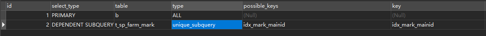

## Explain

Explain可以用于查看SQL语句的执行过程，以加快SQL的执行效率


explain执行计划中包含的信息如下：

- id:  查询序列号
- select_type: 查询类型
- table: 表名或者别名
- type: 访问类型
- possible_keys: 可能用到的索引
- key: 实际用到的索引
- key_len: 索引长度
- ref: 与索引比较的列
- rows: 估算的行数
- Extra: 额外信息


### ID

表示查询中执行select子句或者操作表的顺序


```sql
mysql>  EXPLAIN select * from one o where o.two_id = (select t.two_id from two t where t.three_id = (select r.three_id  from three r where r.three_name='我是第三表2')) AND o.one_id in(select one_id from one where o.one_name="我是第一表2");

+----+-------------+-------+------------+--------+---------------+---------+---------+--------------------+------+----------+-------------+
| id | select_type | table | partitions | type   | possible_keys | key     | key_len | ref                | rows | filtered | Extra       |
+----+-------------+-------+------------+--------+---------------+---------+---------+--------------------+------+----------+-------------+
|  1 | PRIMARY     | o     | NULL       | ALL    | PRIMARY       | NULL    | NULL    | NULL               |    2 |       50 | Using where |
|  1 | PRIMARY     | one   | NULL       | eq_ref | PRIMARY       | PRIMARY | 4       | xin-slave.o.one_id |    1 |      100 | Using index |
|  2 | SUBQUERY    | t     | NULL       | ALL    | NULL          | NULL    | NULL    | NULL               |    2 |       50 | Using where |
|  3 | SUBQUERY    | r     | NULL       | ALL    | NULL          | NULL    | NULL    | NULL               |    2 |       50 | Using where |
+----+-------------+-------+------------+--------+---------------+---------+---------+--------------------+------+----------+-------------+
```


分为三种情况

1. id相同，则执行顺序为由上到下
2. id不同，id值越大，越先执行


### select_type

主要用来分辨查询的类型，是普通查询还是联合查询还是子查询


##### 1、sample

`SIMPLE`：表示最简单的 select 查询语句，也就是在查询中不包含子查询或者 `union`交并差集等操作

##### 2、PRIMARY

`PRIMARY`：当查询语句中包含任何复杂的子部分，最外层查询则被标记为`PRIMARY`。

##### 3、SUBQUERY

`SUBQUERY`：当 `select` 或 `where` 列表中包含了子查询，该子查询被标记为：`SUBQUERY` 。

##### 4、DERIVED

`DERIVED`：表示包含在`from`子句中的子查询的select，在我们的 `from` 列表中包含的子查询会被标记为`derived` 。

##### 5、UNION

`UNION`：如果`union`后边又出现的`select` 语句，则会被标记为`union`；若 `union` 包含在 `from` 子句的子查询中，外层 `select` 将被标记为 `derived`。

##### 6、UNION RESULT

`UNION RESULT`：代表从`union`的临时表中读取数据，而`table`列的`<union1,4>`表示用第一个和第四个`select`的结果进行`union`操作。


### table

对应行正在访问哪一个表，表名或者别名，可能是临时表或者union合并结果集.

  1、如果是具体的表名，则表明从实际的物理表中获取数据，当然也可以是表的别名.

  2、表名是derivedN的形式，表示使用了id为N的查询产生的衍生表.

  3、当有union result的时候，表名是union n1,n2等的形式，n1,n2表示参与union的id.


### type

type显示的是访问类型，访问类型表示我是以何种方式去访问我们的数据，最容易想的是全表扫描，直接暴力的遍历一张表去寻找需要的数据，效率非常低下。


> 效率从最好到最坏依次是：
>
> system > **const** > eq_ref > **ref** > fulltext > ref_or_null > index_merge > unique_subquery > index_subquery > **range** > **index** > ALL


##### system

`system`：表只有一行记录（等于系统表），数据量少，平时不会出现,不需要进行磁盘io


##### const

`const`：表示查询时命中 `primary key` 主键或者 `unique` 唯一索引，进行等值查询。这类扫描效率极高，返回数据量少，速度非常快。

```sql
mysql> EXPLAIN SELECT * from three where three_id=1;

+----+-------------+-------+------------+-------+---------------+---------+---------+-------+------+----------+-------+
| id | select_type | table | partitions | type  | possible_keys | key     | key_len | ref   | rows | filtered | Extra |
+----+-------------+-------+------------+-------+---------------+---------+---------+-------+------+----------+-------+
|  1 | SIMPLE      | three | NULL       | const | PRIMARY       | PRIMARY | 4       | const |    1 |      100 | NULL  |
+----+-------------+-------+------------+-------+---------------+---------+---------+-------+------+----------+-------+
```


##### eq_ref

`eq_ref`：当进行等值联表查询使用主键索引或者唯一性非空索引进行数据查找(实际上唯一索引等值查询type不是eq_ref而是const)

```sql
mysql> EXPLAIN select o.one_name from one o ,two t where o.one_id = t.two_id ; 

+----+-------------+-------+------------+--------+---------------+----------+---------+--------------------+------+----------+-------------+
| id | select_type | table | partitions | type   | possible_keys | key      | key_len | ref                | rows | filtered | Extra       |
+----+-------------+-------+------------+--------+---------------+----------+---------+--------------------+------+----------+-------------+
|  1 | SIMPLE      | o     | NULL       | index  | PRIMARY       | idx_name | 768     | NULL               |    2 |      100 | Using index |
|  1 | SIMPLE      | t     | NULL       | eq_ref | PRIMARY       | PRIMARY  | 4       | xin-slave.o.one_id |    1 |      100 | Using index |
+----+-------------+-------+------------+--------+---------------+----------+---------+--------------------+------+----------+-------------+
```


##### ref

`ref`：区别于`eq_ref` ，`ref`表示使用非唯一性索引，会找到很多个符合条件的行。

```sql
mysql> select o.one_id from one o where o.one_name = "xin" ; 
+--------+
| one_id |
+--------+
|      1 |
|      3 |
+--------+

mysql> EXPLAIN select o.one_id from one o where o.one_name = "xin" ; 
+----+-------------+-------+------------+------+---------------+----------+---------+-------+------+----------+-------------+
| id | select_type | table | partitions | type | possible_keys | key      | key_len | ref   | rows | filtered | Extra       |
+----+-------------+-------+------------+------+---------------+----------+---------+-------+------+----------+-------------+
|  1 | SIMPLE      | o     | NULL       | ref  | idx_name      | idx_name | 768     | const |    1 |      100 | Using index |
+----+-------------+-------+------------+------+---------------+----------+---------+-------+------+----------+-------------+

```


##### ref_or_null

`ref_or_null`：这种连接类型类似于 ref，区别在于 `MySQL`会额外搜索包含`NULL`值的行。

```sql
mysql> EXPLAIN select o.one_id from one o where o.one_name = "xin" OR o.one_name IS NULL; 

+----+-------------+-------+------------+-------------+---------------+----------+---------+-------+------+----------+--------------------------+
| id | select_type | table | partitions | type        | possible_keys | key      | key_len | ref   | rows | filtered | Extra                    |
+----+-------------+-------+------------+-------------+---------------+----------+---------+-------+------+----------+--------------------------+
|  1 | SIMPLE      | o     | NULL       | ref_or_null | idx_name      | idx_name | 768     | const |    3 |      100 | Using where; Using index |
+----+-------------+-------+------------+-------------+---------------+----------+---------+-------+------+----------+--------------------------+
```


##### index_merge

`index_merge`：使用了索引合并优化方法，查询使用了两个以上的索引。

```sql
mysql> EXPLAIN select * from one o where o.one_id >1 and o.one_name ='xin'; 

+----+-------------+-------+------------+-------------+------------------+------------------+---------+------+------+----------+------------------------------------------------+
| id | select_type | table | partitions | type        | possible_keys    | key              | key_len | ref  | rows | filtered | Extra                                          |
+----+-------------+-------+------------+-------------+------------------+------------------+---------+------+------+----------+------------------------------------------------+
|  1 | SIMPLE      | o     | NULL       | index_merge | PRIMARY,idx_name | idx_name,PRIMARY | 772,4   | NULL |    1 |      100 | Using intersect(idx_name,PRIMARY); Using where |
+----+-------------+-------+------------+-------------+------------------+------------------+---------+------+------+----------+------------------------------------------------+

```


##### unique_subquery

`unique_subquery`：利用唯一索引来关联子查询

```sql
mysql> EXPLAIN SELECT * FROM t_sp_farm_base b where b.fid not in (SELECT mainid from t_sp_farm_mark )
```





##### index_subquery

`index_subquery`：区别于`unique_subquery`，使用非唯一索引来关联子查询


##### range

`range`：使用索引选择行，仅检索给定范围内的行。简单点说就是针对一个有索引的字段，给定范围检索数据。

> 适用的操作符：=, <>, >, >=, <, <=, IS NULL, BETWEEN, LIKE, or IN() 


```sql
mysql> EXPLAIN SELECT * from three where three_id BETWEEN 2 AND 3;

+----+-------------+-------+------------+-------+---------------+---------+---------+------+------+----------+-------------+
| id | select_type | table | partitions | type  | possible_keys | key     | key_len | ref  | rows | filtered | Extra       |
+----+-------------+-------+------------+-------+---------------+---------+---------+------+------+----------+-------------+
|  1 | SIMPLE      | three | NULL       | range | PRIMARY       | PRIMARY | 4       | NULL |    1 |      100 | Using where |
+----+-------------+-------+------------+-------+---------------+---------+---------+------+------+----------+-------------+
```


##### index

全索引扫描，但这个比all的效率要好

主要有两种情况，

- 当前的查询时覆盖索引，即我们需要的数据在索引中就可以索取

- 使用了索引进行排序，这样就避免数据的重排序

  

```sql
mysql> EXPLAIN SELECT three_id from three ;

+----+-------------+-------+------------+-------+---------------+---------+---------+------+------+----------+-------------+
| id | select_type | table | partitions | type  | possible_keys | key     | key_len | ref  | rows | filtered | Extra       |
+----+-------------+-------+------------+-------+---------------+---------+---------+------+------+----------+-------------+
|  1 | SIMPLE      | three | NULL       | index | NULL          | PRIMARY | 4       | NULL |    1 |      100 | Using index |
+----+-------------+-------+------------+-------+---------------+---------+---------+------+------+----------+-------------+
```


##### ALL

`ALL`： 全表扫描，需要扫描整张表，从头到尾找到需要的数据行


```sql
mysql> EXPLAIN SELECT * from two ;

+----+-------------+-------+------------+------+---------------+------+---------+------+------+----------+-------+
| id | select_type | table | partitions | type | possible_keys | key  | key_len | ref  | rows | filtered | Extra |
+----+-------------+-------+------------+------+---------------+------+---------+------+------+----------+-------+
|  1 | SIMPLE      | two   | NULL       | ALL  | NULL          | NULL | NULL    | NULL |    2 |      100 | NULL  |
+----+-------------+-------+------------+------+---------------+------+---------+------+------+----------+-------+
```


### possible_keys

显示可能应用在这张表中的索引，一个或多个，查询涉及到的字段上若存在索引，则该索引将被列出，但不一定被查询实际使用。


### key

区别于`possible_keys`，key是查询中实际使用到的索引，若没有使用索引，显示为`NULL`


### key_len

表示查询用到的索引长度（字节数），原则上长度越短越好 。

- 单列索引，那么需要将整个索引长度算进去；

- 多列索引，不是所有列都能用到，需要计算查询中实际用到的列。

  

> 注意：`key_len`只计算`where`条件中用到的索引长度，而排序和分组即便是用到了索引，也不会计算到`key_len`中。


### ref

显示之前的表在key列记录的索引中查找值所用的列或者常量


常见的有：`const`，`func`，`null`，字段名。

- 当使用常量等值查询，显示`const`，
- 当关联查询时，会显示相应关联表的`关联字段`
- 如果查询条件使用了`表达式`、`函数`，或者条件列发生内部隐式转换，可能显示为`func`
- 其他情况`null`


### rows

以表的统计信息和索引使用情况，估算要找到我们所需的记录，需要读取的行数。


这是评估`SQL` 性能的一个比较重要的数据，`mysql`需要扫描的行数，很直观的显示 `SQL` 性能的好坏，一般情况下 `rows` 值越小越好。


```sql
mysql> EXPLAIN SELECT * from three;

+----+-------------+-------+------------+------+---------------+------+---------+------+------+----------+-------+
| id | select_type | table | partitions | type | possible_keys | key  | key_len | ref  | rows | filtered | Extra |
+----+-------------+-------+------------+------+---------------+------+---------+------+------+----------+-------+
|  1 | SIMPLE      | three | NULL       | ALL  | NULL          | NULL | NULL    | NULL |    3 |      100 | NULL  |
+----+-------------+-------+------------+------+---------------+------+---------+------+------+----------+-------+
```


### Extra

包含额外的信息


##### 1、Using index

`Using index`：我们在相应的 `select` 操作中使用了覆盖索引，通俗一点讲就是查询的列被索引覆盖，使用到覆盖索引查询速度会非常快，`SQl`优化中理想的状态。

```sql
mysql> EXPLAIN SELECT one_id from one ;

+----+-------------+-------+------------+-------+---------------+------------+---------+------+------+----------+-------------+
| id | select_type | table | partitions | type  | possible_keys | key        | key_len | ref  | rows | filtered | Extra       |
+----+-------------+-------+------------+-------+---------------+------------+---------+------+------+----------+-------------+
|  1 | SIMPLE      | one   | NULL       | index | NULL          | idx_two_id | 5       | NULL |    3 |      100 | Using index |
+----+-------------+-------+------------+-------+---------------+------------+---------+------+------+----------+-------------+

```


##### 2、Using where

`Using where`：查询时未找到可用的索引，进而通过`where`条件过滤获取所需数据，但要注意的是并不是所有带`where`语句的查询都会显示`Using where`。


```sql
mysql> EXPLAIN SELECT one_name from one where create_time ='2020-05-18';

+----+-------------+-------+------------+------+---------------+------+---------+------+------+----------+-------------+
| id | select_type | table | partitions | type | possible_keys | key  | key_len | ref  | rows | filtered | Extra       |
+----+-------------+-------+------------+------+---------------+------+---------+------+------+----------+-------------+
|  1 | SIMPLE      | one   | NULL       | ALL  | NULL          | NULL | NULL    | NULL |    3 |    33.33 | Using where |
+----+-------------+-------+------------+------+---------------+------+---------+------+------+----------+-------------+
```


##### 3、Using temporary

`Using temporary`：表示查询后结果需要使用临时表来存储，一般在排序或者分组查询时用到。


```sql
mysql> EXPLAIN SELECT one_name from one where one_id in (1,2) group by one_name;

+----+-------------+-------+------------+------+---------------+------+---------+------+------+----------+-------------+
| id | select_type | table | partitions | type | possible_keys | key  | key_len | ref  | rows | filtered | Extra       |
+----+-------------+-------+------------+------+---------------+------+---------+------+------+----------+-------------+
|  1 | SIMPLE      | one   | NULL       | range| NULL          | NULL | NULL    | NULL |    3 |    33.33 | Using where; Using temporary; Using filesort |
+----+-------------+-------+------------+------+---------------+------+---------+------+------+----------+-------------+
```


##### 4、Using filesort

`Using filesort`：表示无法利用索引完成的排序操作，也就是`ORDER BY`的字段没有索引，通常这样的SQL都是需要优化的。


```sql
mysql> EXPLAIN SELECT one_id from one  ORDER BY create_time;

+----+-------------+-------+------------+------+---------------+------+---------+------+------+----------+----------------+
| id | select_type | table | partitions | type | possible_keys | key  | key_len | ref  | rows | filtered | Extra          |
+----+-------------+-------+------------+------+---------------+------+---------+------+------+----------+----------------+
|  1 | SIMPLE      | one   | NULL       | ALL  | NULL          | NULL | NULL    | NULL |    3 |      100 | Using filesort |
+----+-------------+-------+------------+------+---------------+------+---------+------+------+----------+----------------+
```


##### 5、Using join buffer

`Using join buffer`：在我们联表查询的时候，如果表的连接条件没有用到索引，需要有一个连接缓冲区来存储中间结果。


```sql
mysql> EXPLAIN SELECT one_name from one o,two t where o.one_name = t.two_name;

+----+-------------+-------+------------+------+---------------+------+---------+------+------+----------+----------------------------------------------------+
| id | select_type | table | partitions | type | possible_keys | key  | key_len | ref  | rows | filtered | Extra                                              |
+----+-------------+-------+------------+------+---------------+------+---------+------+------+----------+----------------------------------------------------+
|  1 | SIMPLE      | t     | NULL       | ALL  | NULL          | NULL | NULL    | NULL |    2 |      100 | NULL                                               |
|  1 | SIMPLE      | o     | NULL       | ALL  | NULL          | NULL | NULL    | NULL |    3 |    33.33 | Using where; Using join buffer (Block Nested Loop) |
+----+-------------+-------+------------+------+---------------+------+---------+------+------+----------+----------------------------------------------------+
```

