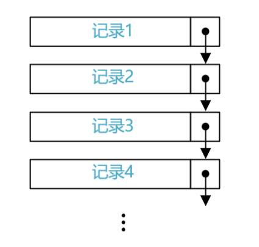
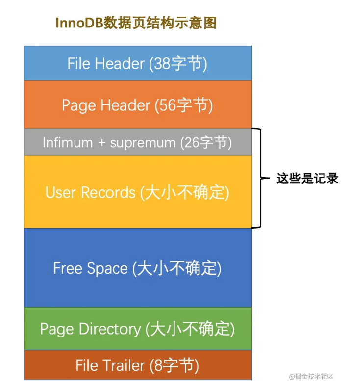
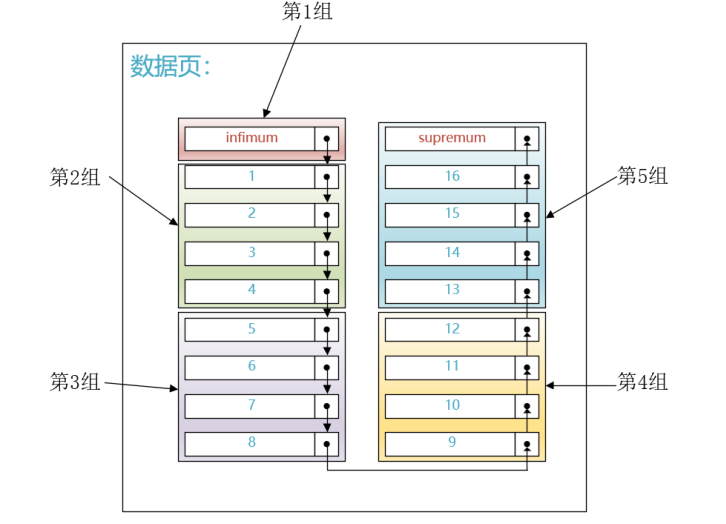
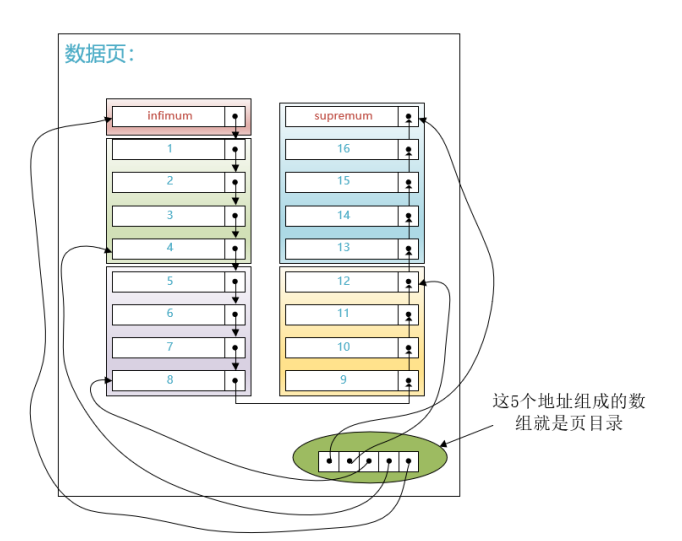
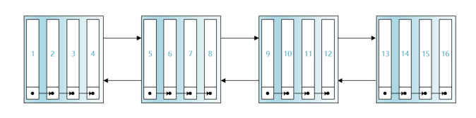
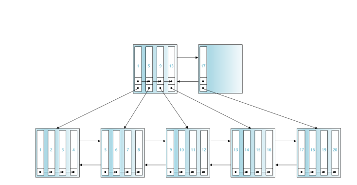
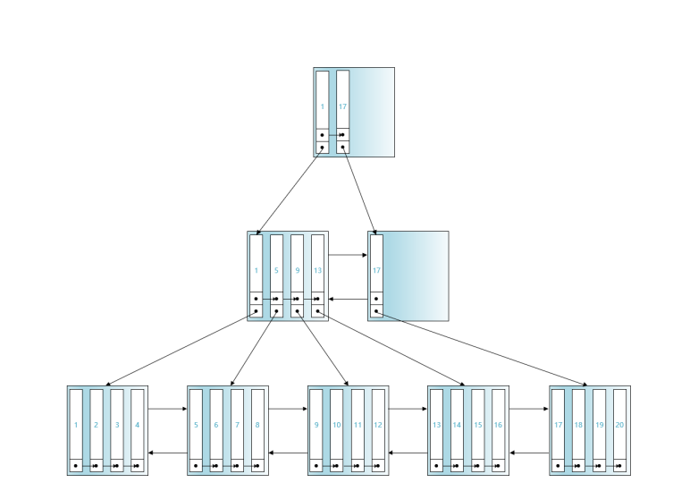

## 索引结构

不同的引擎所使用的存储数据结构不同，主要分为B+树、和Hash索引

#### B+树

- B+树是一个平衡的多叉树，层数为1~3层
- 同层级的节点间有指针相互链接，是有序的
- 非叶结点仅具有索引作用，跟记录有关的信息均存放在叶结点中
- 树的所有叶结点构成一个有序链表，可以按照关键码排序的次序遍历全部记录

#### Hash索引

##### 优点

- 采用 Hash 进行检索效率非常高，基本上一次检索就可以找到数据，而 B+ 树需要自顶向下依次查找，多次访问节点才能找到数据，中间需要多次 I/O 操作，理论上来说 Hash 比 B+ tree更快

##### 缺点

- 不支持范围查询
- 不支持索引完成排序
- 不支持联合索引的最左前缀匹配规则
- hash表在使用的时会将所有数据加载到内存，比较消耗内存

### 记录

一条记录分两部分存储：记录的额外信息和记录的真是数据。

其中额外信息中有一个2KB的`next_record`指针，通过该指针各条记录可以组成一个单向链表

单向链表中的记录的是有序的

### 页

而记录是存在于页中的

InnoDB通以页为单位从磁盘中加载数据，默认为16kb

- Infimum记录：本页最小记录
- Supremum记录：本页最大记录

#### 页目录

由于数据是通过链表存储起来的，为了解决快速搜索的问题，创建了一个`页目录`

将单向链表的记录分成若干组。然后将把每个组最大的那条记录在页面中的地址（就是距离页面第0个字节处的偏移量）取出来单 独放到页面中的一个部分。每个地址占用2个字节，多个地址就可以组成一个数组结构

页目录实际是一个指针数组，指针指向的位置是有序的。可以通过二分查找法定位到主键在哪个组里。

#### 多个页

在数据库中，肯定也不止一个页，当数据太多时，数据就会分散到不同页中。因此我们还需要考虑如何在多个页中快速定位到数据的位置

页中储存的除了数据记录外，还有两个指针（在File Header中）

- 一个指针指向上一页
- 一个指针指向下一页

如此一来，多个页就通过双向链表连接起来，而且InnoDB会保证每个页中存储记录的主键值不大于下一页的主键值

#### B+树

但是链表并不支持随机访问，在查询一个主键时，会需要循环链表，时间复杂度太高。

因此又引入了B+树的数据结构

在InnoDB中，会把每页最小的主键值提取出来，然后和该页的页号拼接成一个新的记录，为了和用户插入的记录区分开来，我们把用户插入的记录称作`用户记录`，这个新拼接成的称作`目录项记录`

那当数据再多起来时，当前的目录项记录的查找性能还是很低，因此进行了一个套娃操作，再增加了一层`目录项记录`

如此一来，各个页面就分为了三层。

当我们需要查找主键值为6的记录时，那么查找就分为了3步：

- 第一步：先通过第一层页面的页目录进行二分查找，因为1<6<17,因此我们就去第二层最左边的页中进一步查询
- 第二步：继续进行二分查找，5<6<9，所以主键6的用户记录在主键值为5的目录项记录所指向的页中
- 第三步：再次通过页目录通过2分查找法找到主键值为6的用户记录

