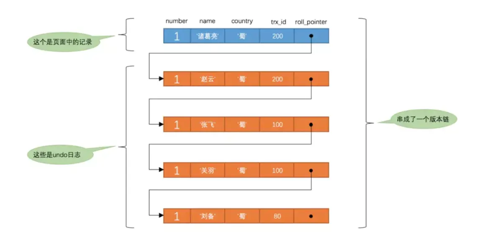

## MySQL

### 数据库三范式

#### 第一范式

数据库表中的所有字段值都是不可分解的原子值

#### 第二范式

确保每一个列都和主键相关，而不能只和主键的某一部分相关（联合主键），也就是说一个表中只能存一种数据，不可以把多种数据存在数据库中

#### 第三范式

表中的每一列数据都和直接直接相关，而不能间接相关

### MyISAM和InnoDB的区别

MyISAM是5.5版本以前的默认引擎。后面版本引入了InnoDB

- 是否支持行级锁：MyISAM只支持表级锁，而InnoDB支持行级锁和表级锁，默认为行级锁
- 是否支持事务和崩溃后的安全恢复：MyISAM强调的是性能，每次查询都具有原子性，其执行速度比InnoDB快,但不支持事务
- 是否支持外键:MyISAM不支持，InnoDB支持
- 是否支持MVCC：InnoDB支持，MVCC可以使用乐观锁和悲观锁来实现。MVCC仅在Read Committed和Repeatable Read两个隔离级别下工作

#### 索引

- MyISAM：B+Tree叶子节点的data域存放的是数据记录的地址。在检索时，首先按照B+Tree搜索算法，搜索索引，如果存在，取出data域的值，然后以data域的值为地址读取相应的数据记录。被称为："非聚簇索引"
- InnoDB:数据本身就是索引结构。B+Tree叶子节点的data域存放的是完整的数据记录。这个索引的key是数据表的主键，称为聚簇索引。其余的索引称为辅助索引，辅助索引需要两次查询，先查询到主键，然后再通过主键查询到数据

### 事务

事务：一组操作，要么都执行，要么都不执行

#### 四大特性

- 原子性：事务是最小的
- 一致性：事务执行前后，数据保持一致，多个事务对同一数据读取的结果都是相同的
- 隔离性：并发访问数据库时，一个事务不会被其他事务干扰。
- 持久性：一个事务提交后，对数据库的改变是永久的。

#### 事务实现原理（InnoDB）：

1. 使用redo log(重做日志)保证事务的持久性
2. 使用undo log(回滚日志)来保证事务的原子性
3. 通过锁机制、MVCC来保证事务的隔离性

保证了事务的持久性、原子性、隔离性之后，一致性才能得到保障。

#### 带来的问题

- 脏读：
- 丢失更改：
- 不可重复读：
- 幻读：

#### 事务隔离级别

InnoDB的隔离级别是Repeatable-Read

### MySQL中的锁

#### 锁粒度

- 行锁：行锁是作用在索引之上的，当命中索引时，那锁住的就是命中条件内的索引节点，行锁又可以分为读锁和写锁

- 表锁：没命中索引时，锁住的就是整个索引树
- 页锁：用于BDB引擎中，开销界于表锁和行锁之间，并发度一般

#### 锁兼容性

- 读锁：共享锁（S锁），多个事务可以同时读取同一个资源，但不允许其他事务修改。事务对数据A加上共享锁后，其他数据只能对数据A加上共享锁，而不能加上排他锁
- 写锁：排他锁（X锁），写锁会阻塞其他的写锁和读锁。事务对数据A加上排他锁后，其他数据不能对数据A加上任何锁

#### 锁模式：

- 记录锁：记录锁锁住的是索引记录，如果使用索引作为条件命中了记录，那么就是记录锁，被锁住的记录不能被别的事务插入相同的索引键值，修改和删除
- 间隙锁：当我们使用索引无论是等值还是范围查询，没有命中一条记录时候，加的就是间隙锁。间隙锁是对索引记录之间的间隙的锁定。
- 临间锁：记录锁和间隙锁的组合
- 意向锁：表级别的锁，MySQL中有两种意向锁：意向共享锁（IS）和意向排他锁(IX)
  - 在事务可以获取表中某行的共享锁前，必须获取表中的IS锁或者更强的锁；
  - 在事务可以获取，某行的排它锁前，必须获取该表中的IX锁。

### MVCC

MVCC (Multi-Version Concurrency Control) 多版本并发控制。基本思想是为每次事务生成一个新版本的数据，在读数据时选择不同版本的数据即可对事务结果的完整性读取。

MVCC只工作在REPEATABLE READ和READ COMMITED隔离级别下。

READ UNCOMMITED不是MVCC兼容的，因为查询不能找到适合他们事务版本的行版本；它们每次都只能读到最新的版本

SERIABLABLE也不与MVCC兼容，因为会对读取的行都加锁

聚簇索引在每行数据都增加了三个隐藏字段：

- trx_id: 存储每次对本行记录修改的事务ID
- roll_pointer: 每次对数据进行修改的时候，都会把老版本的写入undo日志中。roll_pointer就是存了一个指针，指向这个数据的上一个版本的位置。
- row_id:如果表中没有主键或者合适的唯一索引，那么聚簇索引会使用row_id的值来作为主键，这个id值是单调自增的。

所有的版本都会被`roll_pointer`属性连接成一个`链表`，我们把这个链表称之为`版本链`

#### Read View(读视图)

事务进行`快照读`的时候生产的`读视图`(Read View)，在该事务执行的快照读的那一刻，会生成数据库系统当前的一个`快照`。

包含几个属性：

- trx_ids:所有的未提交并活跃的事务ID列表
- up_limit_id:已提交事务中的最大事务ID+1(下一次要生成的事务ID值)
- low_limit_id:活跃列表中最小的事务ID
- create_trx_id:当前的事务ID

**Read Commited**: 事务中的每次select语句都会创建一个快照

**Repeatable Read**：在事务开始后的第一次select创建一个快照，后面的查询复用这个快照

##### 可见性判断

- 被访问的trx_id小于low_limit_id或者等于当前事务ID，代表当前事务是在Read View 创建前提交的，或者是自身事务修改的，可见
- 被访问的trx_id大于或者等于up_limit_id，代表该版本在生成Read View时，还未提交，不可见
- 被访问的trx_id是否在活跃事务列表中
  - 如果在,则说明生成Read View时，该事务还未提交，该版本不可见
  - 如果不在，则说明生成Read View时，该事务已经提交，该版本可见

### redo log、undo log、bin log

#### bin log

存储着每条变更的SQL语句（表和数据）（逻辑变化）

`redo log`**事务开始**的时候，就开始记录每次的变更信息

作用：

- 在主从结构中，通过bin log保证了从服务器与主服务器的数据一致
- 在数据库的数据被干掉时，可以通过bin log 进行恢复

#### redo log

MySQL的基本存储结构是**页**(记录都存在页里边)，所以MySQL是先把这条记录所在的**页**找到，然后把该页加载到内存中，将对应记录进行修改，内存写完了，然后会写一份`redo log`记载着这次**在某个页上做了什么修改**(物理变化)

`binlog`是在**事务提交**的时候才记录

作用：

- 持久化，如果数据库挂了，可以通过redo log来恢复内存还没来得及刷到磁盘的数据

  

MySQL需要保证`redo log`和`binlog`的**数据是一致**的

- 如果`redo log`写失败了，而`binlog`写成功了。那假设内存的数据还没来得及落磁盘，机器就挂掉了。那主从服务器的数据就不一致了。（从服务器通过`binlog`得到最新的数据，而主服务器由于`redo log`没有记载，没法恢复数据）
- 如果`redo log`写成功了，而`binlog`写失败了。那从服务器就拿不到最新的数据了。

MySQL通过两阶段提交来保证redo log 和 bin log的数据是一致的

- 阶段1：InnoDB`redo log` 写盘，InnoDB 事务进入 `prepare` 状态
- 阶段2：`binlog` 写盘，InooDB 事务进入 `commit` 状态
- 每个事务`binlog`的末尾，会记录一个 `XID event`，标志着事务是否提交成功，也就是说，恢复过程中，`binlog` 最后一个 XID event 之后的内容都应该被 purge。

#### undo log

`undo log`存储着修改之前的数据，相当于一个**前版本**

作用：

- 回滚
- 多版本控制(MVCC)

在数据修改的时候，不仅记录了`redo log`，还记录`undo log`，如果因为某些原因导致事务失败或回滚了，可以用`undo log`进行回滚

### 索引

#### 结构

##### B+树

- B+树是一个平衡的多叉树，层数为1~3层
- 同层级的节点间有指针相互链接，是有序的
- 非叶结点仅具有索引作用，跟记录有关的信息均存放在叶结点中
- 树的所有叶结点构成一个有序链表，可以按照关键码排序的次序遍历全部记录

##### Hash索引

###### 优点

- 采用 Hash 进行检索效率非常高，基本上一次检索就可以找到数据，而 B+ 树需要自顶向下依次查找，多次访问节点才能找到数据，中间需要多次 I/O 操作，理论上来说 Hash 比 B+ tree更快

###### 缺点

- 不支持范围查询
- 不支持索引完成排序
- 不支持联合索引的最左前缀匹配规则

#### 最左匹配原则

以最左边的为起点任何连续的索引都能匹配上。同时遇到范围查询(>、<、between、like)就会停止匹配。

#### 索引为什么能提升效？

- 数据索引的存储是 有序的
- 在有序的情况下, 通过索引查询一个数据是无需遍历所有记录的

#### 为什么主键通常建议使用自增ID？

聚簇索引的数据存放的物理结构和索引的顺序是一致的，即只要索引是相邻的，那么对应的数据也一定是相邻的存放在磁盘上。如果ID不是自增的，那插入数据时就会不断地调整数据的物理地址。但如果自增的，那就只需要一页一页地写，索引结构相对紧凑，磁盘碎片少，效率也高。

#### 索引失效

### MySQL优化手段

1. 优化表结构，选择字段合适的数据类型，数据长度
2. SQL优化，使用索引
3. 表数据量很大时，可以进行分表
4. 数据库参数配置优化，如最大连接数、数据库占用的内存等
5. 采用集群，主从复制，读写分离
6. 增加缓存层
7. 升级服务器配置

#### SQL优化：

1. 避免全表扫描，考虑在 where 及 order by 涉及的列上建立索引。
2. 避免在 where 子句中使用!=或<>操作符、or、in/not in
3. 避免在where对字段进行Null值判断
4. 避免前后都模糊匹配like "%adb%"
5. 避免在 where 子句中对字段进行表达式操作
6. 避免在where子句中对字段进行函数操作
7. 不要在 where 子句中的“=”左边进行函数、算术运算或其他表达式运算
8. .很多时候用 exists 代替 in 是一个好的选择
9. 尽量使用多表连接（join）查询（避免子查询）
10. 二者都能使用尽量使用where （与having比较）
    　　where 先过滤（数据就少了）再分组
11. 索引并不是越多越好，索引固然可以提高相应的 select 的效率，但同时也降低了 insert 及 update 的效率，因为 insert 或 update 时有可能会重建索引，所以怎样建索引需要慎重考虑
12. 任何地方都不要使用 select * from t ，用具体的字段列表代替“*”，不要返回用不到的任何字段
13. 较频繁地作为查询条件的字段，唯一性不太差的字段适合建立索引，更新不太频繁地字段适合创建索引，不会出现在where条件中的字段不该建立索引

### 分库分表

#### 好处

单机的存储能力、连接数有限，自身很容易成为系统的瓶颈。分库分表可以减少数据库的负担，缩短查询时间

#### 如何分库分表

分库分表就是要将大量数据分散到多个数据库中，核心理念是对数据进行切分

针对切分类型可以分为：

- 垂直切分
- 水平切分

##### 垂直切分

垂直切分可以分为垂直分库和垂直分表

###### 垂直分库

和微服务很像，将表按照业务分类进行划分，每个业务都有独立的数据库

###### 垂直分表

基于数据表的列为依据切分。是一种大表拆小标的方式

###### 优点：

- 业务间解耦，不同业务的数据进行独立的维护、监控、扩展
- 在高并发场景下，一定程度上缓解了数据库的压力

###### 缺点：

- 提升了开发的复杂度，由于业务的隔离性，很多表无法直接访问，必须通过接口方式聚合数据，
- 分布式事务管理难度增加
- 数据库还是存在单表数据量过大的问题，并未根本上解决，需要配合水平切分

##### 水平切分

将大数据量的表，切分成多个表结构相同，而每个表只占原表的一部分数据。

###### 库内分表

库内分表虽然将表拆分，但子表都还是在同一个数据库实例中

###### 分库分表

分库分表则是将切分出来的子表，分散到不同的数据库中，从而使得单个表的数据量变小，达到分布式的效果。

###### 优点：

- 解决高并发时单库数据量过大的问题，提升系统稳定性和负载能力
- 业务系统改造的工作量不是很大

###### 缺点：

- 跨分片的事务一致性难以保证
- 跨库的join关联查询性能较差
- 扩容的难度和维护量较大，（拆分成几千张子表想想都恐怖）

##### 数据该往哪个库的表存？

###### 根据取值范围

如根据时间区间和ID区间切分，如定义每个库只存10000条数据，那第一个库Id就是1~9999，第二个库就是10000~20000

**优点**：

- 单表数据量是可控的
- 能快速定位要查询的数据在哪个库

**缺点**：

- 由于连续分片可能存在数据热点，如果按时间字段分片，有些分片存储最近时间段内的数据，可能会被频繁的读写，而有些分片存储的历史数据，则很少被查询

###### hash取模

hash取模mod（**对hash结果取余数 (hash() mod N)**）的切分方式比较常见

对数据库从0到N-1进行编号，对`User表`中`userId`字段进行取模，得到余数`i`，`i=0`存第一个库，`i=1`存第二个库，`i=2`存第三个库....以此类推。

**优点：**

- 数据分片相对比较均匀，不易出现某个库并发访问的问题

**缺点：**

- 但这种算法存在一些问题，当某一台机器宕机，本应该落在该数据库的请求就无法得到正确的处理，这时宕掉的实例会被踢出集群，此时算法变成hash(userId) mod N-1，用户信息可能就不再在同一个库中。

##### 存在的坑

###### 1、事务一致性问题

由于表分布在不同库中，不可避免会带来跨库事务问题。一般可使用"XA协议"和"两阶段提交"处理，但是这种方式性能较差，代码开发量也比较大。

通常做法是做到最终一致性的方案，往往不苛求系统的实时一致性，只要在允许的时间段内达到最终一致性即可，可采用事务补偿的方式。

###### 2、分页、排序的坑

日常开发中分页、排序是必备功能，而多库进行查询时limit分页、order by排序，着实让人比较头疼。
分页需按照指定字段进行排序，如果排序字段恰好是分片字段时，通过分片规则就很容易定位到分片的位置；一旦排序字段非分片字段时，就需要先在不同的分片节点中将数据进行排序并返回，然后将不同分片返回的结果集进行汇总和再次排序，最终返回给用户，过程比较复杂。

###### 3、全局唯一主键问题

由于分库分表后，表中的数据同时存在于多个数据库，而某个分区数据库的自增主键已经无法满足全局

唯一，所以此时一个能够生成全局唯一ID的系统是非常必要的。那么这个全局唯一ID就叫`分布式ID`

#### 清空数据库SQL 

SELECT CONCAT('truncate table ',TABLE_NAME,';') AS a FROM INFORMATION_SCHEMA.TABLES WHERE TABLE_SCHEMA = 'db_member' ;

