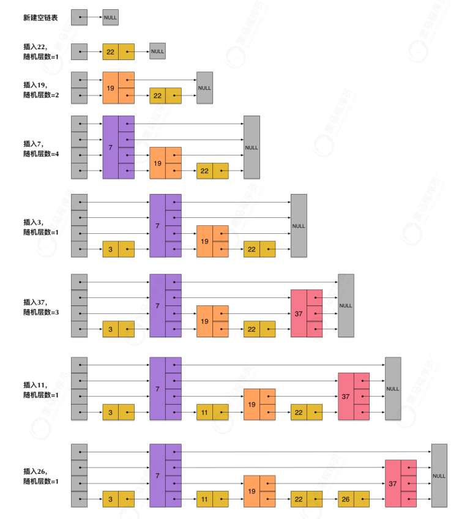

## Redis

### 常见数据结构及使用场景

##### String

1. **介绍**：string 数据结构是简单的 key-value 类型

2. **常用命令：** `set,get,strlen,exists,decr,incr,setex` 等等。

3. **应用场景：** 一般常用在需要计数的场景，比如用户的访问次数、热点文章的点赞转发数量等等。

   

##### list

1. **介绍**：Redis 的 list 的实现为一个 **双向链表**，即可以支持反向查找和遍历
2. **常用命令:** `rpush,lpop,lpush,rpop,lrange,llen` 等。
3. **应用场景:** 发布与订阅或者说消息队列、慢查询。


##### hash

1. **介绍**：hash 类似于 JDK1.8 前的 HashMap，内部实现也差不多(数组 + 链表)。另外，hash 是一个 string 类型的 field 和 value 的映射表，**特别适合用于存储对象**，可以用来存储用户信息，商品信息等等。
2. **常用命令:** `hset,hmset,hexists,hget,hgetall,hkeys,hvals` 等。
3. **应用场景:** 系统中对象数据的存储。


##### set

1. **介绍**：set 类似于 Java 中的 `HashSet` 。Redis 中的 set 类型是一种无序集合，集合中的元素没有先后顺序。可以基于 set 轻易实现交集、并集、差集的操作。
2. **常用命令:** `sadd,spop,smembers,sismember,scard,sinterstore,sunion` 等。
3. **应用场景:** 需要存放的数据不能重复以及需要获取多个数据源交集和并集等场景


##### sorted set

1. **介绍**：和 set 相比，sorted set 增加了一个权重参数 score，使得集合中的元素能够按 score 进行有序排列，还可以通过 score 的范围来获取元素的列表

2. **常用命令:** `zadd,zcard,zscore,zrange,zrevrange,zrem` 等。

3. **应用场景:** 需要对数据根据某个权重进行排序的场景。比如在直播系统中，实时排行信息包含直播间在线用户列表，各种礼物排行榜，弹幕消息（可以理解为按消息维度的消息排行榜）等信息。


### 底层数据结构


#### 字符串

Redis构建了一个叫做简单动态字符串（simple dynamic string，SDS）


在Redis中，包含字符串值的键值对底层都是用SDS实现的


##### Redis 3.2前

```c++
struct sdshdr{
     //记录buf数组中已使用字节的数量
     //等于 SDS 保存字符串的长度
     int len;
     //记录 buf 数组中未使用字节的数量
     int free;
     //字节数组，用于保存字符串
     char buf[];
}
```


##### Redis 3.2后

```c++
struct  sdshdr8 {
        uint8_t len; /* 记录当前已使用的字节数 */
        uint8_t alloc; /* 记录当前字节数组总共分配的字节数量 */
    	//标记当前字节数组的属性，是sdshdr8还是sdshdr16等，flags值的定义可以看下面代码
        unsigned char flags; 
        char buf[]; //字节数组，用于保存字符串，包括结尾空白字符
    };
```


#### 链表

链表在Redis中应用的非常广，列表（List）的底层实现就是链表。此外，Redis的发布与订阅、慢查询、监视器等功能也用到了链表

- listNode

```c++
typedef struct listNode {
    // 前置节点
    struct listNode *prev;
    // 后置节点
    struct listNode *next;
    // 节点值
    void *value;
} listNode;
```

- list

```c++
typedef struct list {
    // 链表头节点
    listNode *head;
    // 链表尾节点
    listNode *tail;
    // 节点值复制函数
    void *(*dup)(void *ptr);
    // 节点值释放函数
    void (*free)(void *ptr);
    // 节点值对比函数
    int (*match)(void *ptr, void *key);
    // 链表所包含的节点数量
    unsigned long len;
} list;
```


#### 字典

Redis的字典底层是使用**哈希表**实现的，一个哈希表里面可以有多个**哈希表节点**，每个哈希表节点中保存了字典中的一个**键值对**


- dictht

  ```c++
  typedef struct dictht {
      // 哈希表数组
      dictEntry **table;
      // 哈希表大小
      unsigned long size;
      // 哈希表大小掩码，用于计算索引值，等于size-1
      unsigned long sizemask;
      // 哈希表已有节点的数量
      unsigned long used;
  } dictht;
  ```

  

- dictEntry

  ```c++
  typedef struct dictEntry {
      // 键
      void *key;
      // 值
      union {
          void *val;
          uint64_t u64;
          int64_t s64;
          double d;
      } v;
      // 指向下一个哈希表节点，形成链表
      struct dictEntry *next;
  } dictEntry;
  ```

  

- dict

```c++
typedef struct dict {
    // 和类型相关的处理函数
    dictType *type;
    // 私有数据
    void *privdata;
    // 哈希表
    dictht ht[2];
    // rehash 索引，当rehash不再进行时，值为-1
    long rehashidx; /* rehashing not in progress if rehashidx == -1 */
    // 迭代器数量
    unsigned long iterators; /* number of iterators currently running */
} dict;
```


##### 增量式重Hash

`dict`的`ht`属性是两个元素的数组，包含两个`dictht`哈希表，一般字典只使用`ht[0]`哈希表，`ht[1]`哈希表会在对`ht[0]`哈希表进行`rehash`（重哈希）的时候使用，即当哈希表的键值对数量超过负载数量过多的时候，会将键值对迁移到`ht[1]`上


- 当进行扩容时，会跟Java的HashMap一样，扩容之后的大小为大于used*2的2的n次方的最小值

- 使用rahashidx记录当前扩容的数组下标
- 整个过程的重点在于rehashidx，其为第一个数组正在移动的下标位置，如果当前内存不够，或者操作系统繁忙，扩容的过程可以随时停止。
- 如果是新增，则直接新增后第二个数组，因为如果新增到第一个数组，以后还是要移过来，没必要浪费时间
- 如果是删除，更新，查询，则先查找第一个数组，如果没找到，则再查询第二个数组。


#### 跳表

跳跃表其实可以把它理解为**多层的链表**，它有如下的性质

- **多层**的结构组成，每层是一个**有序的链表**
- 最底层（level 1）的链表包含所有的元素
- 跳跃表的查找次数近似于层数，时间复杂度为O(logn)，插入、删除也为 O(logn)
- 跳跃表是一种随机化的数据结构(通过抛硬币来决定层数)




- zskiplist

  ```c++
  typedef struct zskiplist {
      // 表头节点和表尾节点
      struct zskiplistNode *header, *tail;
      // 表中节点的数量
      unsigned long length;
      // 表中层数最大的节点的层数
      int level;
  } zskiplist;
  ```


- zskiplistNode

  ```c++
  typedef struct zskiplistNode {
      // 成员对象 （robj *obj;）
      sds ele;
      // 分值
      double score;
      // 后退指针
      struct zskiplistNode *backward;
      // 层
      struct zskiplist Level {
          // 前进指针
          struct zskiplistNode *forward;
          // 跨度
          // 跨度实际上是用来计算元素排名(rank)的，在查找某个节点的过程中，将沿途访过的所有层的跨度累积起来，得到的结果就是目标节点在跳跃表中的排位
          unsigned long span;
      } level[];
  } zskiplistNode;
  ```


`zskiplist`的头结点不是一个有效的节点，它有**ZSKIPLIST_MAXLEVEL**层(32层)，每层的`forward`指向该层跳跃表的第一个节点，若没有则为NULL，在Redis中，上面的跳跃表结构如下


### 如何判断是否为过期数据

Redis通过一个叫做过期字典（可以看做HashMap）来保存数据.过期字典的key指向Redis的某个键。值是一个Long long整数，保存的是过期时间


#### 过期策略

- 惰性删除：只在取出Key时对数据进行检查。对CPU好，但是会造成太多过期key没删除
- 定期删除：每隔一段时间抽取一批key执行删除过期key操作。并且Reids底层会通过限制删除操作执行的时长和频率来减少对CPU的影响

Redis采用定期删除+惰性删除

为了避免大量过期的Key堆积在内存，采用内存淘汰机制


### 内存淘汰机制

1. Volatile-lru:从已设置过期时间的数据集，挑选最少使用的数据淘汰
2. Volatile-ttl:从已设置过期时间的数据集，挑选即将过期的数据淘汰
3. Volatile-random:从已设置过期时间的数据集，随机挑选数据淘汰
4. Allkey-lru:当内存不足以容纳写入新数据时，移除最少使用的Key
5. Allkeys-random:从数据集随机淘汰key
6. no-eviction:不足以容纳新数据时，报错
7. Volatile-lfu:从已设置过期时间的数据集，挑选最不经常使用的数据淘汰
8. Allkeys-lfu:当内存不足以容纳写入新数据时，移除最不经常使用的Key


### 持久化操作

RDB:创建快照来存储在内存里面的数据在某个时间点上的副本

AOF:每执行一条更改Redis中数据的命令，都会将该命令写入硬盘中的AOF文件

4.0后：混合


### 缓存穿透

大量请求的key根本不存在缓存中，直接请求到了数据库上。

解决：

1. 缓存无效Key
2. 布隆过滤器


### 布隆过滤器

1. 使用布隆过滤器中的哈希函数对元素值计算，得到哈希值

2. 根据得到的哈希值，在位数组中把对应的下标置为1.

判断：

1. 对给定元素再次进行相同的哈希计算
2. 得到值后判断位数组中的每个元素是否都为1，如果都为1，则说明存在布隆过滤器中，不为1，说明该元素不在。

在布隆过滤器，不一定key存在缓存中，因为不同的字符串可能哈希出来的位置相同。（可以增加位数组大小或者调整哈希函数）


### 缓存雪崩

缓存在同一时间里大量失效，后面的请求直接落到数据库上。

针对Reids服务不可用的解决：

1. 采用Redis集群，避免单机出现问题导致整个缓存服务都无法使用
2. 限流，避免同时处理大量请求

针对热点失效的解决：

1. 设置不同的失效时间
2. 缓存永不失效


### 分布式锁

- 加锁，给Key设置一个值，并设置过期时间，避免死锁

  set lock_key random_value nx px 5000

- 解锁：用lua脚本保证解锁的原子性，判断当前锁的字符串是否于传入的值相等，是的话删除key


### 集群

**Master用于写，多个Slave用于读操作。**


主从同步和从从同步：主节点首先执行BGSAVE操作，并将后续修改数据等操作记录到Buffer中，完成后将AOF文件全量同步到从节点，从节点将数据同步到缓存中并通知主节点将期间操作的数据记录同步过来。即两个过程，全同步和增量同步过程


### 哨兵

- 监控：检查主从服务器是否正常
- 提醒：当某个服务器异常时，通过api发送通知
- 自动故障迁移:当一个主服务器不能使用时，会将失效的主服务器的其中一个从服务器升为新的主服务器

