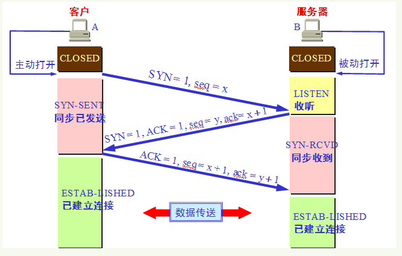

## 计算机网络

### 三次握手的过程

- 客户端发送一个带有SYN标志的数据包
- 服务端接收到后发送带有SYN/ACK 标志的数据包
- 客户端发送带有ACK标志的数据包

#### 为什么需要三次握手

目的是建立可靠的通信通道，确保双方的接收和发送都是正常的

### 四次挥手的过程

- 客户端发送一个FIN，用来关闭客户端到服务器的数据传送。

- 服务端收到FIN后，会发回一个ACK,确认序号为收到的序号加1。

- 服务端发送一个FIN给客户端。

- 客户端发挥ACK报文确认。

  

#### 为什么要四次挥手

- 任何一方在数据传输结束后可以发送连接释放通知，待对方确认后处于半关闭状态。当另一方也没用数据要发送时，则发出连接释放通知，对方确认后就完全关闭了TCP连接

### TCP和UDP的区别

UDP：无连接，不可靠，效率高，需要资源少，面向报文。应用场景：要求通信速度高：视频，直播，语音

TCP：有连接，可靠，效率低，需要资源多，面向字节流，有拥塞控制，超时重传等机制

#### TCP是如果保证可靠性传输的

1. 应用数据被分割成TCP认为最适合传输的数据块
2. TCP把每个包编号，接收方对数据包进行排序。
3. **校验和**：TCP将保持它首部和数据的校验合，目的是检测数据在传输过程中的任何变化，如果收到端的校验和有差错，TCP将丢弃这个报文段和不确认收到该报文段
4. TCP的接收端会丢弃接收到的重复数据
5. **流量控制**：当接收端来不及处理发送方的数据的时候，能提示发送方降低发送的速率（滑动窗口）
6. **拥塞控制**：当网络阻塞时，减少数据的发送
7. **ARQ协议**：发完一个分组以后就停止发送，等待对方确认，在收到确认后再发送下一个分组
8. **超时重传**：当TCP发送一个段后，它启动一个定时器，等待目的端确认收到这个报文段，如果不能及时收到确认，将重发这个报文段

### HTTPS和HTTP的区别

#### HTTP 

是互联网应用上最广泛的一种网络协议，基于TCP协议，可以使浏览器工作更加高效，使网络传输减少。端口80

#### HTTPS

是HTTP的加强版，可以认为是HTTP+SSL(Secure Socket Layer)。在HTTP的基础上增加了一系列的安全机制。一方面是保证了数据的传输的安全，另一方面对访问者增加了验证机制。是目前架构下，最为安全的解决方案。端口443

### HTTP/1.0和HTTP/1.1

1. 连接方式

   - 1.0默认使用短链接，当客户端和服务器每进行一次HTTP操作，就建立一次连接，任务结束就中断。例如当客户端浏览器访问某个HTML网页时，每遇到一个js文件，图片文件，CSS都会重新建立一个TCP连接
   - 1.1默认使用长链接，当一个网页打开完成后，TCP连接不会关闭，客户端再次访问这个服务器的时候，会继续使用这个连接

2. 状态码

   1.1增加了大量的状态码

3. 缓存处理不同

4. 1.1在请求头加入了Host字段

### 浏览器输入URL地址->显示主页的过程

1. 浏览器查找域名的IP地址。

   (DNS解析：浏览器缓存，路由器缓存，DNS缓存）

2. 通过三次握手建立TCP连接

3. 浏览器向WEB服务器发送一个HTTP请求

4. 服务器处理请求

5. 服务器返回一个HTTP响应

6. 浏览器解析并渲染页面

### cookie和Session的区别

- cookie:一般用来保存用户信息，存在于客户端
- session:服务端用来记录用户的状态，存在于服务端

seesion比cookie安全性高

### 状态码

200 OK                        //客户端请求成功

301 Moved Permanently   //永久重定向,使用域名跳转

302 Found                                         //  临时重定向,未登陆的用户访问用户中心重定向到登录页面

400 Bad Request               //客户端请求有语法错误，不能被服务器所理解

401 Unauthorized              //请求未经授权，这个状态代码必须和WWW-Authenticate报头域一起使用

403 Forbidden                 //服务器收到请求，但是拒绝提供服务

404 Not Found                 //请求资源不存在，eg：输入了错误的URL

500 Internal Server Error     //服务器发生不可预期的错误

503 Server Unavailable        //服务器当前不能处理客户端的请求，一段时间后可能恢复正常

