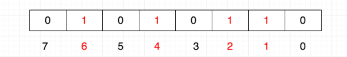
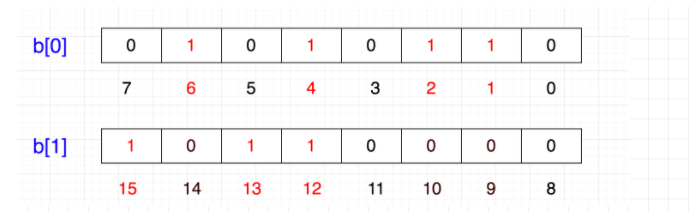
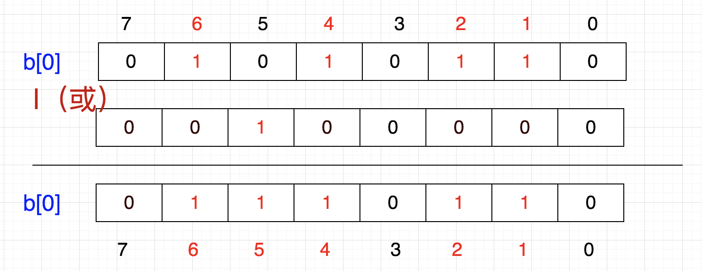
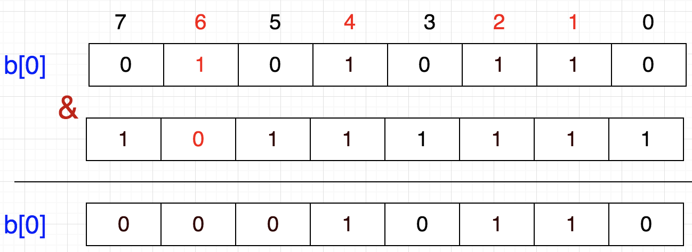

## BitMap

### 基本思想

用一个bit位来标记某个元素对应的Value，而Key即是该元素。由于采用了Bit为单位来存储数据，因此在存储空间方面，可以大大节省。（PS：划重点 **节省存储空间**）

常用于去重、快速查找、排序

假设有这样一个需求：

在20亿个随机整数中找出某个数m是否存在其中，并假设32位操作系统，4G 内存

int 占4字节，1 byte=8  bit

假定每个数都用int储存，那么需要的内存为2,000,000,000*4/1024/1024/1024≈**7.45 **G

但是如果按位存储，那么仅需要2,000,000,000/8/1024/1024/1024=**0.233**G

### 存储结构

给定一个长度为8的bitmap,假设需要存储1 2 4 6 这几个数

计算机内存分配的最小单位是字节，也就是8位，那如果要表示12、13、15就需要在另一个8位上表示

但是这样会形成一个二位数组，所以我们可以优化一下，申请一个int数组长度为int tmp[1+N/32]即可存储，其中N表示要存储的这些数的最大值。

> tmp[0]：表示0~31
>
> tmp[1]：表示32~63
>
> tmp[2]：表示64~95

所以，给定一个整数M，可以通过M/32得到数组下标，M%32得到在此下标中的位置

### 增删改查

ps：增删改查需要用到如下的位运算

- |（或）有1得1：

   `0 | 1 = 1`	`0 | 0 = 0` 	 `1 | 1 = 1`

- &  (与)	双1得1:

  `0 & 1 = 0`	  `0 & 0 =0 ` 	`1 & 1 = 1`

- ^（异或）不同得1：

  `0 & 1 = 1`	  `0 & 0 =0 ` 	`1 & 1 = 0`

#### 添加：

**将1左移带代表该数字的那一位，然后与原数进行按位或操作**

例如我们需要添加一个数`5`。

1. 我们首先的需要得到数组的下标：`5/8=0`
2. 然后计算在数组中的位置：`5%8=5`
3. 说明在temp[0]中的第五个位置，然后我们让b[0]与1<<5相与就得到了插入后的数组

相当于

b[0] = b[0] | (1<<5)	  =>	86|(1<<5)=118 

#### 清除

**将1左移带代表该数字的那一位，然后取反与原数进行按位与操作**

例如需要将6移除 `6/8=0`，`6%8=6`

b[0] = b[0] & (~(1<<6))

#### 查找

在位数中，1代表存在，0代表不存在。

**将1左移带代表该数字的那一位，然后取反与原数进行按位与操作，值不变代表不在，变了代表存**

b[0] == b[0] & (~(1<<6))

### 排序

假设我们要对0-7内的5个元素(4,7,2,5,3)排序（这里假设这些元素没有重复）,我们就可以采用Bit-map的方法来达到排序的目的。

要表示8个数，我们就只需要8个Bit（1Bytes），首先我们开辟1Byte的空间，将这些空间的所有Bit位都置为0，然后将对应位置为1。

最后，遍历一遍Bit区域，将该位是一的位的编号输出（2，3，4，5，7），这样就达到了排序的目的，时间复杂度O(n)。

优点：

- 运算效率高，不需要进行比较和移位；
- 占用内存少，比如N=10000000；只需占用内存为N/8=1250000Byte=1.25M

缺点：

- 所有的数据不能重复。即不可对重复的数据进行排序和查找。
- 只有当数据比较密集时才有优势

### 快速去重

20亿个整数中找出不重复的整数的个数，内存不足以容纳这20亿个整数。 

首先，根据“内存空间不足以容纳这05亿个整数”我们可以快速的联想到Bit-map。下边关键的问题就是怎么设计我们的Bit-map来表示这20亿个数字的状态了。其实这个问题很简单，一个数字的状态只有三种，分别为不存在，只有一个，有重复。因此，我们只需要2bits就可以对一个数字的状态进行存储了，假设我们设定一个数字不存在为00，存在一次01，存在两次及其以上为11。那我们大概需要存储空间2G左右。

接下来的任务就是把这20亿个数字放进去（存储），如果对应的状态位为00，则将其变为01，表示存在一次；如果对应的状态位为01，则将其变为11，表示已经有一个了，即出现多次；如果为11，则对应的状态位保持不变，仍表示出现多次。

最后，统计状态位为01的个数，就得到了不重复的数字个数，时间复杂度为O(n)。

### 快速查找

int数组中的一个元素是4字节占32位，那么除以32就知道元素的下标，对32求余数（%32）就知道它在哪一位，如果该位是1，则表示存在。

