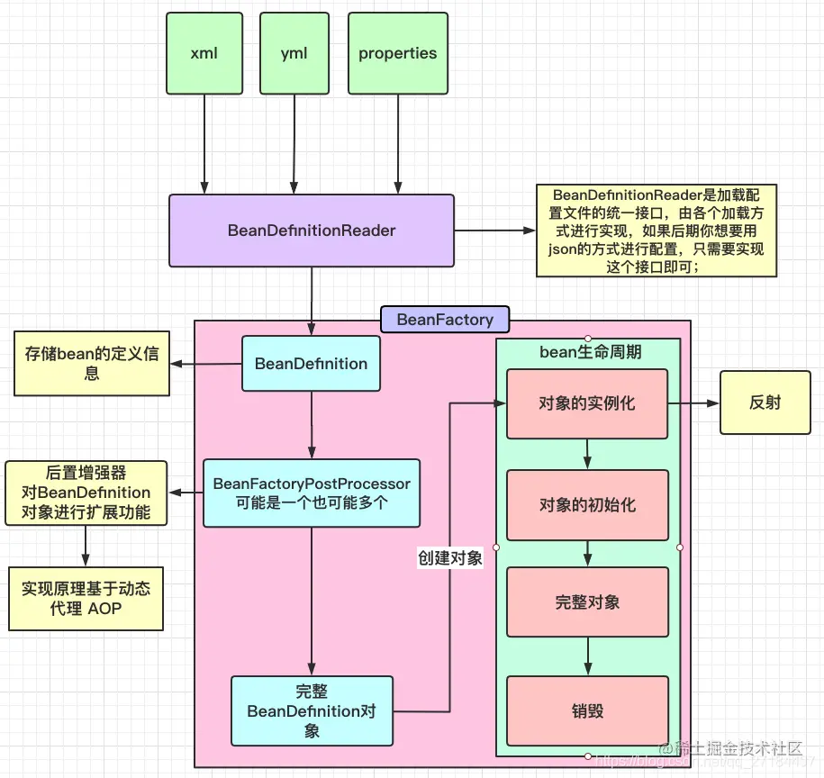
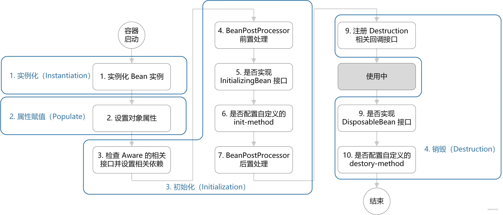
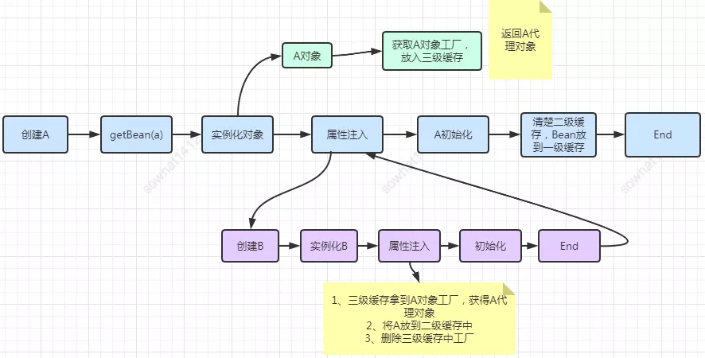

## Spring


### 用到了哪些设计模式？


1. 工厂设计模式：比如通过BeanFactory和ApplicationContext来生产Bean对象
2. 代理设计模式：AOP的实现方式就是通过代理来实现的，Spring主要使用的是JDK动态代理和静态代理
3. 单例模式：Spring中的Bean默认都是单例的
4. 模板方法：Spring中JdbcTemplate等以Template结尾的对数据库操作的类，都会使用到模板方法设计模式，一些通用的功能
5. 包装器设计模式：项目需要连接不同的项目，而且不同的客户在每次访问中根据需要会去访问不同的数据库。这种模式让我们可以根据客户的需求能够动态切换不同的数据源
6. 观察者模式：Spring事件驱动模型观察者模式
7. 适配器模式：Spring AOP 的增强或通知（Advice）使用到了适配器模式


### 什么spring框架？

Spring是按照设计模式精心打造的，实现工厂模式的工厂类，这个类名为BeanFactory(接口)

Spring的核心是IOC，AOP


#### IOC

IOC（控制反转），是一种设计思想。将原本在程序中手动创建对象的控制权交给spring来管理。IOC容器是spring用来实现IOC的载体，IOC容器实际上就是MAP,MAP中存放的是各种对象。IOC容器就像是一个工厂一样，当我们需要创建一个对象的时候，只需要配置好文件/注解即可。完全不用考虑对象是如何被创建出来的。


三种注入方式：1.接口注入	2.构造器注入 	3.Setter方法


#### AOP

AOP(面向切面编程)，系统中有很多不相干的类吗，在这众多的方法中加入某种系统功能的代码，如日志，权限控制，事务处理等等。AOP可以降低系统的重复代码，降低模块之间的耦合度。

AOP是基于动态代理实现的。


AOP在spring中主要表现在两个方面：提供声明式的事务管理，和支持用户自定义切面。


### spring事务有几种方式？

1. 编程式事务，在代码中硬编码。（不推荐使用）

2. 声明式事务，在配置文件中配置。


声明式事务又分为两种：

1. 基于xml
2. 基于注解


### Bean的作用域？

- singleton:单例，Spring中的Bean默认都是单例的
- Prototype:每次请求都会创建新的Bean实例
- Request:每次HTTP请求都会创建一个新的Bean,该Bean只在当前的Http Request中有效
- Session:每次HTTP请求都会创建一个新的Bean,该Bean只在当前的Http Session中有效
- Global-session：全局seesion作用域，spring5已经没有了


##### 单例模式的线程安全处理：

1. 在Bean对象中尽量避免定义可变的成员变量
2. 在类中定义一个ThreadLocal成员变量，将需要的可变成员变量保存在ThreadLocal中


### Spring IOC的加载过程



1. `Bean`容器找到配置文件中的`Spring Bean`定义，`Spring`所管理的`Bean`使用`BeanDefiniton`来描述对象信息（如：@Lazy，@Scope，@DependsOn等）
2. 然后会把这些信息放到一个`BeanDefinitionMap`中，这个map的key是`BeanName`，value则是`BeanDefinition`对象
3. 然后遍历整个Map，中间通过执行`BeanFactoryPostProcessor`的后置处理器，可以对bean的定义信息进行统一的修改
4. 在 `BeanDefiniton`和完整`BeanDefinition` 
5. 接下来开始走Bean的生命周期，也就是实例化到销毁的过程；


### Bean的生命周期




1. 通过反射，选择合适的构造器把对象实例化
1. 给对象变量赋值
2. 给容器属性赋值，判断该Bean是否实现了相关的Aware接口的方法，如果存在则填充相关资源。如实现`ApplicationContextAware`接口，通过获取`ApplicationContext`对象进而获取`Spring Bean`，实现`ApplicationEventPublisherAware`接口来实现事件发布器
3. 然后到了初始化阶段，先执行`BeanPostProcessor`后置处理器相关子类的`before`方法，这个`BeanPostProcessor`的子类`AnnotationAwareAspectJAutoProxyCreator`是AOP实现的关键
4. 执行init相关方法，比如`@PostConstruct`、实现了`InitializingBean`接口、定义的`init-method`方法
5. 接着执行`BeanPostProcessor`后置处理器相关子类的`after`方法
6. 然后就可以获取对象取使用了
7. 销毁阶段
   - 单例：执行`destroy()`方法
   - 原型：返回bean给用户，剩余生命周期让用户控制


#### 循环依赖

```java
@Component
public class A {
    // A中注入了B
    @Autowired
    private B b;
}

@Component
public class B {
    // B中注入了A
    @Autowired
    private A a;
}


@Component
public class C {
    // C中注入了C
    @Autowired
    private C c;
}
```


Spirng Bean的创建分为两步

- 当前对象实例化
- 对象属性赋值


Spring通过三级缓存来解决循环依赖，其中一级缓存为单例池（singletonObjects），二级缓存为早期曝光对象earlySingletonObjects，三级缓存为早期曝光对象工厂（singletonFactories）。


当A、B对象发生循环引用时，在A完成实例化后，就使用实例化后的对象取创建一个`对象工厂`，如果A被AOP代理的话，那么获取到的就是AOP的代理对象，否则，获取到的就是A实例化后的对象。


在A进行属性注入时，会去创建B，同时B又依赖于A，所以创建B的同时又会去调用getBean()来获取需要的依赖

此时A就是从缓存中获取

>第一步：先获取到三级缓存中的工厂；
>
>第二步：调用对象工工厂的getObject方法来获取到对应的对象，得到这个对象后将其注入到B中。紧接着B会走完它的生命周期流程，包括初始化、后置处理器等。
>
>第三步：当B创建完后，会将B再注入到A中，此时A再完成它的整个生命周期。至此，循环依赖结束！





#### 只用二级缓存能否解决循环依赖？

如果只使用二级缓存，那就意味着在对象实例化后就要完成AOP代理，但这违背了Spring的设计原则，因为Spring设计之初就是通过`AnnotationAwareAspectJAutoProxyCreator`后置处理器来在Bean生命周期的初始化后才完成AOP代理的，而不是在实例化后立即进行AOP代理。


#### 为什么要使用二级缓存？

为了性能，直接从三级缓存的工厂中创建出对象，再扔到二级缓存中，避免每次都从工厂里面拿。


### 事务隔离级别

1. Default:使用后端数据库默认的隔离级别，mqsql :repeatable_read  oracle:read_commited
2. Read_uncommitted:最低的隔离级别，允许读取尚未提交的数据变更。可能会造成脏读，幻读或不可重复读
3. Read_Committed：允许读取并发事务已经提交的数据，可以阻止脏读
4. Repeatable_Read:对同一个字段的多次读取结果都是一致的，除非是被本身事务所修改的。可以阻止脏读，不可重复读
5. Serializable:各个事务逐个执行，会影响程序性能


### 事务传播行为

支持当前事务的情况：

- Required:如果当前存在事务，则加入该事务；没有则创建一个事务
- Supports:存在则加入，否则以非事务方式运行
- Mandatory:存在则加入，否则抛出异常

不支持当前事务的情况：

-  Requires_New:创建一个新的事务，如果当前存在事务，则把当前事务挂起
-  Not_Support:以非事务方式运行，如果当前存在事务，则把当前是事务挂起
-  Never:以非事务方式运行，如果当前存在事务，则抛出异常

其他：

- Nested:如果当前存在事务，则创建一个事务作为当前事务的嵌套事务运行，否则创建一个事务


### SpirngMVC工作原理

1. 客户端发送请求，直接请求到DispatcherServlet
2. DispatcherServlet根据请求信息调动HandlerMappping，解析请求对应的Handler。
3. 解析到对应的Handler后（controller控制器），开始由HandlerAdapter适配器处理。
4. HandlerAdapter会根据Handler来调用真正的处理器来处理请求，并处理相应的业务逻辑
5. 处理器处理完业务后，会返回一个ModelAndView对象，Model是返回的数据对象，View是逻辑上的View。
6. ViewResolbver会根据逻辑的View查找数据的View。
7. DispatcherServlet把返回的Model传给View(视图渲染)。
8. 把View返回给请求者（浏览器）。


### SpringBoot的优点

1. 开发基于 Spring 的应用程序很容易。
2. Spring Boot 项目所需的开发或工程时间明显减少，通常会提高整体生产力。
3. Spring Boot 不需要编写大量样板代码、XML 配置和注释。
4. Spring 引导应用程序可以很容易地与 Spring 生态系统集成，如 Spring JDBC、Spring ORM、Spring Data、Spring Security 等。
5. Spring Boot 应用程序提供嵌入式 HTTP 服务器，如 Tomcat 和 Jetty，可以轻松地开发和测试 web 应用程序。


### SpringBoot的自动装配原理

这个是因为`@SpringBootApplication`注解的原因

`SpringBootApplication`可以看作是`@Configuration`、`@EnableAutoConfiguration`、`@ComponentScan`注解的集合。

- `EnableAutoConfiguration`:启动SpringBoot的自动配置机制
- `@ComponentScan`:扫描被`@Component`(`@Servcie`,`@Controller`)注解的bean，注解默认会扫描该类下所在的包的所有的类。
- `@Configuration`:允许在上下文中注册额外的bean或者导入其他配置类

