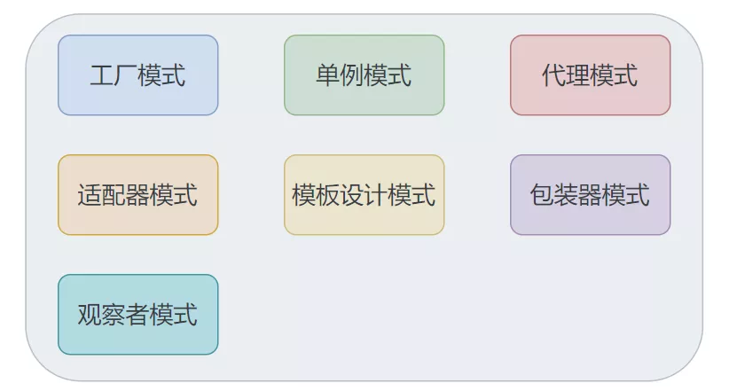

## Spring

### 用到了哪些设计模式？

1. 工厂设计模式：比如通过BeanFactory和ApplicationContext来生产Bean对象
2. 代理设计模式：AOP的实现方式就是通过代理来实现的，Spring主要使用的是JDK动态代理和静态代理
3. 单例模式：Spring中的Bean默认都是单例的
4. 模板方法：Spring中JdbcTemplate等以Template结尾的对数据库操作的类，都会使用到模板方法设计模式，一些通用的功能
5. 包装器设计模式：项目需要连接不同的项目，而且不同的客户在每次访问中根据需要会去访问不同的数据库。这种模式让我们可以根据客户的需求能够动态切换不同的数据源
6. 观察者模式：Spring事件驱动模型观察者模式
7. 适配器模式：Spring AOP 的增强或通知（Advice）使用到了适配器模式

### 什么spring框架？

Spring是按照设计模式精心打造的，实现工厂模式的工厂类，这个类名为BeanFactory(接口)

Spring的核心是IOC，AOP

#### IOC

IOC（控制反转），是一种设计思想。将原本在程序中手动创建对象的控制权交给spring来管理。IOC容器是spring用来实现IOC的载体，IOC容器实际上就是MAP,MAP中存放的是各种对象。IOC容器就像是一个工厂一样，当我们需要创建一个对象的时候，只需要配置好文件/注解即可。完全不用考虑对象是如何被创建出来的。

三种注入方式：1.接口注入	2.构造器注入 	3.Setter方法

#### AOP

AOP(面向切面编程)，系统中有很多不相干的类吗，在这众多的方法中加入某种系统功能的代码，如日志，权限控制，事务处理等等。AOP可以降低系统的重复代码，降低模块之间的耦合度。

AOP是基于动态代理实现的。

AOP在spring中主要表现在两个方面：提供声明式的事务管理，和支持用户自定义切面。

### spring事务有几种方式？

1. 编程式事务，在代码中硬编码。（不推荐使用）

2. 声明式事务，在配置文件中配置。

声明式事务又分为两种：

1. 基于xml
2. 基于注解

### Bean的作用域？

- singleton:单例，Spring中的Bean默认都是单例的
- Prototype:每次请求都会创建新的Bean实例
- Request:每次HTTP请求都会创建一个新的Bean,该Bean只在当前的Http Request中有效
- Session:每次HTTP请求都会创建一个新的Bean,该Bean只在当前的Http Session中有效
- Global-session：全局seesion作用域，spring5已经没有了

##### 单例模式的线程安全处理：

1. 在Bean对象中尽量避免定义可变的成员变量
2. 在类中定义一个ThreadLocal成员变量，将需要的可变成员变量保存在ThreadLocal中

### 事务隔离级别

1. Default:使用后端数据库默认的隔离级别，mqsql :repeatable_read  oracle:read_commited
2. Read_uncommitted:最低的隔离级别，允许读取尚未提交的数据变更。可能会造成脏读，幻读或不可重复读
3. Read_Committed：允许读取并发事务已经提交的数据，可以阻止脏读
4. Repeatable_Read:对同一个字段的多次读取结果都是一致的，除非是被本身事务所修改的。可以阻止脏读，不可重复读
5. Serializable:各个事务逐个执行，会影响程序性能

### 事务传播行为

支持当前事务的情况：

- Required:如果当前存在事务，则加入该事务；没有则创建一个事务
- Supports:存在则加入，否则以事务方式运行
- Mandatory:存在则加入，否则抛出异常

不支持当前事务的情况：

-  Requires_New:创建一个新的事务，如果当前存在事务，则把当前事务挂起
-  Not_Support:以非事务方式运行，如果当前存在事务，则把当前是事务挂起
-  Never:以非事务方式运行，如果当前存在事务，则抛出异常

其他：

- Nested:如果当前存在事务，则创建一个事务作为当前事务的嵌套事务运行，否则创建一个事务

### SpirngMVC工作原理

1. 客户端发送请求，直接请求到DispatcherServlet
2. DispatcherServlet根据请求信息调动HandlerMappping，解析请求对应的Handler。
3. 解析到对应的Handler后（controller控制器），开始由HandlerAdapter适配器处理。
4. HandlerAdapter会根据Handler来调用真正的处理器来处理请求，并处理相应的业务逻辑
5. 处理器处理完业务后，会返回一个ModelAndView对象，Model是返回的数据对象，View是逻辑上的View。
6. ViewResolbver会根据逻辑的View查找数据的View。
7. DispatcherServlet把返回的Model传给View(视图渲染)。
8. 把View返回给请求者（浏览器）。