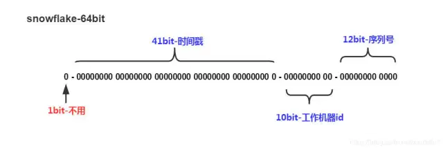
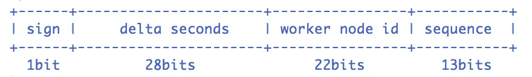
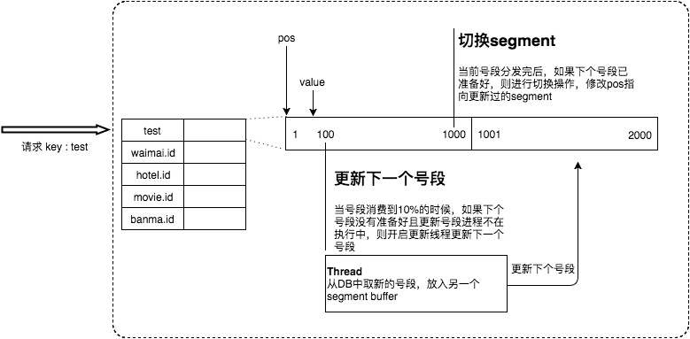
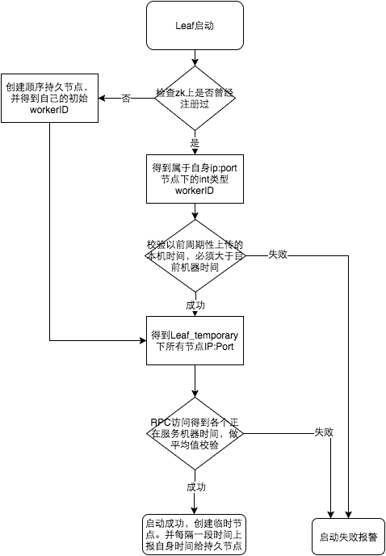

## 分布式ID


### 简介

在MySQL数据库中，当对数据库进行分库分表后，需要有一条唯一ID来标识一条数据


#### 条件

分布式ID的条件：

- 全局唯一：必须保证ID是全局性唯一的，基本要求
- 高性能：高可用低延时，ID生成响应要块，否则反倒会成为业务瓶颈
- 高可用：100%的可用性是骗人的，但是也要无限接近于100%的可用性
- 好接入：要秉着拿来即用的设计原则，在系统设计和实现上要尽可能的简单
- 趋势递增：最好趋势递增，这个要求就得看具体业务场景了，一般不严格要求


#### 生成方式

- UUID
- 数据库自增ID
- 数据库多主模式
- 号段模式
- Reids
- 雪花算法（SnowFlake)
- 滴滴出品（TinyID）
- 百度（Uidgenerator）
- 美团（Leaf）


### UUID

UUID可以生成一个具有唯一性的ID

```java
	String uuid=UUID.randomUUID().toString().replaceAll("-","");
```

优点：

- 生成简单，本地生成无网络消耗

缺点：

- 无序的字符串，不具备自增特性

- 没有具体的业务含义

- 长度过长，16字节128位，36位长度的字符串，存储以及查询对MySQL的性能消耗较大，MySQL官方建议主键要越短约好，作为数据库主键UUID的无序性会导致数据库位置频繁变动，严重影响性能。

  

### 数据库自增ID

基于数据库的`auto_increment`自增ID

```sql
CREATEDATABASE`SEQ_ID`;
CREATETABLE SEQID.SEQUENCE_ID (
    id bigint(20) unsigned NOTNULL auto_increment, 
    value char(10) NOT NULL default'',
    PRIMARY KEY (id),
) ENGINE=MyISAM;

insertinto SEQUENCE_ID(value)  VALUES ('values');
```

优点：

- 实现简单，ID单调自增，数值类型查询速度快

缺点：

- DB单点存在宕机风险，无法扛住高并发场景


### 数据库集群模式

对于高可用的优化，我们可以采用数据库的集群模式。

为两台服务器设置不同的**初始值**和自增**步长**


MySQL_1配置

```sql
set @@auto_increment_offset = 1;     -- 起始值
set @@auto_increment_increment = 2;  -- 步长
```

MySQL_2配置

```sql
set @@auto_increment_offset = 2;     -- 起始值
set @@auto_increment_increment = 2;  -- 步长
```


优点：

- 解决DB单点问题

缺点：

- 不利于后续扩容，当需要增加机器的时候，需要修改原有数据的初始值和步长，把第三台机器的ID的初始值设定为比现在的最大自增ID的位置远一些。


### 数据库号段模式

号段模式可以理解为从数据库获取的批量自增ID，然后存在内存里面，需要用到的时候就从内存里面拿

```sql
CREATETABLE id_generator (
  idint(10) NOTNULL,
  max_id bigint(20) NOT NULL COMMENT'当前最大id',
  step int(20) NOT NULL COMMENT'号段的布长',
  biz_type	int(20) NOT NULL COMMENT'业务类型',
  version int(20) NOT NULL COMMENT'版本号',
  PRIMARY KEY (`id`)
) 
```


| id   | biz_type | max_id | step | version |
| :--- | :------- | :----- | :--- | :------ |
| 1    | 101      | 0      | 100  | 0       |

1. 通过`select`获取指定业务下的批量唯一ID

   ```sql
   SELECT `id`，`max_id`, `step`,`version` FROM `id_generator` where `biz_type` = 101
   ```

   return:

   ```text
   id	max_id	step	version		biz_type
   1	0		100		0			101
   ```

2. 每次申请ID，都需要进行一次`update`操作，`update`成功则说明新号段获取成功

   ```sql
   update id_generator set max_id = #{max_id+step}, version = version + 1 where version = # {version} and biz_type = XXX
   ```


优点： 

- ID 有序递增、存储消耗空间小
- 相比于数据库主键自增的方式，**数据库的号段模式对于数据库的访问次数更少，数据库压力更小。**

缺点：

- 存在数据库单点问题（可以使用数据库集群解决，不过增加了复杂度）
- ID 没有具体业务含义、安全问题（比如根据订单 ID 的递增规律就能推算出每天的订单量，商业机密啊！ ）


### Redis模式

利用`redis`的 `incr`命令实现ID的原子性自增。

```sh
127.0.0.1:6379> set sequence_id_biz_type 1 // 初始化自增ID为1
OK
127.0.0.1:6379> incr sequence_id_biz_type // 增加1，并返回递增后的数值
(integer) 2
127.0.0.1:6379> get sequence_id_biz_type
"2"
```

优点：

- 性能不错，并且id是有序递增的

缺点：

- ID 没有具体业务含义、安全问题、

  

### 雪花算法（Snowflake）模式

雪花算法是Twitter公司内部分布式项目采用的ID生成算法



`Snowflake`生成的是Long类型的ID，一个Long类型占8个字节，每个字节占8比特，也就是说一个Long类型占64个比特。


Snowflake ID组成结构：`正数位`（占1比特）+ `时间戳`（占41比特）+ `机器ID`（占5比特）+ `数据中心`（占5比特）+ `自增值`（占12比特），总共64比特组成的一个Long类型。


- 第一个bit位（1bit）：Java中long的最高位是符号位代表正负，正数是0，负数是1，一般生成ID都为正数，所以默认为0。
- 时间戳部分（41bit）：毫秒级的时间，不建议存当前时间戳，而是用（当前时间戳 - 固定开始时间戳）的差值，可以使产生的ID从更小的值开始；41位的时间戳可以使用69年，(1L << 41) / (1000L * 60 * 60 * 24 * 365) = 69年
- 工作机器id（10bit）：也被叫做`workId`，这个可以灵活配置，机房或者机器号组合都可以。
- 序列号部分（12bit），自增值支持同一毫秒内同一个节点可以生成4096个ID


优点：

- 生成速度比较快
- 生成的 ID 有序递增
- 比较灵活（可以对 Snowflake 算法进行简单的改造比如加入业务 ID）

缺点：

- 需要解决重复 ID 问题（依赖时间，当机器时间不对的情况下，可能导致会产生重复 ID）


### 百度（Uid-Generator）

百度的唯一ID组成方式如下



`uid-generator`是基于`Snowflake`算法实现的，与原始的`snowflake`算法不同在于，`uid-generator`支持自`定义时间戳`、`工作机器ID`和 `序列号` 等各部分的位数，而且`uid-generator`中采用用户自定义`workId`的生成策略，时间的单位是秒，而不是毫秒


`uid-generator`需要与数据库配合使用，需要新增一个`WORKER_NODE`表。当应用启动时会向数据库表中去插入一条数据，插入成功后返回的自增ID就是该机器的`workId`数据由host，port组成。


### 美团（Leaf）

Leaf 提供了 **号段模式** 和 **Snowflake(雪花算法)** 这两种模式来生成分布式 ID。并且，它支持双号段，还解决了雪花 ID 系统时钟回拨问题。不过，时钟问题的解决需要弱依赖于 Zookeeper 。


#### 号段模式

对原有的数据库号段模式使用了双Buffer进行了改进，比如他这里的双号段避免了在当前号段用完了，在获取下一个号段的时候造成的线程阻塞。实现方法就是在我这个这个号段还没用完之前，就提前去获取下一个号段



#### 雪花算法

对于`workerID`的分配，当服务集群数量较小的情况下，完全可以手动配置。`Leaf`服务规模较大，动手配置成本太高。所以使用`Zookeeper`持久顺序节点的特性自动对`snowflake`节点配置`wokerID`。


`Leaf-snowflake`是按照下面几个步骤启动的：

1.  启动`Leaf-snowflake`服务，连接`Zookeeper`，在`leaf_forever`父节点下检查自己是否已经注册过（是否有该顺序子节点）。

2. 如果有注册过直接取回自己的`workerID`（zk顺序节点生成的int类型ID号），启动服务。

3. 如果没有注册过，就在该父节点下面创建一个持久顺序节点，创建成功后取回顺序号当做自己的`workerID`号，启动服务。

   

##### leaf的雪花算法弱依赖于zookeeper

除了每次会去ZK拿数据以外，也会在本机文件系统上缓存一个`workerID`文件。当`ZooKeeper`出现问题，恰好机器出现问题需要重启时，能保证服务能够正常启动。这样做到了对三方组件的弱依赖。一定程度上提高了`SLA`


##### 解决时钟问题

因为雪花算法依赖时间，如果机器的时钟发生了回拨，那么就会有可能生成重复的ID号，需要解决时钟回退的问题。



### 滴滴(Tinyid)

[Tinyid (opens new window)](https://github.com/didi/tinyid)是滴滴开源的一款基于数据库号段模式的唯一 ID 生成器。


`Tinyid`提供`http`和`tinyid-client`两种方式接入

#### 


http方式下，我们通过 HTTP 请求向发号器服务申请唯一 ID。负载均衡 router 会把我们的请求送往其中的一台 tinyid-server。

优化：

- **双号段缓存** ：为了避免在获取新号段的情况下，程序获取唯一 ID 的速度比较慢。 Tinyid 中的号段在用到一定程度的时候，就会去异步加载下一个号段，保证内存中始终有可用号段。

- **增加多 db 支持** ：支持多个 DB，并且，每个 DB 都能生成唯一 ID，提高了可用性。

- **增加 tinyid-client** ：纯本地操作，无 HTTP 请求消耗，性能和可用性都有很大提升。

