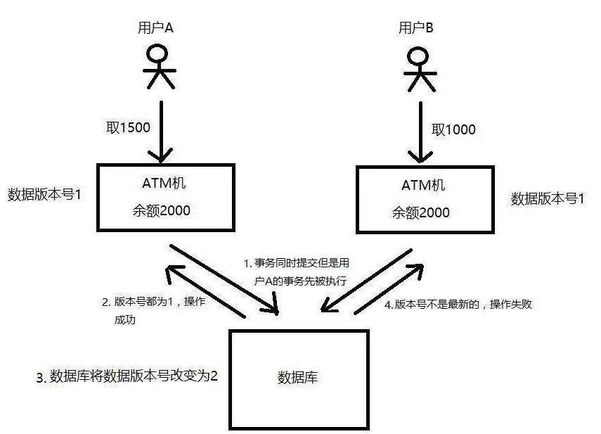
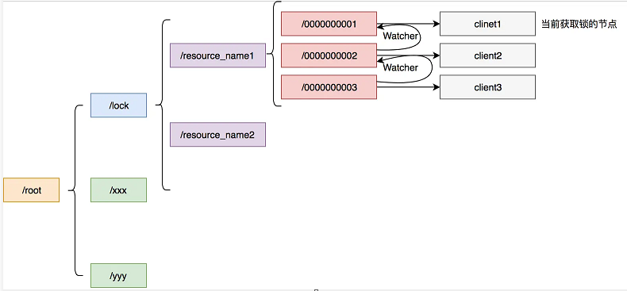

## 分布式锁


### 简介

#### 场景

在分布式环境下加锁

- 效率:使用分布式锁可以避免不同节点重复相同的工作，这些工作会浪费资源。比如用户付了钱之后有可能不同节点会发出多封短信。

- 正确性:加分布式锁同样可以避免破坏正确性的发生，如果两个节点在同一条数据上面操作，比如多个节点机器对同一个订单操作不同的流程有可能会导致该笔订单最后状态出现错误，造成损失。

  

#### 特点

- 互斥性:和我们本地锁一样互斥性是最基本，但是分布式锁需要保证在不同节点的不同线程的互斥。

- 可重入性:同一个节点上的同一个线程如果获取了锁之后那么也可以再次获取这个锁。

- 锁超时:和本地锁一样支持锁超时，防止死锁。

- 高效，高可用:加锁和解锁需要高效，同时也需要保证高可用防止分布式锁失效，可以增加降级。

- 支持阻塞和非阻塞:和`ReentrantLock`一样支持`lock`和`trylock`以及`tryLock(long timeOut)`。

- 支持公平锁和非公平锁(可选):公平锁的意思是按照请求加锁的顺序获得锁，非公平锁就相反是无序的。这个一般来说实现的比较少。


#### 常见的分布式锁

- MySql
- Zk
- Redis


### MySQL分布式锁

- 基于数据库的乐观锁
- 基于数据库的悲观锁
- 唯一索引


#### 乐观锁

乐观锁机制其实就是在数据库表中引入一个版本号（`version`）字段来实现的


当我们要从数据库中读取数据的时候，同时把这个`version`字段也读出来，如果要对读出来的数据进行更新后写回数据库，则需要将`version`加1，同时将新的数据与新的`version`更新到数据表中，且必须在更新的时候同时检查目前数据库里`version`值是不是之前的那个`version`，如果是，则正常更新。如果不是，则更新失败，说明在这个过程中有其它的进程去更新过数据了。




通过上面这个例子可以看出来，使用「乐观锁」机制，必须得满足：

（1）锁服务要有递增的版本号`version`

（2）每次更新数据的时候都必须先判断版本号对不对，然后再写入新的版本号


#### 悲观锁

悲观锁也叫做排他锁，在`MySQL`中是通过`select .. for update` 实现的

>InnoDB引擎在加锁的时候，只有通过索引进行检索的时候才会使用行级锁，否则会使用表级锁。这里我们希望使用行级锁，就要给method_name添加索引，值得注意的是，这个索引一定要创建成唯一索引，否则会出现多个重载方法之间无法同时被访问的问题。重载方法的话建议把参数类型也加上
>
>

首先创建一个表

```sql
CREATE TABLE `resource_lock`  (
  `id` int(11) NOT NULL,
  `resource_name` varchar(128) CHARACTER SET utf8mb4 COLLATE utf8mb4_general_ci NOT NULL COMMENT '资源名称',
  `node_info` varchar(255) CHARACTER SET utf8mb4 COLLATE utf8mb4_general_ci NOT NULL COMMENT '机器信息',
  `count` int(11) NOT NULL COMMENT '锁的次数',
  `desc` varchar(255) CHARACTER SET utf8mb4 COLLATE utf8mb4_general_ci NOT NULL COMMENT '额外描述信息',
  `create_time` datetime NULL DEFAULT NULL,
  `update_time` datetime NULL DEFAULT NULL,
  PRIMARY KEY (`id`) USING BTREE
) ENGINE = InnoDB CHARACTER SET = utf8mb4 COLLATE = utf8mb4_general_ci ROW_FORMAT = Dynamic;
```


##### Lock()

Lock是阻塞式获取锁，不获取到锁，就一直循环等待

```java
    public void lock(){
        while (true){
            if (this.getLock("resouce")){
                try {
                    //doSomething
                }catch (Exception e){
                    throw new Exception(e);
                }finally {
                    this.unlock("resouce");
                    return;
                }
            }
            //休眠3ms后再尝试
            LockSupport.parkNanos(1000*1000*3);
        }
    }
```


##### tryLock（）

tryLock是非阻塞获取锁，索取不到就返回

```java
    public void tryLock(){
        if (getLock("resourceName")){
            try {
                //doSomething
            }catch (Exception e){
                throw new Exception(e);
            }finally {
                this.unlock("resouce");
                return;
            }
        }else {
            return;
        }
    }
```

```java
    public void tryLock(Long timeout){
        long endTime=System.currentTimeMillis()+timeout;
        while (true){
            if (getLock("resourceName")){
                try {
                    //doSomething
                }catch (Exception e){
                    throw new Exception(e);
                }finally {
                    this.unlock("resouce");
                    return;
                }
            }
            endTime= endTime-timeout;
            if (endTime<0){
                return;
            }
        }
    }
```


获取锁：

```java
    @Transactional
    public boolean getLock(String resourceName){
        //concurrentNodeInfo可以用机器IP+线程名称表示
        String select="select * from resource_lock where resource_name = 'resourceName' for update";
        if (查到有值){
            if (node_info==concurrentNodeInfo){
                String update="update resource_lock set count = count +1 where resource_name = 'resourceName' ";
            }else
                return false;
        }else {
            String insert="INSERT INTO resource_lock " +
                    "(`id`, `resource_name`, `node_info`, `count`, `desc`, `create_time`, `update_time`) " +
                    "VALUES (1, 'resourceName', '127.0.0.1:Thread1', 1, 'xx', NOW(), NULL);";
        }
        return false;
    }
```


解锁：

```java
    @Transactional
    public boolean unlock(String resourceName){
        String select="select * from resource_lock where resource_name = 'resourceName' for update";
        if (查到有值){
            if (node_info==concurrentNodeInfo){
                if (count > 1){
                    String update="update resource_lock set count = count -1 where resource_name = 'resourceName' ";
                    return true;
                }else {
                    String delete="delete from resource_lock where resource_name = 'resourceName'";
                    return true;
                }
            }
            else return false;
        }
        return false;
    }
```

#### 唯一索引

要实现分布式锁，最简单的方式可能就是直接创建一张锁表，然后通过操作该表中的数据来实现了。

当我们要锁住某个方法或资源时，我们就在该表中增加一条记录，想要释放锁的时候就删除这条记录。

 创建这样一张数据库表：

```sql
CREATE TABLE `unique_lock`  (
  `id` int(11) NOT NULL,
  `method_name` varchar(64) CHARACTER SET utf8mb4 COLLATE utf8mb4_general_ci NULL DEFAULT NULL,
  `desc` varchar(255) CHARACTER SET utf8mb4 COLLATE utf8mb4_general_ci NULL DEFAULT NULL,
  `crate_time` datetime NULL DEFAULT NULL,
  PRIMARY KEY (`id`) USING BTREE,
  UNIQUE INDEX `uidx_method_name`(`method_name`) USING BTREE
) ENGINE = InnoDB CHARACTER SET = utf8mb4 COLLATE = utf8mb4_general_ci ROW_FORMAT = Dynamic;
```


当想要锁住某方法的时候，执行以下SQL：

```sql
insert into unique_lock(method_name,desc) values('method_name','desc');
```

因为我们对method_name做了唯一性约束，这里如果有多个请求同时提交到数据库的话，数据库会保证只有一个操作可以成功（原子性），那么我们就可以认为操作成功的那个线程获得了该方法的锁，可以执行方法体内容。


#### 锁超时

我们有可能会遇到我们的机器节点挂了，那么这个锁就不会得到释放，我们可以启动一个定时任务，通过计算一般我们处理任务的一般的时间，比如是5ms，那么我们可以稍微扩大一点，当这个锁超过20ms没有被释放我们就可以认定是节点挂了然后将其直接释放。

```sql
delete from unique_lock where method_name ='method_name';
```


#### 小结

- 适用场景:`Mysql`分布式锁一般适用于资源不存在数据库，如果数据库存在比如订单，那么可以直接对这条数据加行锁，不需要我们上面多的繁琐的步骤，比如一个订单，那么我们可以用`select * from order_table where id = 'xxx' for update`进行加行锁，那么其他的事务就不能对其进行修改。

- 优点:理解起来简单，不需要维护额外的第三方中间件(比如Redis,Zk)。

- 缺点:虽然容易理解但是实现起来较为繁琐，需要自己考虑锁超时，加事务等等。性能局限于数据库，一般对比缓存来说性能较低。对于高并发的场景并不是很适合。

### Redis分布式锁


#### 加锁

给Key设置一个值，并设置过期时间，避免死锁

`setnx lock_key random_value px 5000`

#### 解锁

用lua脚本保证解锁的原子性，判断当前锁的字符串是否于传入的值相等，是的话删除key


存在问题：如果线程执行时间超过设置的过期时间，会导致别的线程获取到该锁。

解决方法：

- 设置守护线程，监控当前线程是否执行完成，如果没有则给当前key延长过期时间
- 引入锁续约机制，也就是获取锁之后，释放锁之前，会定时进行锁续约，比如以锁超时时间的1/3为间隔周期进行锁续约。


#### 小结

- 优点:对于Redis实现简单，性能对比ZK和Mysql较好。如果不需要特别复杂的要求，那么自己就可以利用setNx进行实现，如果自己需要复杂的需求的话那么可以利用或者借鉴Redission。对于一些要求比较严格的场景来说的话可以使用RedLock。

- 缺点:需要维护Redis集群，如果要实现RedLock那么需要维护更多的集群。


### Zookeeper分布式锁



大致流程：

1. 客户端连接`zookeeper`，并在`/lock/resource_name`下创建临时的且有序的子节点，第一个客户端对应的子节点为`/lock/resource_name/00000000001`，第二个为`/lock/resource_name/00000000002`，以此类推。
2. 客户端获取`/lock/resource_name`下的子节点列表，判断自己创建的子节点是否为当前子节点列表中序号最小的子节点，如果是则认为获得锁，否则监听`/lock/resource_name`的子节点变更消息，获得子节点变更通知后重复此步骤直至获得锁；
3. 执行业务代码；
4. 完成业务流程后，删除对应的子节点释放锁。


#### 锁超时

`Zookeeper`不需要配置锁超时，由于我们设置节点是临时节点，我们的每个机器维护着一个`session`，通过这个`session`，`Zookeeper`可以判断机器是否宕机。如果我们的机器挂掉的话，那么这个临时节点对应的就会被删除，所以我们不需要关心锁超时。


#### 小结

- 优点：有效的解决单点问题，不可重入问题，非阻塞问题以及锁无法释放的问题。实现起来较为简单。

- 缺点:ZK需要额外维护，增加维护成本，性能和Mysql相差不大，依然比较差。并且需要开发人员了解ZK是什么。

  

### 总结

上面几种方式，哪种方式都无法做到完美。就像CAP一样，在复杂性、可靠性、性能等方面无法同时满足，所以，根据不同的应用场景选择最适合自己的才是王道。

> 从理解的难易程度角度（从低到高）

数据库 > 缓存 > Zookeeper

> 从实现的复杂性角度（从低到高）

Zookeeper >= 缓存 > 数据库

> 从性能角度（从高到低）

缓存 > Zookeeper >= 数据库

> 从可靠性角度（从高到低）

Zookeeper > 缓存 > 数据库

