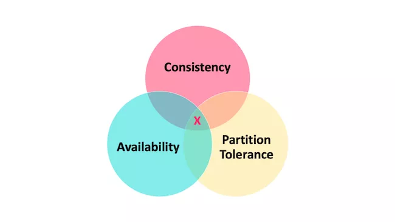
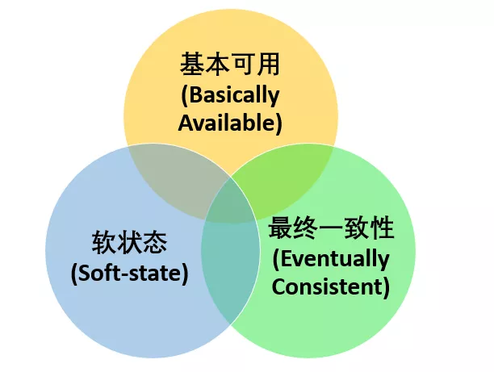
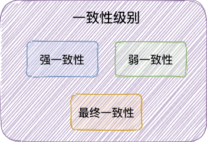
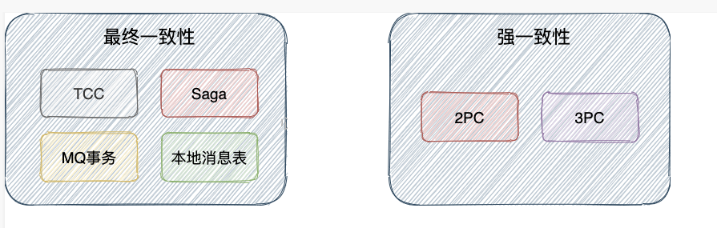
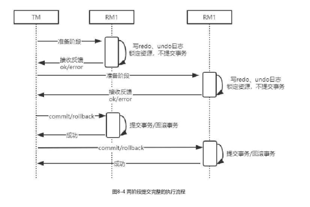
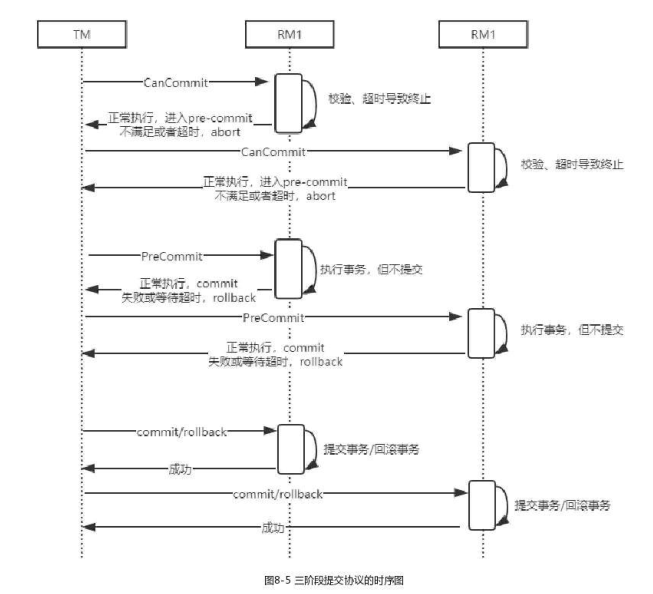
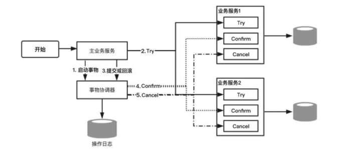
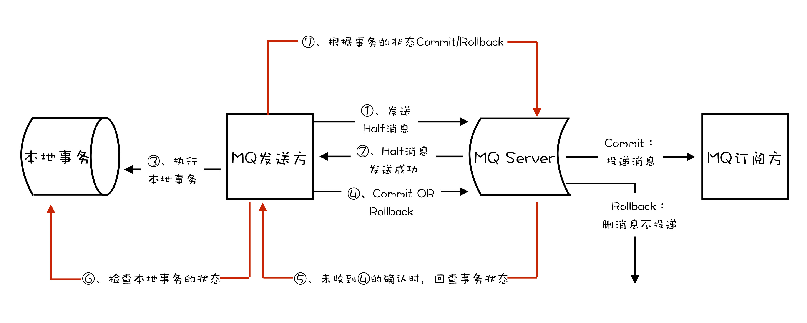
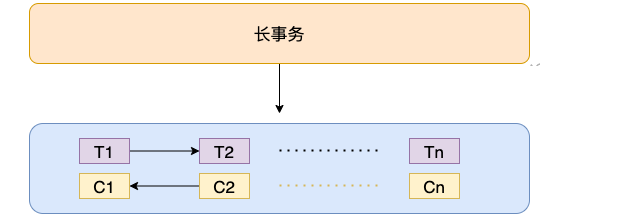

## 分布式事务

### 分布式事务基础理论

#### CAP理论

- Consistency(一致性)：所有节点访问同一份最新的数据副本
- Abailability(可用性)：非故障节点在合理的时间内返回合理的响应（不是错误、超时的响应）
- Partition Tolerance(分区容错性)：分布式系统出现网络分区的时候，仍能对外提供服务

> 分布式系统中，多个节点之前的网络本来是连通的，但是因为某些故障（比如部分节点网络出了问题）某些节点之间不连通了，整个网络就分成了几块区域，这就叫网络分区。

在系统发生“分区”的情况下，CAP 理论只能满足 CP 或者 AP。要注意的是，这里的前提是系统发生了“分区”

如果系统没有发生“分区”的话，节点间的网络连接通信正常的话，也就不存在 P 了。这个时候，我们就可以同时保证 C 和 A 了。

#### BASE 理论

- 基本可用：分布式系统在出现不可预知故障的时候，允许损失部分可用性
- 软状态：允许系统中的数据存在中间状态（**CAP 理论中的数据不一致**），并认为该中间状态的存在不会影响系统的整体可用性，即允许系统在不同节点的数据副本之间进行数据同步的过程存在延时。
- 最终一致性：系统中所有的数据副本，在经过一段时间的同步后，最终能够达到一个一致的状态。

>分布式一致性的 3 种级别：
>
>**强一致性** ：系统写入了什么，读出来的就是什么。
>
>**弱一致性** ：不一定可以读取到最新写入的值，也不保证多少时间之后读取到的数据是最新的，只是会尽量保证某个时刻达到数据一致的状态。
>
>**最终一致性** ：弱一致性的升级版。，系统会保证在一定时间内达到数据一致的状态，

#### 柔性事务

互联网应用最关键的就是要保证高可用， 计算式系统几秒钟之内没办法使用都有可能造成数百万的损失。在此场景下，一些大佬们在 CAP 理论和 BASE 理论的基础上，提出了 **柔性事务** 的概念。 **柔性事务追求的是最终一致性。**

实际上，柔性事务就是 **BASE 理论 +业务实践**。 柔性事务追求的目标是：我们根据自身业务特性，通过适当的方式来保证系统数据的最终一致性。 像 **TCC**、 **Saga**、**MQ 事务** 、**本地消息表** 就属于柔性事务。

#### 刚性事务

刚性事务追求的是 **强一致性**。像**2PC** 、**3PC** 就属于刚性事务

### 分布式事务解决方案

分布式事务的解决方案有很多，比如：**2PC**、**3PC**、**TCC**、**本地消息表**、**MQ 事务**（Kafka 和 RocketMQ 都提供了事务相关功能） 、**Saga** 等等。这些方案的适用场景有所区别，我们需要根据具体的场景选择适合自己项目的解决方案。

#### 2PC（两阶段提交协议）

2PC（Two-Phase Commit）这三个字母的含义:

- **2** -> 指代事务提交的 2 个阶段
- **P**-> Prepare (准备阶段)

- **C** ->Commit（提交阶段）

  

##### 准备阶段(Prepare)

准备阶段：询问事务参与者执行本地数据库事务操作是否成功

1. **事务协调者/管理者** 向所有参与者发送消息询问：“你是否可以执行事务操作呢？”，并等待其答复。
2. **事务参与者** 接收到消息之后，开始执行本地数据库事务预操作比如写 redo log/undo log 日志。但是 ，此时并不会提交事务！

1. **事务参与者** 如果执行本地数据库事务操作成功，那就回复：“就绪”，否则就回复：“未就绪”。

##### 提交阶段(Commit)

提交阶段的核心是“询问”事务参与者提交事务是否成功。

当所有事务参与者都是“就绪”状态的话：

1. **事务协调者/管理者** 向所有参与者发送消息：“你们可以提交事务啦！”（**commit 消息**）
2. **事务参与者** 接收到 **commit 消息** 后执行 **提交本地数据库事务** 操作，执行完成之后 **释放整个事务期间所占用的资源**。

1. **事务参与者** 回复：“事务已经提交” （**ack 消息**）。
2. **事务协调者/管理者** 收到所有 **事务参与者** 的 **ack 消息** 之后，整个分布式事务过程正式结束。

##### 优点

- 实现起来非常简单，各大主流数据库比如 MySQL、Oracle 都有自己实现。
- 针对的是数据强一致性。不过，仍然可能存在数据不一致的情况。

##### 缺点

- **同步阻塞** ：事务参与者会在正式提交事务之前会一直占用相关的资源。比如用户小明转账给小红，那其他事务也要操作用户小明或小红的话，就会阻塞。
- **数据不一致** ：由于网络问题或者事务协调者/管理者宕机都有可能会造成数据不一致的情况。比如在第2阶段（提交阶段），部分网络出现问题导致部分参与者收不到 commit/rollback 消息的话，就会导致数据不一致。

- **单点问题** ： 事务协调者/管理者在其中也是一个很重要的角色，如果事务协调者/管理者在准备(Prepare)阶段完成之后挂掉的话，事务参与者就会一直卡在提交(Commit)阶段。

#### 3PC（三阶段提交协议）

3PC 把 2PC 中的 **准备阶段(Prepare)** 做了进一步细化，并增加了超时机制解决了同步阻塞的问题。分为 2 个阶段：

- **询问阶段(CanCommit)** ：这一步 不会执行事务操作，只会询问事务参与者能否执行本地数据库事操作。
- **准备阶段(PreCommit)** ：当所有事物参与者都返回“可执行”之后， 事务参与者才会执行本地数据库事务预操作比如写 redo log/undo log 日志。

#### TCC（补偿事务）

TCC 属于目前比较火的一种柔性事务解决方案。

TCC 是 Try、Confirm、Cancel 三个词的缩写，它分为三个阶段：

1. **Try（尝试）阶段** : 尝试执行。完成业务检查，并预留好必需的业务资源。
2. **Confirm（确认）阶段** ：确认执行。当所有事务参与者的 Try 阶段执行成功就会执行 Confirm ，Confirm 阶段会处理 Try 阶段预留的业务资源。否则，就会执行 Cancel 。

3. **Cancel（取消）阶段** ：取消执行，释放 Try 阶段预留的业务资源。

##### 例子

理财APP中，用户通过账户余额购买一个理财产品，涉及两个事务操作：

- 在账户服务中，对用户余额进行扣减。
- 在理财产品服务中，对指定理财产品可申购金额进行扣减

TCC的工作机制中，账户服务和理财产品服务分别提供Try、Confirm和Cancel三个方法。

- 在账户服务的Try方法中对实际申购金额进行冻结，Comfirm方法把Try方法中冻结的资金进行扣减，Cancel方法把Try方法冻结的资金进行解冻
- 在理财产品服务的Try方法中对本次可申购的部分额度进行冻结，Comfirm方法把Try方法中冻结的额度进行扣减，Cancel方法把Try方法冻结的额度进行解冻

#### MQ事务

事务允许事件流应用将消费，处理，生产消息整个过程定义为一个原子操作。

1. MQ 发送方（比如物流服务）在消息队列上开启一个事务，然后发送一个“半消息”给 MQ Server/Broker。事务提交之前，半消息对于 MQ 订阅方/消费者（比如第三方通知服务）不可见
2. “半消息”发送成功的话，MQ 发送方就开始执行本地事务。
3. MQ 发送方的本地事务执行成功的话，“半消息”变成正常消息，可以正常被消费。MQ 发送方的本地事务执行失败的话，会直接回滚。

从上面的流程中可以看出，MQ 的事务消息使用的是两阶段提交（2PC），简单来说就是咱先发送半消息，等本地事务执行成功之后，半消息才变为正常消息。

#### Saga

Saga 属于长事务解决方案，其核心思想史将长事务拆分为多个本地短事务（本地短事务序列）。

- 长事务 —> T1,T2 ~ Tn 个本地短事务
- 每个短事务都有一个补偿动作 —> C1,C2 ~ Cn

如果 T1,T2 ~ Tn 这些短事务都能顺利完成的话，整个事务也就顺利结束，否则，将采取恢复模式。

**反向恢复** ：

- 简介：如果 Ti 短事务提交失败，则补偿所有已完成的事务（一直执行 Ci 对 Ti 进行补偿）。
- 执行顺序：T1，T2，…，Ti（失败），Ci（补偿），…，C2，C1。

**正向恢复** ：

- 简介：如果 Ti 短事务提交失败，则一直对 Ti 进行重试，直至成功为止。
- 执行顺序：T1，T2，…，Ti（失败），Ti（重试）…，Ti+1，…，Tn。

和 TCC 类似，Saga 正向操作与补偿操作都需要业务开发者自己实现，因此也属于 **侵入业务代码** 的一种分布式解决方案。和 TCC 很大的一点不同是 Saga 没有“Try” 动作，它的本地事务 Ti 直接被提交。因此，性能非常高！

理论上来说，补偿操作一定能够执行成功。不过，当网络出现问题或者服务器宕机的话，补偿操作也会执行失败。这种情况下，往往需要我们进行人工干预。并且，为了能够提高容错性（比如 Saga 系统本身也可能会崩溃），保证所有的短事务都得以提交或补偿，我们还需要将这些操作通过日志记录下来（Saga log，类似于数据库的日志机制）。这样，Saga 系统恢复之后，我们就知道短事务执行到哪里了或者补偿操作执行到哪里了。

另外，因为 Saga 没有进行“Try” 动作预留资源，所以不能保证隔离性。这也是 Saga 比较大的一个缺点。

针对 Saga 的实现，业界也有一些不错的开源框架。不同的框架对于 Saga 的实现可能略有不同，不过大致思想都一样。

1. [**ServiceComb Pack**](https://github.com/apache/servicecomb-pack) ：微服务应用的数据最终一致性解决方案。
2. [**Seata**](https://seata.io/zh-cn/index.html) :Seata 是一款开源的分布式事务解决方案，致力于在微服务架构下提供高性能和简单易用的分布式事务服务。

