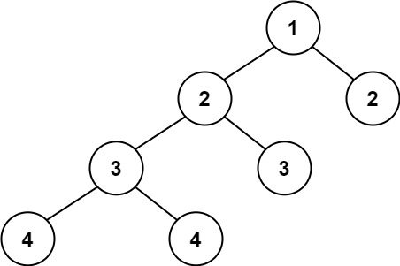
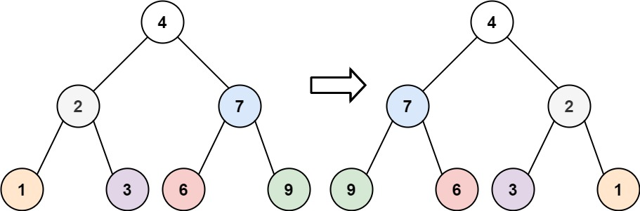

# LeetCode


#### [1.两数之和](https://leetcode-cn.com/problems/two-sum/)

给定一个整数数组 nums 和一个整数目标值 target，请你在该数组中找出 和为目标值 target  的那 两个 整数，并返回它们的数组下标。

你可以假设每种输入只会对应一个答案。但是，数组中同一个元素在答案里不能重复出现。

你可以按任意顺序返回答案。

>输入：nums = [2,7,11,15], target = 9
>输出：[0,1]
>解释：因为 nums[0] + nums[1] == 9 ，返回 [0, 1] 。


思路：

- 使用HashMap存储target与当前数的差值，然后在遍历过程中对HashMap进行获取

  

```java
    public int[] twoSum(int[] nums, int target) {
    
        Map<Integer, Integer> map = new HashMap<>();

        for (int j = 0; j < nums.length; j++) {
            if (map.containsKey(target - nums[j])) {
                return new int[]{j, map.get(target - nums[j])};
            } else map.put(nums[j], j);
        }
        return new int[]{0, 0};
    }
```


#### [9. 回文数](https://leetcode-cn.com/problems/palindrome-number/)

给你一个整数 x ，如果 x 是一个回文整数，返回 true ；否则，返回 false 。

回文数是指正序（从左向右）和倒序（从右向左）读都是一样的整数。例如，121 是回文，而 123 不是


>输入：x = 121
>输出：true

>输入：x = -121
>输出：false


思路：

- 首先负数肯定不是回文数

- 果尾数是0，回文数，那第一位也必定是0，除0外，没有这样的数

- 然后对数进行取余相加

- 奇数和偶数的区别：奇数多了一位，但是可以除10，去掉。

  

```java
    public boolean isPalindrome(int x) {
        if (x < 0 || (x % 10 == 0 && x != 0))
            return false;
        int temp = 0;
        while (x > temp) {
            temp = temp * 10 + x % 10;
            x = x / 10;
        }
        return x == temp || x == temp / 10;
    }
```


#### [14. 最长公共前缀](https://leetcode-cn.com/problems/longest-common-prefix/)

编写一个函数来查找字符串数组中的最长公共前缀。

如果不存在公共前缀，返回空字符串 `""`。


>输入：strs = ["flower","flow","flight"]
>输出："fl"


思路：

- 当长度为1且只有一个字符时直接返回
- 从第一个字符串开始向下遍历，判断切割出来的前缀是否相等


```java
    public static String longestCommonPrefix(String[] strs) {
        if (strs.length == 1 && strs[0].length() == 1) {
            return strs[0].substring(0, 1);
        }
        String commonPrefix = "";
        for (int i = 1; i <= strs[0].length(); i++) {
            String common = strs[0].substring(0, i);
            for (int j = 1; j < strs.length; j++) {
                if (strs[j].length() < i || !common.equals(strs[j].substring(0, i))) {
                    return commonPrefix;
                }
            }
            commonPrefix = common;
        }
        return commonPrefix;
    }
```


#### [20. 有效的括号](https://leetcode-cn.com/problems/valid-parentheses/)

给定一个只包括 '('，')'，'{'，'}'，'['，']' 的字符串 s ，判断字符串是否有效。

有效字符串需满足：

左括号必须用相同类型的右括号闭合。
左括号必须以正确的顺序闭合。


>输入：s = "()"
>输出：true


思路：

- 利用栈和HashMap来解决
- 碰到左括号压栈，右括号弹栈


 ```java
     public static boolean isValid(String s) {
         HashMap<Character, Character> hashMap = new HashMap<>();
         hashMap.put('(', ')');
         hashMap.put('[', ']');
         hashMap.put('{', '}');
         LinkedList<Character> list = new LinkedList<>();
 
         for (int i = 0; i < s.length(); i++) {
             if (s.charAt(i) == '[' || s.charAt(i) == '(' || s.charAt(i) == '{') {
                 list.push(s.charAt(i));
             } else if (list.isEmpty()) {
                 return false;
             } else {
                 Character c = list.pop();
                 if (s.charAt(i) != hashMap.get(c)) {
                     return false;
                 }
             }
         }
         return list.isEmpty();
     }
 ```


#### [21. 合并两个有序链表](https://leetcode-cn.com/problems/merge-two-sorted-lists/)

将两个升序链表合并为一个新的 **升序** 链表并返回。新链表是通过拼接给定的两个链表的所有节点组成的。 


> 输入：l1 = [1,2,4], l2 = [1,3,4]
> 输出：[1,1,2,3,4,4]


思路：

- 创建一个头结店和prev
- 对链表进行迭代，当有一个链表为空时，直接返回另一个链表


```java
    public class ListNode {
        int val;
        ListNode next;
        ListNode() {
        }
        ListNode(int val) {
            this.val = val;
        }
        ListNode(int val, ListNode next) {
            this.val = val;
            this.next = next;
        }
    }

    public ListNode mergeTwoLists(ListNode list1, ListNode list2) {
        ListNode prehead = new ListNode(-1);
        ListNode prev = prehead;
        while (list1 != null && list2 != null) {
            if (list1.val < list2.val) {
                prev.next = list1;
                list1 = list1.next;
            } else {
                prev.next = list2;
                list2 = list2.next;
            }
            prev = prev.next;
        }
        prev.next = list1 == null ? list2 : list1;
        return prehead.next;
    }
```


#### [26. 删除有序数组中的重复项](https://leetcode-cn.com/problems/remove-duplicates-from-sorted-array/)

给你一个有序数组 nums ，请你 原地 删除重复出现的元素，使每个元素 只出现一次 ，返回删除后数组的新长度。

不要使用额外的数组空间，你必须在 原地 修改输入数组 并在使用 O(1) 额外空间的条件下完成。


> 输入：nums = [1,1,2]
> 输出：2, nums = [1,2]
> 解释：函数应该返回新的长度 2 ，并且原数组 nums 的前两个元素被修改为 1, 2 。不需要考虑数组中超出新长度后面的元素。


思路：

- 使用双指针，用i标记当前需要比对的数，如果与nums[j]相等，就nums[i+1]和nums[j]兑换


```java
public int removeDuplicates(int[] nums) {
    int i=0;
    for (int j=i+1;j<nums.length;j++){
        if (nums[i]!=nums[j]){
            nums[++i]=nums[j];
        }
    }
    return i+1;
}
```


#### [28. 实现 strStr()](https://leetcode-cn.com/problems/implement-strstr/)

实现 strStr() 函数。

给你两个字符串 haystack 和 needle ，请你在 haystack 字符串中找出 needle 字符串出现的第一个位置（下标从 0 开始）。如果不存在，则返回  -1 。


>输入：haystack = "hello", needle = "ll"
>输出：2


>输入：haystack = "aaaaa", needle = "bba"
>输出：-1


>输入：haystack = "", needle = ""
>输出：0


思路：

- 暴力枚举法，遍历haystack和needle，如果haystack剩余需要判断的字符串大于needle，那肯定是返回-1

```java
    public int strStr(String haystack, String needle) {
        boolean flag = true;
        for (int i = 0; i + needle.length() <= haystack.length(); i++) {

            for (int j = 0; j < needle.length(); j++) {
                if (haystack.charAt(i + j) != needle.charAt(j)) {
                    flag = false;
                    break;
                }
                flag = true;
            }
            if (flag) {
                return i;
            }
        }
        return -1;
    }
```


#### [35. 搜索插入位置](https://leetcode-cn.com/problems/search-insert-position/)

给定一个排序数组和一个目标值，在数组中找到目标值，并返回其索引。如果目标值不存在于数组中，返回它将会被按顺序插入的位置。

请必须使用时间复杂度为 O(log n) 的算法。


> 输入: nums = [1,3,5,6], target = 5
> 输出: 2


>输入: nums = [1,3,5,6], target = 0
>输出: 0


思路：

- 时间复杂度为 O(log n) 的算法，那就只能是二分查找法了


```java
public int searchInsert(int[] nums, int target) {
        int right = nums.length, left = 0;
        while ((left + right) / 2 != left) {
            int mid=(left + right) / 2;
            if (nums[mid] == target) {
                return mid;
            }
            if (nums[mid] < target) {
                left = mid;
            }
            if (nums[mid] > target) {
                right = mid;
            }
        }
        return nums[left] < target?left + 1:0;
}
```


#### [53. 最大子数组和](https://leetcode-cn.com/problems/maximum-subarray/)


给你一个整数数组 `nums` ，请你找出一个具有最大和的连续子数组（子数组最少包含一个元素），返回其最大和。

**子数组** 是数组中的一个连续部分。


>输入：nums = [-2,1,-3,4,-1,2,1,-5,4]
>输出：6
>解释：连续子数组 [4,-1,2,1] 的和最大，为 6 。


思路：

- 动态规划的是首先对数组进行遍历，当前最大连续子序列和为 sum，结果为 ans
- 如果 sum > 0，则说明 sum 对结果有增益效果，则 sum 保留并加上当前遍历数字
- 如果 sum <= 0，则说明 sum 对结果无增益效果，需要舍弃，则 sum 直接更新为当前遍历数字
- 每次比较 sum 和 ans的大小，将最大值置为ans，遍历结束返回结果


```java
public int maxSubArray(int[] nums) {
    int ans = nums[0];
    int sum = 0;

    for (int num : nums) {
        if (sum > 0) {
            sum += num;
        } else {
            sum = num;
        }
        ans = Math.max(ans, sum);

    }
    return ans;
}
```


#### [58. 最后一个单词的长度](https://leetcode-cn.com/problems/length-of-last-word/)

给你一个字符串 `s`，由若干单词组成，单词前后用一些空格字符隔开。返回字符串中最后一个单词的长度。

**单词** 是指仅由字母组成、不包含任何空格字符的最大子字符串。


>输入：s = "Hello World"
>输出：5


思路：

- 对字符串反向遍历，去掉空格


```java
public int lengthOfLastWord(String s) {
    int index = s.length() - 1;
    while (s.charAt(index) == ' ') {
        index--;
    }
    int wordLength = 0;
    while (index >= 0 && s.charAt(index) != ' ') {
        wordLength++;
        index--;
    }
    return wordLength;
}
```


#### [66. 加一](https://leetcode-cn.com/problems/plus-one/)

给定一个由 整数 组成的 非空 数组所表示的非负整数，在该数的基础上加一。

最高位数字存放在数组的首位， 数组中每个元素只存储单个数字。

你可以假设除了整数 0 之外，这个整数不会以零开头。


>输入：digits = [1,2,3]
>输出：[1,2,4]
>解释：输入数组表示数字 123。


>输入：digits = [0]
>输出：[1]


思路：

- 末位无进位，则末位加一即可，因为末位无进位，前面也不可能产生进位，比如 45 => 46
- 末位有进位，在中间位置进位停止，则需要找到进位的典型标志，即为当前位 %10后为 0，则前一位加 1，直到不为 0 为止，比如 499 => 500
- 末位有进位，并且一直进位到最前方导致结果多出一位，对于这种情况，需要在第 2 种情况遍历结束的基础上，进行单独处理，比如 999 => 1000


```java
public int[] plusOne(int[] digits) {
    int len = digits.length;
    for(int i = len - 1; i >= 0; i--) {
        digits[i]++;
        digits[i] %= 10;
        if(digits[i]!=0)
            return digits;
    }
    digits = new int[len + 1];
    digits[0] = 1;
    return digits;
}
```


#### [67. 二进制求和](https://leetcode-cn.com/problems/add-binary/)

给你两个二进制字符串，返回它们的和（用二进制表示）。

输入为 **非空** 字符串且只包含数字 `1` 和 `0`。


> 输入: a = "1010", b = "1011"
> 输出: "10101"


思路：

- 对字符串逆序，竖列进行比对
- 加入一个变量sum，代表是否需要进1


```java
public String addBinary(String a, String b) {
    StringBuilder s = new StringBuilder();
    int ap = 0;
    for (int i = a.length() - 1, j = b.length() - 1; i >= 0 || j >= 0; i--, j--) {
        int sum = ap;
        sum += i >= 0 ? a.charAt(i) - '0' : 0;
        sum += j >= 0 ? b.charAt(j) - '0' : 0;
        s.append(sum % 2);
        ap = sum / 2;
    }

    s.append(ap > 0 ? ap : "");
    return s.reverse().toString();
}
```


#### [70. 爬楼梯](https://leetcode-cn.com/problems/climbing-stairs/)

假设你正在爬楼梯。需要 `n` 阶你才能到达楼顶。

每次你可以爬 `1` 或 `2` 个台阶。你有多少种不同的方法可以爬到楼顶呢？


>输入：n = 3
>输出：3
>解释：有三种方法可以爬到楼顶。
>1. 1 阶 + 1 阶 + 1 阶
>2. 1 阶 + 2 阶
>3. 2 阶 + 1 阶


```java
public int climbStairs(int n) {
    int[] arr = new int[n + 1];
    arr[0] = 1;
    arr[1] = 2;
    for (int i = 2; i <= n - 1; i++) {
        arr[i] = arr[i - 1] + arr[i - 2];
    }
    return arr[n - 1];
}
```


#### [83. 删除排序链表中的重复元素](https://leetcode-cn.com/problems/remove-duplicates-from-sorted-list/)

存在一个按升序排列的链表，给你这个链表的头节点 `head` ，请你删除所有重复的元素，使每个元素 **只出现一次** 。

返回同样按升序排列的结果链表。


> 输入：head = [1,1,2]
> 输出：[1,2]


思路：

- 指定 cur 指针指向头部 head

- 当 cur 和 cur.next 的存在为循环结束条件，当二者有一个不存在时说明链表没有去重复的必要了

- 当 cur.val 和 cur.next.val 相等时说明需要去重，则将 cur 的下一个指针指向下一个的下一个，这样就能达到去重复的效果

- 如果不相等则 cur 移动到下一个位置继续循环

  

```java
public ListNode deleteDuplicates(ListNode head) {
    ListNode cur = head;
    while (cur != null && cur.next != null) {
        if (cur.val == cur.next.val) {
            cur.next = cur.next.next;
        } else {
            cur = cur.next;
        }
    }
    return head;
}
```


#### [88. 合并两个有序数组](https://leetcode-cn.com/problems/merge-sorted-array/)


给你两个按 非递减顺序 排列的整数数组 nums1 和 nums2，另有两个整数 m 和 n ，分别表示 nums1 和 nums2 中的元素数目。

请你 合并 nums2 到 nums1 中，使合并后的数组同样按 非递减顺序 排列。

注意：最终，合并后数组不应由函数返回，而是存储在数组 nums1 中。为了应对这种情况，nums1 的初始长度为 m + n，其中前 m 个元素表示应合并的元素，后 n 个元素为 0 ，应忽略。nums2 的长度为 n 。


>输入：nums1 = [1,2,3,0,0,0], m = 3, nums2 = [2,5,6], n = 3
>输出：[1,2,2,3,5,6]
>解释：需要合并 [1,2,3] 和 [2,5,6] 。

>输入：nums1 = [0], m = 0, nums2 = [1], n = 1
>输出：[1]
>解释：需要合并的数组是 [] 和 [1] 。


思路：

- 因为 nums1 的空间都集中在后面，所以从后向前处理排序的数据会更好，节省空间，一边遍历一边将值填充进去

- 设置指针 m和 n分别指向 nums1 和 nums2 的有数字尾部，从尾部值开始比较遍历，同时设置指针 left指向 nums1 的最末尾，每次遍历比较值大小之后，则进行填充

- 当 n=0 时遍历结束，此时 nums2数据完全拷贝完全

  

```java
public void merge(int[] nums1, int m, int[] nums2, int n) {
    int left = nums1.length - 1;
    while (n > 0) {
        if (m == 0) {
            nums1[left--] = nums2[--n];
        } else if (nums1[m - 1] > nums2[n - 1]) {
            nums1[left--] = nums1[--m];
        } else {
            nums1[left--] = nums2[--n];
        }
    }
}
```


#### [94. 二叉树的中序遍历](https://leetcode-cn.com/problems/binary-tree-inorder-traversal/)

给定一个二叉树的根节点 `root` ，返回它的 **中序** 遍历。


>输入：root = [1,null,2,3]
>输出：[1,3,2]


```java
public List<Integer> inorderTraversal(TreeNode root) {
    List<Integer> list = new ArrayList<>();
    inorderTraversal(root,list);
    return list;

}

private void inorderTraversal(TreeNode root,List<Integer> list){
    if (root == null) {
        return;
    }
    if (root.left!=null){
        inorderTraversal(root.left,list);
    }
    list.add(root.val);
    if (root.right!=null){
        inorderTraversal(root.right,list);
    }
}
```


#### [100. 相同的树](https://leetcode-cn.com/problems/same-tree/)

给你两棵二叉树的根节点 `p` 和 `q` ，编写一个函数来检验这两棵树是否相同。

如果两个树在结构上相同，并且节点具有相同的值，则认为它们是相同的。


> 入：p = [1,2,3], q = [1,2,3]
> 输出：true


思路：

- 终止条件与返回值：

  - 当两棵树的当前节点都为 null 时返回 true

  - 当其中一个为 null 另一个不为 null 时返回 false

  - 当两个都不为空但是值不相等时，返回 false

- 执行过程：当满足终止条件时进行返回，不满足时分别判断左子树和右子树是否相同，其中要注意代码中的短路效应


```java
public boolean isSameTree(TreeNode p, TreeNode q) {
    if (p == null && q == null) {
        return true;
    }
    if (p == null || q == null) {
        return false;
    }
    if (p.val != q.val) {
        return false;
    }
    return isSameTree(p.left, q.left) && isSameTree(p.right, q.right);
}
```


#### [101. 对称二叉树](https://leetcode-cn.com/problems/symmetric-tree/)

给你一个二叉树的根节点 `root` ， 检查它是否轴对称。

 

>输入：root = [1,2,2,3,4,4,3]
>输出：true


```java
public boolean isSymmetric(TreeNode root) {
    return isMirror(root, root);
}

private boolean isMirror(TreeNode right, TreeNode left) {
    if (right == null && left == null) {
        return true;
    }
    if (right == null || left == null) {
        return false;
    }
    return right.val == left.val && isMirror(right.right, left.left) && isMirror(left.right, right.left);
}
```


#### [104. 二叉树的最大深度](https://leetcode-cn.com/problems/maximum-depth-of-binary-tree/)

给定一个二叉树，找出其最大深度。

二叉树的深度为根节点到最远叶子节点的最长路径上的节点数。


>给定二叉树 `[3,9,20,null,null,15,7]`
>
>   3
>   / \
>  9  20
>    /  \
>   15   7


思路：

- 深度优先算法，递归遍历

- 引入一个常量max，碰到root不为0，max+1，判断左子树和右子树的最大深度。

  

```java
public int maxDepth(TreeNode root) {
    if (root == null) {
        return 0;
    }
    int left=maxDepth(root.left);
    int right=maxDepth(root.right);
    return Math.max(left,right)+1;
}
```


思路：

- 广度优先搜索算法

- 队列里存放的是「当前层的所有节点」

- 每次拓展下一层的时候,每次只从队列里拿出一个节点，我们需要将队列里的所有节点都拿出来进行拓展，这样能保证每次拓展完的时候队列里存放的是当前层的所有节点，即我们是一层一层地进行拓展，最后我们用一个变量 ans 来维护拓展的次数，该二叉树的最大深度即为ans。

  

```java
int deep;
public int maxDepth(TreeNode root) {
    if (root == null) {
        return 0;
    }
    Queue<TreeNode> queue = new LinkedList<TreeNode>();
    queue.offer(root);
    int ans = 0;
    while (!queue.isEmpty()) {
        int size = queue.size();
        while (size > 0) {
            TreeNode node = queue.poll();
            if (node.left != null) {
                queue.offer(node.left);
            }
            if (node.right != null) {
                queue.offer(node.right);
            }
            size--;
        }
        ans++;
    }
    return ans;
}
```


#### [108. 将有序数组转换为二叉搜索树](https://leetcode-cn.com/problems/convert-sorted-array-to-binary-search-tree/)

给你一个整数数组 nums ，其中元素已经按 升序 排列，请你将其转换为一棵 高度平衡 二叉搜索树。

高度平衡 二叉树是一棵满足「每个节点的左右两个子树的高度差的绝对值不超过 1 」的二叉树。


>输入：nums = [-10,-3,0,5,9]
>输出：[0,-3,9,-10,null,5]
>解释：[0,-10,5,null,-3,null,9] 也将被视为正确答案：
>
>


思路：

- 递归
- 将数组中心靠左的数据作为root，数组左边的数据作为左子树，右边的数据作为右子树


```java
public TreeNode sortedArrayToBST(int[] nums) {
    return buildTree(nums,0,nums.length-1);
}

private TreeNode buildTree(int[] nums,int left,int right){
    if (left>right){
        return null;
    }

    int mid= (left+right)/2;

    TreeNode  root=new TreeNode(nums[mid]);
    root.left=buildTree(nums,left,mid-1);
    root.right=buildTree(nums,mid+1,right);
    return root;
}
```


#### [110. 平衡二叉树](https://leetcode-cn.com/problems/balanced-binary-tree/)

给定一个二叉树，判断它是否是高度平衡的二叉树。

本题中，一棵高度平衡二叉树定义为：

> 一个二叉树*每个节点* 的左右两个子树的高度差的绝对值不超过 1 。


>输入：root = [3,9,20,null,null,15,7]
>输出：true


>输入：root = [1,2,2,3,3,null,null,4,4]
>输出：false




思路：

- 递归调用，平衡二叉树的要点有三点：
  - 左右子树的高度差值不大于1
  - 左右子树也为平衡树


```java
public boolean isBalanced(TreeNode root) {
    if (root == null) {
        return true;
    }
    return Math.abs(deth(root.left) - deth(root.right)) <= 1 && isBalanced(root.left) && isBalanced(root.right);
}

private int deth(TreeNode node) {
    if (node == null) {
        return 0;
    }
    return Math.max(deth(node.left), deth(node.right)) + 1;
}
```


#### [111. 二叉树的最小深度](https://leetcode-cn.com/problems/minimum-depth-of-binary-tree/)

给定一个二叉树，找出其最小深度。

最小深度是从根节点到最近叶子节点的最短路径上的节点数量。


>输入：root = [3,9,20,null,null,15,7]
>输出：2
>
>输入：root = [2,null,3,null,4,null,5,null,6]
>输出：5


思路：

- 深度优先遍历dfs
  - 递归遍历获取左子树的最小深度
  - 递归遍历获取右子树的最小深度
  - 返回两个深度的最小值，对于偏向树，即深度为0的，需要考虑进去，直接获取最大值


```java
public int minDepth(TreeNode root) {
    if (root == null) {
        return 0;
    }
    int left=minDepth(root.left);
    int right=minDepth(root.right);
    return Math.min(left, right)==0?Math.max(left,right)+1:Math.min(left, right) + 1;
}
```


#### [112. 路径总和](https://leetcode-cn.com/problems/path-sum/)

给你二叉树的根节点 root 和一个表示目标和的整数 targetSum 。判断该树中是否存在 根节点到叶子节点 的路径，这条路径上所有节点值相加等于目标和 targetSum 。如果存在，返回 true ；否则，返回 false 。

叶子节点 是指没有子节点的节点。

>输入：root = [5,4,8,11,null,13,4,7,2,null,null,null,1], targetSum = 22
>输出：true
>解释：等于目标和的根节点到叶节点路径如上图所示。


思路：

- 将`targetSum`作为剩下节点需要等于的目标值

- 递归出口：

  - 节点为叶子节点，且 `targetSum` 等于 `val`

    

```java
public boolean hasPathSum(TreeNode root, int targetSum) {
    if (root == null) {
        return false;
    }
    if (root.val == targetSum && root.left == null && root.right == null) {
        return true;
    }
    return hasPathSum(root.left, targetSum - root.val) || hasPathSum(root.right, targetSum - root.val);
}
```


#### [118. 杨辉三角](https://leetcode-cn.com/problems/pascals-triangle/)

给定一个非负整数 *`numRows`，*生成「杨辉三角」的前 *`numRows`* 行。

在「杨辉三角」中，每个数是它左上方和右上方的数的和。


> 输入: numRows = 5
> 输出: [[1],[1,1],[1,2,1],[1,3,3,1],[1,4,6,4,1]]


思路：

- 杨辉三角规律：
  - 每一层等于上一层同位和上一位的数相加
  - 首位都为1


```java
public List<List<Integer>> generate(int numRows) {
    List<List<Integer>> listList=new ArrayList<>(numRows);
    for (int i=0;i<numRows;i++){
        List<Integer> list=new ArrayList<>(i+1);
        list.add(1);
        for (int j=1;j<i;j++){
            list.add(listList.get(i-1).get(j-1)+listList.get(i-1).get(j));
        }
        if (i!=0){
            list.add(1);
        }
        listList.add(list);
    }
    return listList;
}
```


#### [119. 杨辉三角 II](https://leetcode-cn.com/problems/pascals-triangle-ii/)

给定一个非负索引 `rowIndex`，返回「杨辉三角」的第 `rowIndex` 行。

在「杨辉三角」中，每个数是它左上方和右上方的数的和。


> 输入: rowIndex = 3
> 输出: [1,3,3,1]


思路：

- 优化空间，倒推


```java
public List<Integer> getRow(int rowIndex){
    List<Integer> list=new ArrayList<>(rowIndex+1);
    list.add(1);
    for (int i=1;i<=rowIndex;i++){
        list.add(0);
        for (int j=i;j>0;j--){
            list.set(j,list.get(j)+list.get(j-1));
        }
    }
    return list;
}
```


#### [121. 买卖股票的最佳时机](https://leetcode-cn.com/problems/best-time-to-buy-and-sell-stock/)

给定一个数组 prices ，它的第 i 个元素 prices[i] 表示一支给定股票第 i 天的价格。

你只能选择 某一天 买入这只股票，并选择在 未来的某一个不同的日子 卖出该股票。设计一个算法来计算你所能获取的最大利润。

返回你可以从这笔交易中获取的最大利润。如果你不能获取任何利润，返回 0 。

 

>输入：[7,1,5,3,6,4]
>输出：5
>解释：在第 2 天（股票价格 = 1）的时候买入，在第 5 天（股票价格 = 6）的时候卖出，最大利润 = 6-1 = 5 。
>     注意利润不能是 7-1 = 6, 因为卖出价格需要大于买入价格；同时，你不能在买入前卖出股票。


思路：

- 选出价格最低的一天，然后计算当天卖出能得到多大的利润。


```java
public int maxProfit(int[] prices) {
    int minPrice = prices[0], maxProfit = 0;
    for (int i = 1; i < prices.length; i++) {
        minPrice = Math.min(minPrice, prices[i]);
        if (prices[i] > minPrice) {
            maxProfit = Math.max(maxProfit, prices[i] - minPrice);

        }
    }
    return maxProfit;
}
```


#### [125. 验证回文串](https://leetcode-cn.com/problems/valid-palindrome/)

给定一个字符串，验证它是否是回文串，只考虑字母和数字字符，可以忽略字母的大小写。

**说明：**本题中，我们将空字符串定义为有效的回文串。


>输入: "A man, a plan, a canal: Panama"
>输出: true
>解释："amanaplanacanalpanama" 是回文串


思路：

- 我们直接在原字符串 ss 上使用双指针。在移动任意一个指针时，需要不断地向另一指针的方向移动，直到遇到一个字母或数字字符，或者两指针重合为止。也就是说，我们每次将指针移到下一个字母字符或数字字符，再判断这两个指针指向的字符是否相同。


```java
public boolean isPalindrome(String s) {
    int left = 0, right = s.length() - 1;
    while (left <= right) {
        if (!Character.isLetterOrDigit(s.charAt(left))) {
            left++;
        } else if (!Character.isLetterOrDigit(s.charAt(right))) {
            right--;
        } else if (String.valueOf(s.charAt(left)).equalsIgnoreCase(String.valueOf(s.charAt(right)))) {
            left++;
            right--;
        } else {
            return false;
        }
    }
    return true;
}
```


#### [136. 只出现一次的数字](https://leetcode-cn.com/problems/single-number/)

给定一个**非空**整数数组，除了某个元素只出现一次以外，其余每个元素均出现两次。找出那个只出现了一次的元素。

>输入: [2,2,1]
>输出: 1


思路：

- 使用异或运算

  - 一个数和 0 做 XOR 运算等于本身：a⊕0 = a
    一个数和其本身做 XOR 运算等于 0：a⊕a = 0
    XOR 运算满足交换律和结合律：a⊕b⊕a = (a⊕a)⊕b = 0⊕b = b

    

```java
public int singleNumber(int[] nums) {
    int single=0;
    for (int num:nums){
        single^=num;
    }
    return single;
}
```


#### [144. 二叉树的前序遍历](https://leetcode-cn.com/problems/binary-tree-preorder-traversal/)

给你二叉树的根节点 `root` ，返回它节点值的 **前序** 遍历。


>输入：root = [1,null,2,3]
>输出：[1,2,3]


思路：

- 递归遍历

  

```java
List<Integer> list = new ArrayList<>();

public List<Integer> preorderTraversal(TreeNode root) {
    preorderTraversal1(root);
    return list;
}

private void preorderTraversal1(TreeNode root) {
    if (root == null) {
        return;
    }
    list.add(root.val);
    preorderTraversal1(root.left);
    preorderTraversal1(root.right);
}
```


#### [145. 二叉树的后序遍历](https://leetcode-cn.com/problems/binary-tree-postorder-traversal/)

给你一棵二叉树的根节点 `root` ，返回其节点值的 **后序遍历** 。


> 输入：root = [1,null,2,3]
> 输出：[3,2,1]


思路：

- 递归遍历，左右中


```java
public List<Integer> postorderTraversal(TreeNode root) {
    List<Integer> list = new ArrayList<>();
    postorderTraversal1(root,list);
    return list;
}

private void postorderTraversal1(TreeNode root,List<Integer> list) {
    if (root == null) {
        return;
    }
    postorderTraversal1(root.left,list);

    postorderTraversal1(root.right,list);
    list.add(root.val);
}
```


#### [226. 翻转二叉树](https://leetcode-cn.com/problems/invert-binary-tree/)

给你一棵二叉树的根节点 `root` ，翻转这棵二叉树，并返回其根节点。




> 输入：root = [4,2,7,1,3,6,9]
> 输出：[4,7,2,9,6,3,1]


思路：

- 递归调用左子树，然后设为右子树
- 递归调用右子树，设为左子树


```java
public TreeNode invertTree(TreeNode root) {
    if (root == null) {
        return null;
    }
    TreeNode left = invertTree(root.left);
    TreeNode right = invertTree(root.right);
    root.left = right;
    root.right = left;
    return root;
}
```


#### [206. 反转链表](https://leetcode-cn.com/problems/reverse-linked-list/)

给你单链表的头节点 `head` ，请你反转链表，并返回反转后的链表。

>输入：head = [1,2,3,4,5]
>输出：[5,4,3,2,1]


思路：

- 迭代：
- 需要储存3个节点，一个是当前节点，一个是上一个节点，一个是下一个节点
- 首先存储下一个节点，然后把当前节点指向到上一个节点
- 然后当前节点就变为了上一个节点。
- 然后下一个节点变为当前节点继续遍历


```java
public ListNode reverseList(ListNode head) {
    ListNode prev=null;
    ListNode cur=head;
    while (cur!=null){
        ListNode temp=cur.next;
        cur.next=prev;
        prev=cur;
        cur=temp;
    }
    return prev;
}
```


思路：

- 递归
- 递归遍历到最后一个节点
- 让当前节点指向前一个节点
- 把前一个节点的next指向为空


```java
public ListNode reverseList(ListNode head) {
    if (head == null || head.next == null) {
        return head;
    }
    ListNode p = reverseList(head.next);
    head.next.next = head;
    head.next = null;
    return p;
}
```


