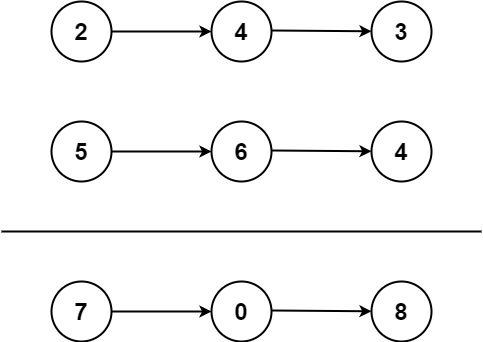

#### [2. 两数相加](https://leetcode-cn.com/problems/add-two-numbers/)

给你两个 非空 的链表，表示两个非负的整数。它们每位数字都是按照 逆序 的方式存储的，并且每个节点只能存储 一位 数字。

请你将两个数相加，并以相同形式返回一个表示和的链表。

你可以假设除了数字 0 之外，这两个数都不会以 0 开头。




> 输入：l1 = [2,4,3], l2 = [5,6,4]
> 输出：[7,0,8]
> 解释：342 + 465 = 807


思路：

- 将两个链表看成是相同长度的进行遍历，如果一个链表较短则在前面补 00，比如 987 + 23 = 987 + 023 = 1010
- 每一位计算的同时需要考虑上一位的进位问题，而当前位计算结束后同样需要更新进位值
- 如果两个链表全部遍历完毕后，进位值为 11，则在新链表最前方添加节点 11
  小技巧：对于链表问题，返回结果为头结点时，通常需要先初始化一个预先指针 pre，该指针的下一个节点指向真正的头结点head。使用预先指针的目的在于链表初始化时无可用节点值，而且链表构造过程需要指针移动，进而会导致头指针丢失，无法返回结果。
  代码


```java
public ListNode addTwoNumbers(ListNode l1, ListNode l2) {
    ListNode pre=new ListNode(-1);
    ListNode cur=pre;
    int temp=0;

    while (l1!=null||l2!=null){
        int val1=l1==null?0:l1.val;
        int val2=l2==null?0:l2.val;
        cur=cur.next=new ListNode((temp+val1+val2)%10);
        temp=(temp+val1+val2)/10;
        l1=l1==null?null:l1.next;
        l2=l2==null?null:l2.next;
    }
    if (temp!=0){
        cur.next=new ListNode(temp);
    }

    return pre.next;
}
```


#### [3. 无重复字符的最长子串](https://leetcode-cn.com/problems/longest-substring-without-repeating-characters/)

给定一个字符串 `s` ，请你找出其中不含有重复字符的 **最长子串** 的长度。


> 输入: s = "abcabcbb"
> 输出: 3 
> 解释: 因为无重复字符的最长子串是 "abc"，所以其长度为 3。


思路：

- 滑动窗口算法
- 定义一个 map 数据结构存储 (k, v)，其中 key 值为字符，value 值为字符位置
- 定义不重复子串的开始位置为 left，结束位置为 right
- 随着 right 不断遍历向后，会遇到与 [left, right] 区间内字符相同的情况，此时将字符作为 key 值，获取其 value 值+1(代表下一次开始位置)，并更新 left，此时 [left, right] 区间内不存在重复字符
- 无论是否更新 start，都会更新其 map 数据结构和结果 length


```java
public int lengthOfLongestSubstring(String s) {
    HashMap<Character, Integer> hashMap = new HashMap<>();
    int length = 0;
    int left = 0, right = 0;
    while (right < s.length()) {
        if (hashMap.containsKey(s.charAt(right))) {
            left = Math.max(hashMap.get(s.charAt(right)) + 1, left);
        }
        length = Math.max(length, right - left + 1);
        hashMap.put(s.charAt(right), right);
        right++;
    }
    return length;
}
```


#### [5. 最长回文子串](https://leetcode-cn.com/problems/longest-palindromic-substring/)

给你一个字符串 `s`，找到 `s` 中最长的回文子串。

>输入：s = "babad"
>输出："bab"
>解释："aba" 同样是符合题意的答案。


思路：

- **中心扩散法**

- 从每一个位置出发，向两边扩散即可。遇到不是回文的时候结束。举个例子，str = acdbbdaastr=acdbbdaa 我们需要寻找从第一个 b（位置为 33）出发最长回文串为多少。怎么寻找？

  - 首先往左寻找与当期位置相同的字符，直到遇到不相等为止。

  - 然后往右寻找与当期位置相同的字符，直到遇到不相等为止。

  - 最后左右双向扩散，直到左和右不相等。如下图所示：

    

  

```java
public String longestPalindrome(String s) {
    int length = 1;
    int maxStart = 0;
    int maxLen = 0;

    for (int i = 0; i < s.length(); i++) {
        int left = i - 1;
        int right = i + 1;
        while (left > 0 && s.charAt(left) == s.charAt(i)) {
            left--;
            length++;
        }
        while (right < s.length() && s.charAt(right) == s.charAt(i)) {
            right++;
            length++;
        }
        while (left >= 0 && right < s.length() && s.charAt(right) == s.charAt(left)) {
            length += 2;
            right++;
            left--;
        }
        if (length > maxLen) {
            maxLen = length;
            maxStart = left;
        }
        length = 1;
    }
    return s.substring(maxStart + 1, maxStart + maxLen + 1);
}
```
