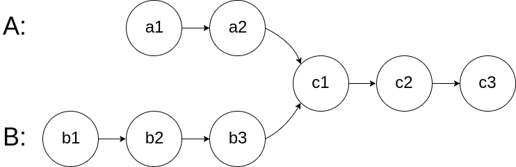
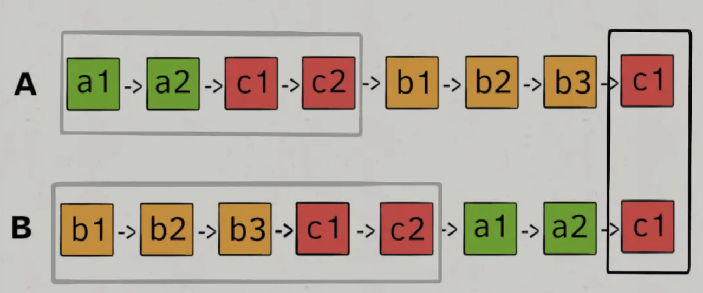

#### [剑指 Offer 21. 调整数组顺序使奇数位于偶数前面](https://leetcode-cn.com/problems/diao-zheng-shu-zu-shun-xu-shi-qi-shu-wei-yu-ou-shu-qian-mian-lcof/)

输入一个整数数组，实现一个函数来调整该数组中数字的顺序，使得所有奇数在数组的前半部分，所有偶数在数组的后半部分。

>输入：nums = [1,2,3,4]
>输出：[1,3,2,4] 
>注：[3,1,2,4] 也是正确的答案之一。


思路：

- 使用双指针，找到左边为偶数，右边为奇数的数，然后交换


```
public int[] exchange(int[] nums) {
    int left=0,right=nums.length-1;
    while (left<right){
        while (left<right &&(nums[left]%2&1)==1){
            left++;
        }
        while (left<right &&(nums[right]%2&1)==0){
            right--;
        }
        int temp=nums[right];
        nums[right]=nums[left];
        nums[left]=temp;
    }
    return nums;
}
```


#### [剑指 Offer 30. 包含min函数的栈](https://leetcode-cn.com/problems/bao-han-minhan-shu-de-zhan-lcof/)

定义栈的数据结构，请在该类型中实现一个能够得到栈的最小元素的 min 函数在该栈中，调用 min、push 及 pop 的时间复杂度都是 O(1)。

>示例：
>
>MinStack minStack = new MinStack();
>minStack.push(-2);
>minStack.push(0);
>minStack.push(-3);
>minStack.min();   --> 返回 -3.
>minStack.pop();
>minStack.top();      --> 返回 0.
>minStack.min();   --> 返回 -2.


思路：

- 引入辅助栈minStack
- 入栈判断
  - 判断当前数是否大于minStack的栈顶元素，如果是，minStack入栈当前栈顶元素。否则入栈当前数


```java
class MinStack {

    Stack<Integer> dataStack, minStack;

    /**
     * initialize your data structure here.
     */
    public MinStack() {
        this.dataStack = new Stack<>();
        this.minStack = new Stack<>();
    }

    public void push(int x) {
        dataStack.push(x);
        if (minStack.size() != 0 && minStack.peek() < x) {
            minStack.push(minStack.peek());
        } else
            minStack.push(x);
    }

    public void pop() {
        dataStack.pop();
        minStack.pop();
    }

    public int top() {
        return dataStack.peek();
    }

    public int min() {
        return minStack.peek();
    }
}
```


#### [剑指 Offer 39. 数组中出现次数超过一半的数字](https://leetcode-cn.com/problems/shu-zu-zhong-chu-xian-ci-shu-chao-guo-yi-ban-de-shu-zi-lcof/)

数组中有一个数字出现的次数超过数组长度的一半，请找出这个数字。

 

你可以假设数组是非空的，并且给定的数组总是存在多数元素。


>输入: [1, 2, 3, 2, 2, 2, 5, 4, 2]
>输出: 2


思路：

- 使用分治算法，将数组分为两半，拿出左边的众数和右边的众数
  - 如果左边众数和右边的众数相等，则直接返回
  - 否则，在这两个中，选择出现次数最多的众数。
- 递归出口：数组只剩一个数、左右众数相等


```java
public int majorityElement(int[] nums) {
    return majorityElement(nums, 0, nums.length - 1);
}


public int majorityElement(int[] nums, int l, int r) {
    if (l == r) {
        return nums[l];
    }
    int min = (r - l) / 2 + l;
    int left = majorityElement(nums, l, min);
    int right = majorityElement(nums, min + 1, r);

    if (left == right) {
        return left;
    }
    int leftCount = countInRange(nums, l, min, left);
    int rightCount = countInRange(nums, min + 1, r, right);
    return leftCount > rightCount ? left : right;
}

public int countInRange(int[] nums, int l, int r, int num) {
    int count = 0;
    for (; l <= r; l++) {
        if (nums[l] == num) {
            count++;
        }
    }
    return count;
}
```


#### [剑指 Offer 40. 最小的k个数](https://leetcode-cn.com/problems/zui-xiao-de-kge-shu-lcof/)

输入整数数组 `arr` ，找出其中最小的 `k` 个数。例如，输入4、5、1、6、2、7、3、8这8个数字，则最小的4个数字是1、2、3、4。

 >输入：arr = [3,2,1], k = 2
 >输出：[1,2] 或者 [2,1]


思路：

- 使用优先级队列，存储当前的最小元素。默认为小根堆，重写比较器，改为大根堆
- 对数组进行遍历。如果发现当前数比队列中最大的数还要小，则把当前数字存入队列中。


```java
public int[] getLeastNumbers(int[] arr, int k) {
    int[] vec = new int[k];
    if (k == 0) { // 排除 0 的情况
        return vec;
    }
    Queue<Integer> priorityQueue = new PriorityQueue<>((num1, num2) -> num2 - num1);

    for (int num : arr) {
        if (priorityQueue.size() < k) {
            priorityQueue.offer(num);
        } else if (num < priorityQueue.peek()) {
            priorityQueue.poll();
            priorityQueue.offer(num);
        }
    }
    int index = 0;
    for (int num : priorityQueue) {
        vec[index++] = num;
    }
    return vec;
}
```


#### [剑指 Offer 50. 第一个只出现一次的字符](https://leetcode-cn.com/problems/di-yi-ge-zhi-chu-xian-yi-ci-de-zi-fu-lcof/)

在字符串 s 中找出第一个只出现一次的字符。如果没有，返回一个单空格。 s 只包含小写字母。


>输入：s = "abaccdeff"
>输出：'b'


思路：

- 使用HashMap存储出现的次数，然后再次遍历字符串。

```java
public char firstUniqChar(String s) {
    HashMap<Character, Integer> hashMap = new HashMap<>();
    char[] arr = s.toCharArray();
    for (char c : arr) {
        hashMap.put(c, hashMap.getOrDefault(c, 0) + 1);
    }

    for (char c : arr) {
        if (hashMap.get(c).equals(1)
        )
            return c;
    }
    return ' ';
}
```


思路：

- 使用有序的LinkedHashMap，再次遍历键即可

```java
public char firstUniqChar(String s) {
    LinkedHashMap<Character, Boolean> hashMap = new LinkedHashMap<>();
    char[] arr = s.toCharArray();
    for (char c : arr) {
        hashMap.put(c, !hashMap.containsKey(c));
    }

    for (Map.Entry<Character, Boolean> e : hashMap.entrySet()) {
        if (e.getValue())
            return e.getKey();
    }
    return ' ';
}
```


#### [剑指 Offer 52. 两个链表的第一个公共节点](https://leetcode-cn.com/problems/liang-ge-lian-biao-de-di-yi-ge-gong-gong-jie-dian-lcof/)

输入两个链表，找出它们的第一个公共节点。

如下面的链表**：**




思路：

- 让p1遍历完链表A之后开始遍历链表B，让p2遍历完链表B之后开始遍历链表A，这样相当于「逻辑上」两条链表接在了一起

- 如果两个链表没有相交点，相当于上图中的c1是空节点null，也能正常返回

  

```java
public ListNode getIntersectionNode(ListNode headA, ListNode headB) {
  if (headA==null||headB==null)
      return null;
  ListNode nodeA=headA;
  ListNode nodeB=headB;
  while (nodeA!=nodeB){
      nodeA=nodeA==null?headB:nodeA.next;
      nodeB=nodeB==null?headA:nodeB.next;
  }
  return nodeA;
}
```


#### [剑指 Offer 53 - I. 在排序数组中查找数字 I](https://leetcode-cn.com/problems/zai-pai-xu-shu-zu-zhong-cha-zhao-shu-zi-lcof/)

统计一个数字在排序数组中出现的次数。

>输入: nums = [5,7,7,8,8,10], target = 8
>输出: 2


思路：

- 由于是排好序的数组，所以我们通过二分查找法将数组中target最左的位置left查找出来，然后将大于target的第一个数的位置right查找出来
- 然后用right-left+1即可得到出现次数


```java
public int search(int[] nums, int target) {
    int left = binarySearch(nums, target, true);
    int right = binarySearch(nums, target, false) - 1;
    if (left <= right && right < nums.length && nums[left] == target && nums[right] == target) {
        return right - left + 1;
    }
    return 0;
}

public int binarySearch(int[] nums, int target, boolean lower) {
    int left = 0;
    int right = nums.length - 1;
    int ans = nums.length;
    while (left <= right) {
        int mid = (left + right) / 2;
        if (nums[mid] > target || (nums[mid] >= target && lower)) {
            right = mid - 1;
            ans = mid;
        } else
            left = mid + 1;
    }
    return ans;
}
```


#### [剑指 Offer 53 - II. 0～n-1中缺失的数字](https://leetcode-cn.com/problems/que-shi-de-shu-zi-lcof/)

一个长度为n-1的递增排序数组中的所有数字都是唯一的，并且每个数字都在范围0～n-1之内。在范围0～n-1内的n个数字中有且只有一个数字不在该数组中，请找出这个数字。

>输入: [0,1,3]
>输出: 2


思路：

- 数组查找使用二分排序法

- 判断当前位置的数是否等于索引下标

  - 如果相等，即在数组右边，left=mid+1;

  - 如果比索引下标大，即在数组左边，right=mid-1;

    

```
public int missingNumber(int[] nums) {
    int left=0,right=nums.length-1;
    while (left<=right){
        int mid=(right+left)/2;
        if (nums[mid]==mid){
            left=mid+1;
        }
        else{
            right=mid-1;
        }
    }
    return left;
}
```


#### [剑指 Offer 54. 二叉搜索树的第k大节点](https://leetcode-cn.com/problems/er-cha-sou-suo-shu-de-di-kda-jie-dian-lcof/)

给定一棵二叉搜索树，请找出其中第 `k` 大的节点的值。

>输入: root = [3,1,4,null,2], k = 1
>   3
>  / \
> 1   4
>  \
>   2
>输出: 4


思路：

- 中序遍历：左-中-右 改为逆序，也就是右-左-中。

- 计算k的次数，当减完等于0，即为第K大的节点

- 此外，不能把k当做参数传入方法中，因为只有值传递。递归回溯时并不会改变K的值

  

```java
int res, k;

public int kthLargest(TreeNode root, int k) {
    this.k = k;
    dfs(root);
    return res;
}

public void dfs(TreeNode root) {
    if (root == null) {
        return;
    }
    dfs(root.right);
    if (k == 0) {
        return;
    }
    if (--k == 0) {
        res = root.val;
    }
    dfs(root.left);
}
```