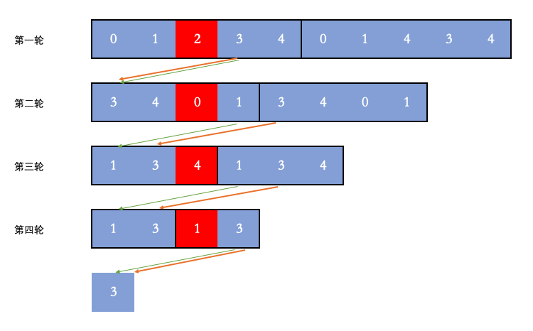

#### [剑指 Offer 21. 调整数组顺序使奇数位于偶数前面](https://leetcode-cn.com/problems/diao-zheng-shu-zu-shun-xu-shi-qi-shu-wei-yu-ou-shu-qian-mian-lcof/)

输入一个整数数组，实现一个函数来调整该数组中数字的顺序，使得所有奇数在数组的前半部分，所有偶数在数组的后半部分。

>输入：nums = [1,2,3,4]
>输出：[1,3,2,4] 
>注：[3,1,2,4] 也是正确的答案之一。


思路：

- 使用双指针，找到左边为偶数，右边为奇数的数，然后交换


```
public int[] exchange(int[] nums) {
    int left=0,right=nums.length-1;
    while (left<right){
        while (left<right &&(nums[left]%2&1)==1){
            left++;
        }
        while (left<right &&(nums[right]%2&1)==0){
            right--;
        }
        int temp=nums[right];
        nums[right]=nums[left];
        nums[left]=temp;
    }
    return nums;
}
```


#### [剑指 Offer 30. 包含min函数的栈](https://leetcode-cn.com/problems/bao-han-minhan-shu-de-zhan-lcof/)

定义栈的数据结构，请在该类型中实现一个能够得到栈的最小元素的 min 函数在该栈中，调用 min、push 及 pop 的时间复杂度都是 O(1)。

>示例：
>
>MinStack minStack = new MinStack();
>minStack.push(-2);
>minStack.push(0);
>minStack.push(-3);
>minStack.min();   --> 返回 -3.
>minStack.pop();
>minStack.top();      --> 返回 0.
>minStack.min();   --> 返回 -2.


思路：

- 引入辅助栈minStack
- 入栈判断
  - 判断当前数是否大于minStack的栈顶元素，如果是，minStack入栈当前栈顶元素。否则入栈当前数


```java
class MinStack {

    Stack<Integer> dataStack, minStack;

    /**
     * initialize your data structure here.
     */
    public MinStack() {
        this.dataStack = new Stack<>();
        this.minStack = new Stack<>();
    }

    public void push(int x) {
        dataStack.push(x);
        if (minStack.size() != 0 && minStack.peek() < x) {
            minStack.push(minStack.peek());
        } else
            minStack.push(x);
    }

    public void pop() {
        dataStack.pop();
        minStack.pop();
    }

    public int top() {
        return dataStack.peek();
    }

    public int min() {
        return minStack.peek();
    }
}
```


#### [剑指 Offer 39. 数组中出现次数超过一半的数字](https://leetcode-cn.com/problems/shu-zu-zhong-chu-xian-ci-shu-chao-guo-yi-ban-de-shu-zi-lcof/)

数组中有一个数字出现的次数超过数组长度的一半，请找出这个数字。

 

你可以假设数组是非空的，并且给定的数组总是存在多数元素。


>输入: [1, 2, 3, 2, 2, 2, 5, 4, 2]
>输出: 2


思路：

- 使用分治算法，将数组分为两半，拿出左边的众数和右边的众数
  - 如果左边众数和右边的众数相等，则直接返回
  - 否则，在这两个中，选择出现次数最多的众数。
- 递归出口：数组只剩一个数、左右众数相等


```java
public int majorityElement(int[] nums) {
    return majorityElement(nums, 0, nums.length - 1);
}


public int majorityElement(int[] nums, int l, int r) {
    if (l == r) {
        return nums[l];
    }
    int min = (r - l) / 2 + l;
    int left = majorityElement(nums, l, min);
    int right = majorityElement(nums, min + 1, r);

    if (left == right) {
        return left;
    }
    int leftCount = countInRange(nums, l, min, left);
    int rightCount = countInRange(nums, min + 1, r, right);
    return leftCount > rightCount ? left : right;
}

public int countInRange(int[] nums, int l, int r, int num) {
    int count = 0;
    for (; l <= r; l++) {
        if (nums[l] == num) {
            count++;
        }
    }
    return count;
}
```


#### [剑指 Offer 40. 最小的k个数](https://leetcode-cn.com/problems/zui-xiao-de-kge-shu-lcof/)

输入整数数组 `arr` ，找出其中最小的 `k` 个数。例如，输入4、5、1、6、2、7、3、8这8个数字，则最小的4个数字是1、2、3、4。

 >输入：arr = [3,2,1], k = 2
 >输出：[1,2] 或者 [2,1]


思路：

- 使用优先级队列，存储当前的最小元素。默认为小根堆，重写比较器，改为大根堆
- 对数组进行遍历。如果发现当前数比队列中最大的数还要小，则把当前数字存入队列中。


```java
public int[] getLeastNumbers(int[] arr, int k) {
    int[] vec = new int[k];
    if (k == 0) { // 排除 0 的情况
        return vec;
    }
    Queue<Integer> priorityQueue = new PriorityQueue<>((num1, num2) -> num2 - num1);

    for (int num : arr) {
        if (priorityQueue.size() < k) {
            priorityQueue.offer(num);
        } else if (num < priorityQueue.peek()) {
            priorityQueue.poll();
            priorityQueue.offer(num);
        }
    }
    int index = 0;
    for (int num : priorityQueue) {
        vec[index++] = num;
    }
    return vec;
}
```


#### [剑指 Offer 50. 第一个只出现一次的字符](https://leetcode-cn.com/problems/di-yi-ge-zhi-chu-xian-yi-ci-de-zi-fu-lcof/)

在字符串 s 中找出第一个只出现一次的字符。如果没有，返回一个单空格。 s 只包含小写字母。


>输入：s = "abaccdeff"
>输出：'b'


思路：

- 使用HashMap存储出现的次数，然后再次遍历字符串。

```java
public char firstUniqChar(String s) {
    HashMap<Character, Integer> hashMap = new HashMap<>();
    char[] arr = s.toCharArray();
    for (char c : arr) {
        hashMap.put(c, hashMap.getOrDefault(c, 0) + 1);
    }

    for (char c : arr) {
        if (hashMap.get(c).equals(1)
        )
            return c;
    }
    return ' ';
}
```


思路：

- 使用有序的LinkedHashMap，再次遍历键即可

```java
public char firstUniqChar(String s) {
    LinkedHashMap<Character, Boolean> hashMap = new LinkedHashMap<>();
    char[] arr = s.toCharArray();
    for (char c : arr) {
        hashMap.put(c, !hashMap.containsKey(c));
    }

    for (Map.Entry<Character, Boolean> e : hashMap.entrySet()) {
        if (e.getValue())
            return e.getKey();
    }
    return ' ';
}
```


#### [剑指 Offer 52. 两个链表的第一个公共节点](https://leetcode-cn.com/problems/liang-ge-lian-biao-de-di-yi-ge-gong-gong-jie-dian-lcof/)

输入两个链表，找出它们的第一个公共节点。

如下面的链表**：**


思路：

- 让p1遍历完链表A之后开始遍历链表B，让p2遍历完链表B之后开始遍历链表A，这样相当于「逻辑上」两条链表接在了一起

- 如果两个链表没有相交点，相当于上图中的c1是空节点null，也能正常返回

  

```java
public ListNode getIntersectionNode(ListNode headA, ListNode headB) {
  if (headA==null||headB==null)
      return null;
  ListNode nodeA=headA;
  ListNode nodeB=headB;
  while (nodeA!=nodeB){
      nodeA=nodeA==null?headB:nodeA.next;
      nodeB=nodeB==null?headA:nodeB.next;
  }
  return nodeA;
}
```


#### [剑指 Offer 53 - I. 在排序数组中查找数字 I](https://leetcode-cn.com/problems/zai-pai-xu-shu-zu-zhong-cha-zhao-shu-zi-lcof/)

统计一个数字在排序数组中出现的次数。

>输入: nums = [5,7,7,8,8,10], target = 8
>输出: 2


思路：

- 由于是排好序的数组，所以我们通过二分查找法将数组中target最左的位置left查找出来，然后将大于target的第一个数的位置right查找出来
- 然后用right-left+1即可得到出现次数


```java
public int search(int[] nums, int target) {
    int left = binarySearch(nums, target, true);
    int right = binarySearch(nums, target, false) - 1;
    if (left <= right && right < nums.length && nums[left] == target && nums[right] == target) {
        return right - left + 1;
    }
    return 0;
}

public int binarySearch(int[] nums, int target, boolean lower) {
    int left = 0;
    int right = nums.length - 1;
    int ans = nums.length;
    while (left <= right) {
        int mid = (left + right) / 2;
        if (nums[mid] > target || (nums[mid] >= target && lower)) {
            right = mid - 1;
            ans = mid;
        } else
            left = mid + 1;
    }
    return ans;
}
```


#### [剑指 Offer 53 - II. 0～n-1中缺失的数字](https://leetcode-cn.com/problems/que-shi-de-shu-zi-lcof/)

一个长度为n-1的递增排序数组中的所有数字都是唯一的，并且每个数字都在范围0～n-1之内。在范围0～n-1内的n个数字中有且只有一个数字不在该数组中，请找出这个数字。

>输入: [0,1,3]
>输出: 2


思路：

- 数组查找使用二分排序法

- 判断当前位置的数是否等于索引下标

  - 如果相等，即在数组右边，left=mid+1;

  - 如果比索引下标大，即在数组左边，right=mid-1;

    

```
public int missingNumber(int[] nums) {
    int left=0,right=nums.length-1;
    while (left<=right){
        int mid=(right+left)/2;
        if (nums[mid]==mid){
            left=mid+1;
        }
        else{
            right=mid-1;
        }
    }
    return left;
}
```


#### [剑指 Offer 54. 二叉搜索树的第k大节点](https://leetcode-cn.com/problems/er-cha-sou-suo-shu-de-di-kda-jie-dian-lcof/)

给定一棵二叉搜索树，请找出其中第 `k` 大的节点的值。

>输入: root = [3,1,4,null,2], k = 1
>   3
>  / \
> 1   4
>  \
>   2
>输出: 4


思路：

- 中序遍历：左-中-右 改为逆序，也就是右-左-中。

- 计算k的次数，当减完等于0，即为第K大的节点

- 此外，不能把k当做参数传入方法中，因为只有值传递。递归回溯时并不会改变K的值

  

```java
int res, k;

public int kthLargest(TreeNode root, int k) {
    this.k = k;
    dfs(root);
    return res;
}

public void dfs(TreeNode root) {
    if (root == null) {
        return;
    }
    dfs(root.right);
    if (k == 0) {
        return;
    }
    if (--k == 0) {
        res = root.val;
    }
    dfs(root.left);
}
```


#### [剑指 Offer 57. 和为s的两个数字](https://leetcode-cn.com/problems/he-wei-sde-liang-ge-shu-zi-lcof/)

输入一个递增排序的数组和一个数字s，在数组中查找两个数，使得它们的和正好是s。如果有多对数字的和等于s，则输出任意一对即可。


>输入：nums = [2,7,11,15], target = 9
>输出：[2,7] 或者 [7,2]


思路：

- 由于是排好序的，所以利用排序的性质，采用双指针
- 定义i,J指针分别指向数组的两端。
  - 当nums[i]和nums[j]的和大于target时，j--；
  - 当nums[i]和nums[j]的和小于target时，i++；
  - 碰到相等时，即返回


```java
public int[] twoSum(int[] nums, int target) {
    int i = 0, j = nums.length - 1;

    while (i != j) {
        if ((nums[i] + nums[j]) > target) {
            j--;
        } else if ((nums[i] + nums[j]) < target) {
            i++;
        } else return new int[]{nums[i], nums[j]};
    }
    return new int[]{0, 0};
}
```


#### [剑指 Offer 57 - II. 和为s的连续正数序列](https://leetcode-cn.com/problems/he-wei-sde-lian-xu-zheng-shu-xu-lie-lcof/)

输入一个正整数 target ，输出所有和为 target 的连续正整数序列（至少含有两个数）。

序列内的数字由小到大排列，不同序列按照首个数字从小到大排列。


>输入：target = 9
>输出：[[2,3,4],[4,5]]


思路：

- 采用滑动窗口算法
- 当窗口的和小于 target 的时候，窗口的和需要增加，所以要扩大窗口，窗口的右边界向右移动
  当窗口的和大于 target 的时候，窗口的和需要减少，所以要缩小窗口，窗口的左边界向右移动
  当窗口的和恰好等于 target 的时候，我们需要记录此时的结果。设此时的窗口为 [i, j)[i,j)，那么我们已经找到了一个 ii 开头的序列，也是唯一一个 ii 开头的序列，接下来需要找 i+1i+1 开头的序列，所以窗口的左边界要向右移动


```java
public int[][] findContinuousSequence(int target) {
    int i = 1, j = 1;
    int sum = 0;
    List<int[]> res = new ArrayList<>();
    while (i <= target / 2) {
        if (sum < target) {
            sum += j;
            j++;
        } else if (sum > target) {
            sum -= i;
            i++;
        } else {

            int[] arr = new int[j - i];
            for (int k = i; k < j; k++) {
                arr[k - i] = k;
            }
            res.add(arr);
            sum -= i;
            i++;
        }
    }
    return res.toArray(new int[res.size()][]);
}
```


#### [剑指 Offer 58 - I. 翻转单词顺序](https://leetcode-cn.com/problems/fan-zhuan-dan-ci-shun-xu-lcof/)

输入一个英文句子，翻转句子中单词的顺序，但单词内字符的顺序不变。为简单起见，标点符号和普通字母一样处理。例如输入字符串"I am a student. "，则输出"student. a am I"。


>输入: "the sky is blue"
>输出: "blue is sky the"


思路：

- 采用双指针，都指向字符串尾端

- 找到碰到空格前的第一个字符串。然后截取加入到返回值里

- 然后去掉空格

- 让边界往左移，继续寻找下一个字符串

  

```java
public String reverseWords(String s) {
    s = s.trim();
    int j = s.length() - 1, i = j;
    StringBuffer sb = new StringBuffer();
    while (i >= 0) {
        while (i >= 0 && s.charAt(i) != ' ') {
            i--;
        }
        sb.append(s.substring(i + 1, j + 1) + " ");
        while (i >= 0 && s.charAt(i) == ' ') {
            i--;
        }
        j = i;
    }
    return sb.toString().trim();
}
```


#### [剑指 Offer 58 - II. 左旋转字符串](https://leetcode-cn.com/problems/zuo-xuan-zhuan-zi-fu-chuan-lcof/)

字符串的左旋转操作是把字符串前面的若干个字符转移到字符串的尾部。请定义一个函数实现字符串左旋转操作的功能。比如，输入字符串"abcdefg"和数字2，该函数将返回左旋转两位得到的结果"cdefgab"。


>输入: s = "abcdefg", k = 2
>输出: "cdefgab"


思路：

- 新建一个StringBuilder
- 先遍历把n+1后的字符到sb中
- 再加入首位到n的字符


```java
public String reverseLeftWords(String s, int n) {
    StringBuffer sb = new StringBuffer();
    for (int i = n; i < s.length(); i++) {
        sb.append(s.charAt(i));
    }
    for (int i = 0; i < n; i++) {
        sb.append(s.charAt(i));
    }
    return sb.toString();
}
```


#### [剑指 Offer 61. 扑克牌中的顺子](https://leetcode-cn.com/problems/bu-ke-pai-zhong-de-shun-zi-lcof/)

从若干副扑克牌中随机抽 5 张牌，判断是不是一个顺子，即这5张牌是不是连续的。2～10为数字本身，A为1，J为11，Q为12，K为13，而大、小王为 0 ，可以看成任意数字。A 不能视为 14。


>输入: [1,2,3,4,5]
>输出: True


思路：

- 题意可等同于
  - 除大小王外，所有牌 **无重复** ；
  - 设此 55 张牌中最大的牌为 max ，最小的牌为 min（大小王除外），则需满足：max−min<5


1. 集合 Set + 遍历
   - 遍历五张牌，遇到大小王（即 00 ）直接跳过。
   - 判别重复： 利用 Set 实现遍历判重， Set 的查找方法的时间复杂度为 O(1)O(1) ；
   - 获取最大 / 最小的牌： 借助辅助变量 mama 和 mimi ，遍历统计即可。

```java
public boolean isStraight(int[] nums) {
    Set<Integer> set = new HashSet<>();
    int max = 0, min = 14;
    for (int i : nums) {
        if (set.contains(i)) {
            return false;
        }
        if (i == 0) {
            continue;
        }
        max = Math.max(max, i);
        min = Math.min(min, i);
        set.add(i);
    }
    return max - min < 5;
}
```


2. 排序 + 遍历
   - 先对数组执行排序。
   - 判别重复： 排序数组中的相同元素位置相邻，因此可通过遍历数组，判断 nums[i] = nums[i + 1]nums[i]=nums[i+1] 是否成立来判重。
   - 获取最大 / 最小的牌： 排序后，数组末位元素 nums[4]nums[4] 为最大牌；元素 nums[joker]nums[joker] 为最小牌，其中 jokerjoker 为大小王的数量。


```java
public boolean isStraight(int[] nums) {
    Arrays.sort(nums);
    int joker=0;
    for (int i=0;i<4;i++){
        if (nums[i]==0){
            joker++;
        }else if (nums[i]==nums[i+1]){
            return false;
        }
    }
    return nums[4]-nums[joker]<5;
}
```


#### [剑指 Offer 62. 圆圈中最后剩下的数字](https://leetcode-cn.com/problems/yuan-quan-zhong-zui-hou-sheng-xia-de-shu-zi-lcof/)

0,1,···,n-1这n个数字排成一个圆圈，从数字0开始，每次从这个圆圈里删除第m个数字（删除后从下一个数字开始计数）。求出这个圆圈里剩下的最后一个数字。

例如，0、1、2、3、4这5个数字组成一个圆圈，从数字0开始每次删除第3个数字，则删除的前4个数字依次是2、0、4、1，因此最后剩下的数字是3。


>输入: n = 5, m = 3
>输出: 3


思路：

- 因为数据是放在数组里，所以我在数组后面加上了数组的复制，以体现是环状的

  - 第一轮是 [0, 1, 2, 3, 4] ，所以是 [0, 1, 2, 3, 4] 这个数组的多个复制。这一轮 2 删除了。

  - 第二轮开始时，从 3 开始，所以是 [3, 4, 0, 1] 这个数组的多个复制。这一轮 0 删除了。
  - 第三轮开始时，从 1 开始，所以是 [1, 3, 4] 这个数组的多个复制。这一轮 4 删除了。
  - 第四轮开始时，还是从 1 开始，所以是 [1, 3] 这个数组的多个复制。这一轮 1 删除了。

- 最后剩下的数字是 3。

- 然后我们从最后剩下的 3 倒着看，我们可以反向推出这个数字在之前每个轮次的位置。

- 最后剩下的 3 的下标是 0。

  - 第四轮反推，补上 mm 个位置，然后模上当时的数组大小 22，位置是(0 + 3) % 2 = 1。
  - 第三轮反推，补上 mm 个位置，然后模上当时的数组大小 33，位置是(1 + 3) % 3 = 1。
  - 第二轮反推，补上 mm 个位置，然后模上当时的数组大小 44，位置是(1 + 3) % 4 = 0。
  - 第一轮反推，补上 mm 个位置，然后模上当时的数组大小 55，位置是(0 + 3) % 5 = 3。
  - 所以最终剩下的数字的下标就是3。因为数组是从0开始的，所以最终的答案就是3。

  

  总结一下反推的过程，就是 (当前index + m) % 上一轮剩余数字的个数。

  

  

递推

```java
public int lastRemaining(int n, int m) {
    int ans=0;
    for (int i=2;i<=n;i++){
        ans=(ans+m)%i;
    }
    return ans;
}
```

递归

```java
public int lastRemaining(int n, int m) {
    return Remaining(n,m);
}

public int Remaining(int n,int m){
    if (n==1){
        return 0;
    }
    int index=Remaining(n-1,m);
    return (index+m)%n;
}
```


#### [剑指 Offer 65. 不用加减乘除做加法](https://leetcode-cn.com/problems/bu-yong-jia-jian-cheng-chu-zuo-jia-fa-lcof/)

写一个函数，求两个整数之和，要求在函数体内不得使用 “+”、“-”、“*”、“/” 四则运算符号。


>输入: a = 1, b = 1
>输出: 2


思路：

- 采用位运算法

- ^ 亦或 ----相当于 无进位的求和， 想象10进制下的模拟情况：（如:19+1=20；无进位求和就是10，而非20；因为它不管进位情况）

- & 与 ----相当于求每位的进位数， 先看定义：1&1=1；1&0=0；0&0=0；即都为1的时候才为1，正好可以模拟进位数的情况,还是想象10进制下模拟情况

- （9+1=10，如果是用&的思路来处理，则9+1得到的进位数为1，而不是10，所以要用<<1向左再移动一位，这样就变为10了）；

  这样公式就是：（a^b) ^ ((a&b)<<1) 即：每次无进位求 + 每次得到的进位数--------我们需要不断重复这个过程，直到进位数为0为止；


```java
public int add(int a, int b) {
    while (b != 0) {
        int c = (a & b) << 1;
        a ^= b;
        b = c;
    }
    return a;
}
```